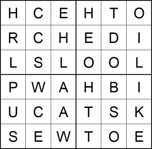
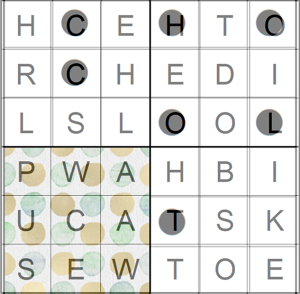
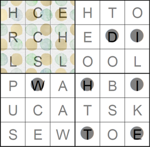

# 06 - Dots

*Uncover the dots' secret!*

*Then enter the password in the egg-o-matic below. Uppercase only, and no spaces!*




---

Not so easy this one .. The key was not to dig inside of the images internals but rather
solve it as a logical puzzle. To be successful, two ideas were required:

1) Combine these images into one:

   
   
   Now you can see that the dots and letters overlap and they start to form words. We can clearly
read `HELLO`. 

2) The second step is to rotate the image with dots. The bottom right corner with colorful
dots looks like it has been cut from the full picture so basically we are just restoring it.

   Here is 90° clock-wise rotation forming a word `CHOCOL`
   
   
   Here is 180° clock-wise rotation forming a word `WHITE`
   
   
   Here is 270° clock-wise rotation forming a word `PASSWO`
   
  
  
This is the final result with letters colored. Each color represents one rotation.


It's not perfect but with a bit of scrabbling we can guess the message:
```
HELLO BUCK THE PASSWORD IS WHITE CHOCOLATE
```

Maybe there was a better way how to get the final message without scrabbling ..? 