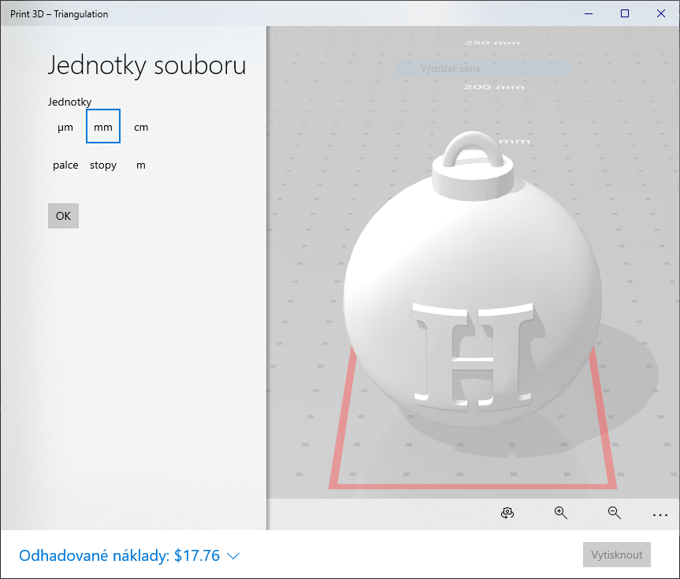
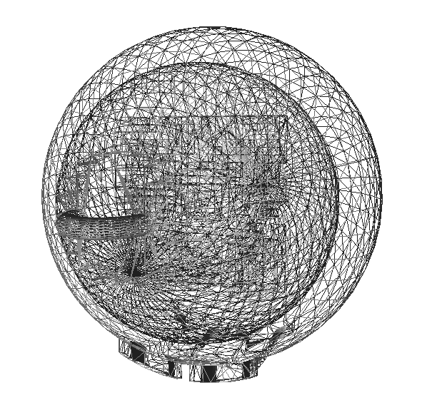
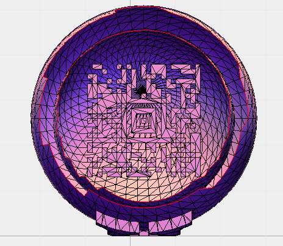

# HV19.02 Triangulation (easy)

_Today we give away decorations for your Christmas tree. But be careful and do not break it._

[HV19.02-Triangulation.zip](a5f47ab8-f151-4741-b061-d2ab331bf641.zip)

---

Archives contains [Triangulation.stl](Triangulation.stl) which is _a file format native to the
stereolithography CAD_ (wiki). Windows is able to open the file in **Print 3D**:

I already solved a bit similar challenge this year - see [Hacky Easter 2019 - Disco](../../HackyEaster2019/ch04/README.md).
The goal is to see what's inside.

I quickly confirmed my idea using https://www.viewstl.com/:

Yep, there's something looking as a QR code inside.

I found this handy tool for editing STL files online https://www.vectary.com/:

**Step 1** - Cut of the top of the ball

**Step 2** - Cut the bottom and adjust lightnings

Here comes the [Aztec code](https://en.wikipedia.org/wiki/Aztec_Code). 

I used https://www.onlinebarcodereader.com/ to read it's value.

The flag is `HV19{Cr4ck_Th3_B411!}`