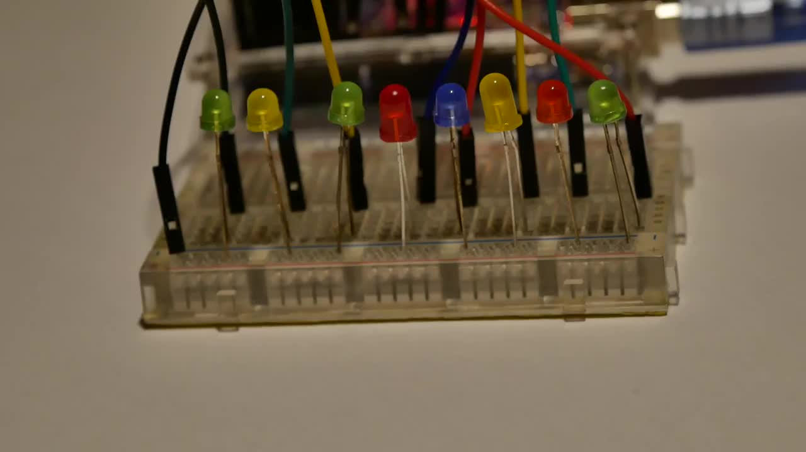
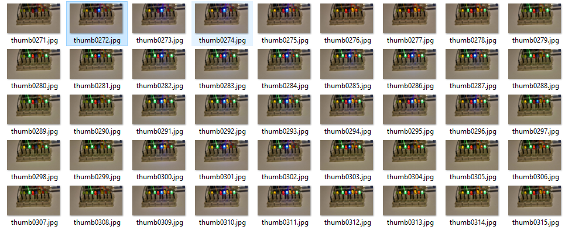

# HV19.07 Santa Rider
_Santa is prototyping a new gadget for his sledge. Unfortunately it still has some glitches, but look for yourself._



[HV19-SantaRider.zip](HV19-SantaRider.zip)

---

The zip contains a short video (22 seconds) with flashing diodes. Notice that there are
8 diodes so it could be representing a single byte.

To make the analysis easier I extracted all frames into images using `ffmpeg`:
```
ffmpeg.exe -i 3DULK2N7DcpXFg8qGo9Z9qEQqvaEDpUCBB1v.mp4 out/thumb%04d.jpg
```



Now it's easy. Just go frame by frame, watch for shining diodes and decode the message:
```
01001000 01010110 00110001 00111001 01111011 00110001 01101101 01011111 01100001 01101100 01110011 00110000 01011111 01110111 00110000 01110010 01101011 00110001 01101110 01100111 01011111 00110000 01101110 01011111 01100001 01011111 01110010 00110011 01101101 00110000 01110100 00110011 01011111 01100011 00110000 01101110 01110100 01110010 00110000 01101100 01111101
```

The flag is `HV19{1m_als0_w0rk1ng_0n_a_r3m0t3_c0ntr0l}`