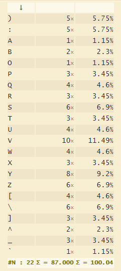
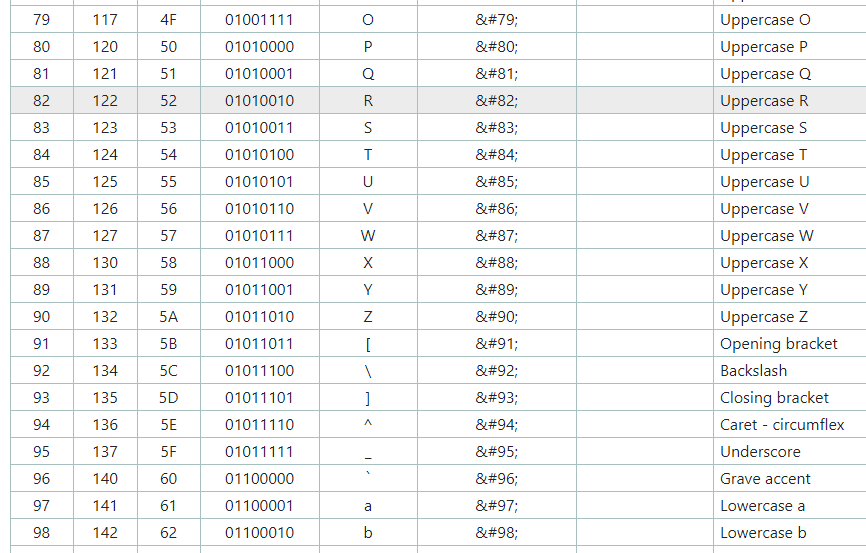

# HV19.08 SmileNcryptor 4.0

_You hacked into the system of very-secure-shopping.com and you found a SQL-Dump with $$-creditcards numbers.
As a good hacker you inform the company from which you got the dump. The managers tell you that they don't
worry, because the data is encrypted._

Dump-File: [dump.zip](dump.zip)

## Goal

Analyze the "Encryption"-method and try to decrypt the flag.

---

I started with analyzing `creditcards` table:
```
(1,'Sirius Black',':)QVXSZUVY\ZYYZ[a','12/2020'),
(2,'Hermione Granger',':)QOUW[VT^VY]bZ_','04/2021'),
(3,'Draco Malfoy',':)SPPVSSYVV\YY_\\]','05/2020'),
(4,'Severus Snape',':)RPQRSTUVWXYZ[\]^','10/2020'),
(5,'Ron Weasley',':)QTVWRSVUXW[_Z`\b','11/2020');
```

The 3rd column is `cc_number` and it's encrypted the same way as the flag.
Two things helped me to break this cipher quickly:

1) Frequency analysis
2) Realizing that decrypted cards number should be digits `[0-9]`

## Frequency analysis
I combined all 5 encrypted cards numbers into a single string
```
:)QVXSZUVY\ZYYZ[a:)QOUW[VT^VY]bZ_:)SPPVSSYVV\YY_\\]:)RPQRSTUVWXYZ[\]^:)QTVWRSVUXW[_Z`\b
```
and analyse it using https://www.dcode.fr/frequency-analysis. This is the result:



We can see that only a very limited subset of letters and characters is used. The key
idea is that they all fall into the same ASCII range (excluding `:)`):



This indicates that credit card numbers might be encrypted using a simple ASCII rotation!
We can easily count the approximate rotation shift: `O` is `79` and `0` is `48`, i.e. `79-48 = 31`.

Let's try that using https://www.dcode.fr/ascii-shift-cipher. This is the ASCII shift by `31`:
```
2794;67:=;::;<B�
2068<75?7:>C;@�
411744:77=::@==>�
3123456789:;<=>?�
2578347698<@;A=C
```

It looks promising but we are still missing something. I wrote 
[SmileDecryptor](../../../src/main/kotlin/cz/vernjan/ctf/hv19/day08/SmileDecryptor.kt) to be able to try a few ideas.
One of the first ideas was that **each digit was encrypted by an decreasing rotation shift**, i.e. the fist
digit was shifted by `31`, the second digit by `30` and so on. This is the result:
```
26717113520///4
2/4582/8/148/3
40/40/40/40/40//
3000000000000000
2455//1/1/25/4/4
```

That looks good! The final step was to find the right starting shift. There are only a very few acceptable options
which satisfies the letters present in encrypted strings. The right one is `30`. Using my
[SmileDecryptor](../../../src/main/kotlin/cz/vernjan/ctf/hv19/day08/SmileDecryptor.kt):
```
Credit card numbers:
    378282246310005
    30569309025904
    5105105105105100
    4111111111111111
    3566002020360505
Flag:
    5M113-420H4-KK3A1-19801
```

The flag is `5M113-420H4-KK3A1-19801`