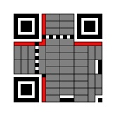
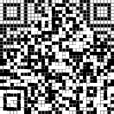

# HV19.09 Santas Quick Response 3.0
_Visiting the following railway station has left lasting memories._


_Santas brand new gifts distribution system is heavily inspired by it. Here is your personal gift, can you extract
the destination path of it?_


## Hints
- it starts with a single pixel
- centering is hard

---

Not an easy one for me. The first step was quick but then I stuck for some time ..

I noticed that the image with the railway station has a nice name
`Cmglee_Cambridge_North_cladding_detail.jpg` (looking into HTTP response with challenge details).

I googled for it and found the
[original image](https://en.wikipedia.org/wiki/Cambridge_North_railway_station#/media/File:Cmglee_Cambridge_North_cladding_detail.jpg)
and also an [article onWikipedia about this station](https://en.wikipedia.org/wiki/Cambridge_North_railway_station).
The article says that the cladding is inspired by [Rule 30](https://en.wikipedia.org/wiki/Rule_30)
which is an [elementary cellular automaton](https://en.wikipedia.org/wiki/Elementary_cellular_automaton). 

This moment I thought I'm almost done.. I was wrong!

The hard part is how to apply the Rule 30. At first I tried to evolve all cells of the scrambled QR code by
some generations. Nope. I also tried to apply [Conway's Game of Life](https://en.wikipedia.org/wiki/Conway%27s_Game_of_Life)
which seemed to be a better fit for 2D QR code. No, no and no.

The breakthrough came when I finally focused on the visible parts of the QR code.. Why they are
not scrambled?  Also, the hint _it starts with a single pixel_ helped me. The idea is to **XOR
Rule 30 and the scrambled QR code together** (it seems so simple now):


Sounds good but how do I confirm my idea without tons of work? Easily! The 7th line of each 33x33
QR code must contain a timing pattern - a repeated sequence of black and white squares.



So, if my idea is right, then the 7th generation of Rule 30 must contain this pattern (otherwise 
the XOR with Rule 30 would not restore the timing pattern):
```
Scrambled QR code: 0101100111010001110
Expeted pattern:   0101010101010101010 
XOR:               -------------------
7th gen pattern:   0000110010000100100
```

YES! Indeed, the 7th generation of Rule 30 contains exactly this pattern (trimming leading zeroes):


 
There was one more trap however. The Rule 30 was not applied in the exact center but shifted
one pixel right (also one of the hints).

Ok, now I knew what I was dealing with but I was not sure how to apply the rule to whole QR code.
I tried a quick and dirty approach first and XOR the scrambled QR code and the rule using _Stegsolve_.
It worked, kinda..



I was unable to find a good image (without the grid) of rule 30 so I took the more fun approach
and program it. See [XorRule30.kt](../../../src/main/kotlin/cz/vernjan/ctf/hv19/day09/XorRule30.kt)
for implementation details.

This is the recovered QR code:


The flag is `HV19{Cha0tic_yet-0rdered}`