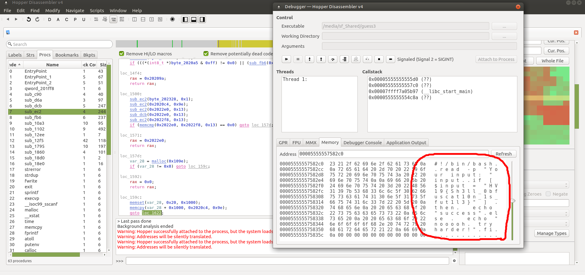

# HV19.10 Guess what
_The flag is right, of course_

[HV19.10-guess3.zip](HV19.10-guess3.zip)

## Hints
- New binary (v3) released at 20:00 CET
- Time for full points will be extended for additional 24 hours
- No asm needed
- run it on linux

---

This one took me a lot of time.. I spent 2 hours trying to crack a _broken binary_.. 
The next day a new binary was released so I could just start over.
```
$ ./guess3 
Your input: hello
nooooh. try harder!
```

The binary required a secret password. At first I tried a few different inputs. The
most interesting input was an empty string:
```
$ ./guess3 
Your input: 
./guess3: line 4: [: =: unary operator expected
nooooh. try harder!
```
Ok, looks like it uses Bash internally. I googled this error and found a nice explanation
on [Stackoverflow](https://stackoverflow.com/questions/13617843/unary-operator-expected/13618376)
(of course I did).

So basically, the Bash script could look like this:
```
if [ $1 = "SECRET" ]; then
  # SOMETHING
else 
  echo "nooooh. try harder!"
fi
```

My first idea was to try _Bash injection_ and bypass the condition. It's quite easy:
```
$ ./guess3 
Your input: ! foo
success
```
Great, but apparently useless :/

I fired up [Hopper Disassembler](https://www.hopperapp.com/) and try to reverse it.
Unfortunately, the logic inside looked very complicated and I was unable to get something
useful out of it.

Nevertheless, I set up a few breakpoints around system function calls and started to debugging it.
To my delight, after a while I found the underlying Bash script including the flag in the
process memory:



The flag is `HV19{Sh3ll_0bfuscat10n_1s_fut1l3}`

---

Yet I wasn't fully satisfied with this solution. I realized that there must be an easier way 
and indeed there is:

1. Grep PID of `guess` using `ps aux`
2. `cat /proc/1184812/cmdline`
```
#!/bin/bash
read -p "Your input: " input

if [ $input = "HV19{Sh3ll_0bfuscat10n_1s_fut1l3}" ] 
then
  echo "success"
else 
  echo "nooooh. try harder!"
fi
```

Note: I fixed the formatting for easier readability (extreme formatting was part of the obfuscation).
This is the original:
