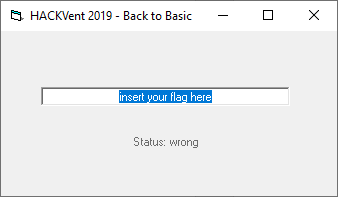
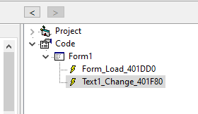
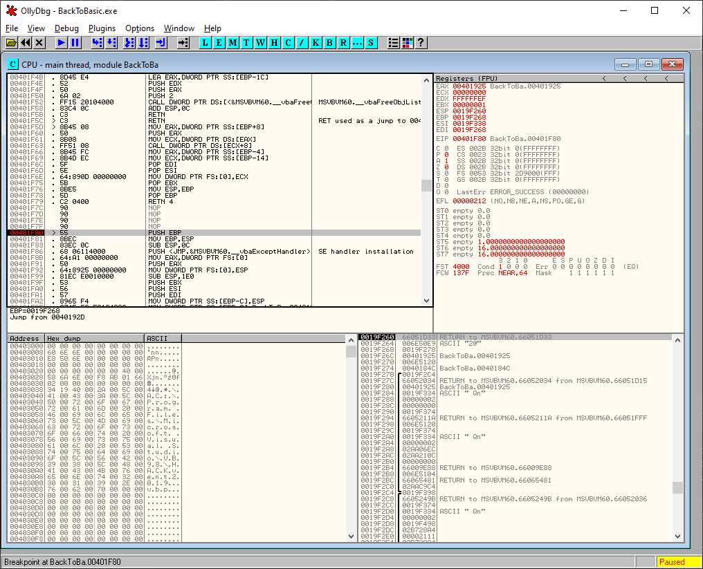

# HV19.12 back to basic

_Santa used his time machine to get a present from the past.
get your rusty tools out of your cellar and solve this one!_

[HV19.12-BackToBasic.zip](HV19.12-BackToBasic.zip)

---

The most difficult challenge for me so far. I'm no reverse engineering expert. The more happy
I was when I finally cracked this one.

The archive contains a single exe file compiled from _Visual Basic_ .



I used combination of 3 tools to understand its internals.

The first one was [VB Decompiler](https://www.vb-decompiler.org/).
Unfortunately, the free version does not include decompiler.. Nevertheless, it helped me to get the
big picture:



Ok, I should most likely focus on procedure starting at `0x401F80`. This procedure seems to
be invoked whenever **the text is changed**.

The second tool was [Ghidra](https://ghidra-sre.org/) (thanks, NSA). Unfortunately, _Ghidra_
does not offer yet (hopefully soon) a debugger. I used it for a _static analysis_ only. I focused
on procedure at `0x401F80`. [This](decompiled.txt) is how _Ghidra_ decompiled it. Not so good but
still better than pure assembly.

**Interesting parts:**
```
local_1b8 = &DAT_00401b38;
local_1c0[0] = 0x8008;
uVar3 = __vbaVarCmpEq(local_80,local_160,local_70);
uVar6 = __vbaVarCmpEq(local_b0,local_180,local_a0);
uVar3 = __vbaVarAnd(local_c0,uVar6,uVar3);
uVar6 = __vbaVarCmpEq(local_f0,local_1a0,local_e0);
uVar3 = __vbaVarAnd(local_100,uVar6,uVar3);
uVar6 = __vbaVarCmpEq(local_130,local_1c0,local_120);
uVar3 = __vbaVarAnd(local_140,uVar6,uVar3);
local_1c4 = __vbaBoolVarNull(uVar3);
```

`DAT_00401b38` refers to string `HV19` and those calls test whether the flag (your input)
starts with it. 

```
local_148 = (undefined *)0x21; // 33 in DEC
local_150[0] = 0x8002;
uVar3 = __vbaLenVar(local_60,local_38);
sVar1 = __vbaVarTstEq(local_150,uVar3);
```

The flag length should be `0x21` (ie. 33 chars).

```
while (iVar5 != 0) { // Looping over something
    puVar8 = local_28;
    local_58 = 1;
    local_60[0] = 2;
    uVar3 = __vbaI4Var(puVar8,local_60);
    rtcMidCharVar(local_70,local_38,uVar3,puVar8);
    uVar3 = __vbaStrVarVal(&local_4c,local_70);
    uVar2 = rtcAnsiValueBstr(uVar3); // Char to Int
    local_158 = (undefined *)((uint)local_158 & 0xffff0000 | (uint)uVar2);
    local_160[0] = 2;
    uVar3 = __vbaVarXor(local_80,local_160,local_28); // XOR !!
    uVar3 = __vbaI4Var(uVar3); // Int to Char
    rtcVarBstrFromAnsi(local_90,uVar3);
    __vbaVarAdd(local_a0,local_90,local_48);
    __vbaVarMove();
    __vbaFreeStr();
    __vbaFreeVarList(3,local_60,local_70,local_90);
    iVar5 = __vbaVarForNext(local_28,local_1d8,local_1e8);
}
```

Apparently, each letter of our input text is XORed somehow.. Not sure how but that's ok for now.

```
local_148 = &DAT_00401b40;
local_150[0] = 0x8008;
sVar1 = __vbaVarTstEq(local_150,local_48);
```

Finally, the most suspicious string `6klzic<=bPBtdvff'yFI~on//N` is loaded from `DAT_00401b40`
and compared to the result of the previous XORing. It starts to make sense. We are supposed to enter
the real flag, it's then XORed somehow and the result is this string.

Hopefully, the only missing part now is how exactly the XORing is done..

Time for tool number 3 - [OllyDbg](http://www.ollydbg.de/) - which offers a nice debugger.
I placed a breakpoint at `0x401F80` and started the program. Once I changed the text the breakpoint
was hit. Nice!



Stepping through assembly produced from _Visual Basic_ is no breeze but armed with a rough idea
what to expect I was able recover the flag. At first I confirmed that the flag really starts
with `HV19` and that the length is 33 characters.

Now for the XORing part. I entered flag `HV19{xxxxxxxxxxxxxxxxxxxxxxxxxxx}` and watched how it
gets XORed (actually, only the `xxxxx..` part is XORed). I grabbed the result of XORing and XORed
it again with the original (i.e. `xxxxx..`) to get the "key". And it turns out that the key is
very simple - bytes from `06` to `33`. 

Finally, I wrote simple reversing program:
```kotlin
fun cz.vernjan.ctf.hv20.cz.vernjan.ctf.hv20.cz.vernjan.ctf.hv20.main() {

    // 6klzic<=bPBtdvff'yFI~on//N    
    val data = listOf(
        0x36, 0x6B, 0x6C, 0x7A, 0x69, 0x63, 0x3C, 0x3D, 0x62,
        0x50, 0x42, 0x74, 0x64, 0x76, 0x66, 0x66, 0x27, 0x79,
        0x7F, 0x46, 0x49, 0x7E, 0x6F, 0x6E, 0x2F, 0x2F, 0x4E
    )

    for (i in data.indices) {
        print((data[i] xor i + 6).toChar())
    }
        
    // Prints 0ldsch00l_Revers1ng_Sess10n     
}
```

The flag is `HV19{0ldsch00l_Revers1ng_Sess10n}`