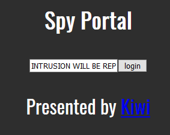
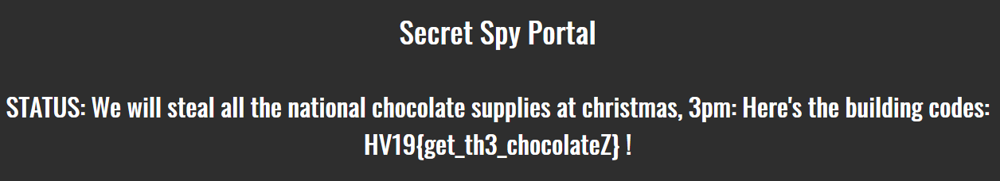

# HV19.13 TrieMe

_Switzerland's national security is at risk. As you try to infiltrate a secret
spy facility to save the nation you stumble upon an interesting looking login portal._

_Can you break it and retrieve the critical information?_

Facility: http://whale.hacking-lab.com:8888/trieme/

[HV19.13-NotesBean.java.zip](HV19.13-NotesBean.java.zip) (See [here](NotesBean.java))

---

Another tough nut to crack for me.. I started totally wrong and spent quite a lot of time
on this one.

## Failed attempts

### Dir Busting (using _dirb_)

I discovered many URLs returning HTTP 500 including the **full stack traces** and other sensitive information:
- http://whale.hacking-lab.com:8888/trieme/faces/ `java.lang.NullPointerException`
- http://whale.hacking-lab.com:8888/trieme/faces/cgi-bin/ `java.lang.NullPointerException`
- http://whale.hacking-lab.com:8888/trieme/faces/resources `/resources/faces/index.xhtml Not Found in ExternalContext as a Resource`
and the info that server is using `Mojarra/Facelets`
- http://whale.hacking-lab.com:8888/trieme/faces/javax.faces.resource/ `java.lang.StringIndexOutOfBoundsException: String index out of range: 0`
and the server is using `Apache Tomcat/9.0.20` (latest version)

I gather some info I was hoping to use later .. (_Spoiler: It was totally useless_)

## Directory traversal

I read about [CVE-2011-4367/](https://www.cvedetails.com/cve/CVE-2011-4367/) and tried
to manipulate the URL `http://whale.hacking-lab.com:8888/trieme/faces/javax.faces.resource/style.css?ln=css`
to return the flag (`/flag.txt?ln=data`) or to get more information about the internals (`/web.xml?ln=../WEB-INF`). No luck.

## Deserialization attacks

Also tried using [Burp Suite](https://portswigger.net/burp) + [ysoserial](https://github.com/summitt/burp-ysoserial)
to send a few malicious deserialization payloads. I wasn't very meticulous about the encoding and I wasn't sure
which version of `Apache commons` is actually used so I gave quite soon.

Good read here:
- https://www.owasp.org/images/a/a3/OWASP-London-2017-May-18-ApostolosGiannakidis-JavaDeserializationTalk.pdf
- https://foxglovesecurity.com/2015/11/06/what-do-weblogic-websphere-jboss-jenkins-opennms-and-your-application-have-in-common-this-vulnerability/

## The right solution

I was a bit disappointed in the end. So much work done and for nothing.

To solve the challenge, you had to stumble upon this issue
https://issues.apache.org/jira/browse/COLLECTIONS-714 - 
`PatriciaTrie ignores trailing null characters in keys`.

I was googling for `vulnerabilities java "PatriciaTrie"` when I finally found this paper
[JQF: Coverage-Guided Property-Based Testing in Java](https://people.eecs.berkeley.edu/~rohanpadhye/files/jqf-issta19.pdf)
and it took me to the `COLLECTIONS-714` issue.

The payload is very simple: `auth_token_4835989\0`.

Basically what happens is that calling `trie.put(unescapeJava("auth_token_4835989\0"), 0);` 
replaces the original token with `auth_token_4835989\u0000` which in turn causes that
`trie.containsKey(securitytoken)` now returns `false` (I tried locally with debugger to confirm that).

The flag is `HV19{get_th3_chocolateZ}`