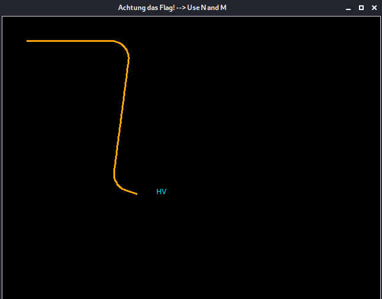
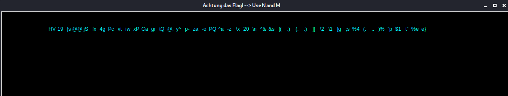

# HV19.14 Achtung das Flag

_Let's play another little game this year. Once again, I promise it is hardly obfuscated._

```perl
use Tk;use MIME::Base64;chomp(($a,$a,$b,$c,$f,$u,$z,$y,$r,$r,$u)=<DATA>);sub M{$M=shift;##
@m=keys %::;(grep{(unpack("%32W*",$_).length($_))eq$M}@m)[0]};$zvYPxUpXMSsw=0x1337C0DE;###
/_help_me_/;$PMMtQJOcHm8eFQfdsdNAS20=sub{$zvYPxUpXMSsw=($zvYPxUpXMSsw*16807)&0xFFFFFFFF;};
($a1Ivn0ECw49I5I0oE0='07&3-"11*/(')=~y$!-=$`-~$;($Sk61A7pO='K&:P3&44')=~y$!-=$`-~$;m/Mm/g;
($sk6i47pO='K&:R&-&"4&')=~y$!-=$`-~$;;;;$d28Vt03MEbdY0=sub{pack('n',$fff[$S9cXJIGB0BWce++]
^($PMMtQJOcHm8eFQfdsdNAS20->()&0xDEAD));};'42';($vgOjwRk4wIo7_=MainWindow->new)->title($r)
;($vMnyQdAkfgIIik=$vgOjwRk4wIo7_->Canvas("-$a"=>640,"-$b"=>480,"-$u"=>$f))->pack;@p=(42,42
);$cqI=$vMnyQdAkfgIIik->createLine(@p,@p,"-$y"=>$c,"-$a"=>3);;;$S9cXJIGB0BWce=0;$_2kY10=0;
$_8NZQooI5K4b=0;$Sk6lA7p0=0;$MMM__;$_=M(120812).'/'.M(191323).M(133418).M(98813).M(121913)
.M(134214).M(101213).'/'.M(97312).M(6328).M(2853).'+'.M(4386);s|_||gi;@fff=map{unpack('n',
$::{M(122413)}->($_))}m:...:g;($T=sub{$vMnyQdAkfgIIik->delete($t);$t=$vMnyQdAkfgIIik->#FOO
createText($PMMtQJOcHm8eFQfdsdNAS20->()%600+20,$PMMtQJOcHm8eFQfdsdNAS20->()%440+20,#Perl!!
"-text"=>$d28Vt03MEbdY0->(),"-$y"=>$z);})->();$HACK;$i=$vMnyQdAkfgIIik->repeat(25,sub{$_=(
$_8NZQooI5K4b+=0.1*$Sk6lA7p0);;$p[0]+=3.0*cos;$p[1]-=3*sin;;($p[0]>1&&$p[1]>1&&$p[0]<639&&
$p[1]<479)||$i->cancel();00;$q=($vMnyQdAkfgIIik->find($a1Ivn0ECw49I5I0oE0,$p[0]-1,$p[1]-1,
$p[0]+1,$p[1]+1)||[])->[0];$q==$t&&$T->();$vMnyQdAkfgIIik->insert($cqI,'end',\@p);($q==###
$cqI||$S9cXJIGB0BWce>44)&&$i->cancel();});$KE=5;$vgOjwRk4wIo7_->bind("<$Sk61A7pO-n>"=>sub{
$Sk6lA7p0=1;});$vgOjwRk4wIo7_->bind("<$Sk61A7pO-m>"=>sub{$Sk6lA7p0=-1;});$vgOjwRk4wIo7_#%"
->bind("<$sk6i47pO-n>"=>sub{$Sk6lA7p0=0 if$Sk6lA7p0>0;});$vgOjwRk4wIo7_->bind("<$sk6i47pO"
."-m>"=>sub{$Sk6lA7p0=0 if $Sk6lA7p0<0;});$::{M(7998)}->();$M_decrypt=sub{'HACKVENT2019'};
__DATA__
The cake is a lie!
width
height
orange
black
green
cyan
fill
Only perl can parse Perl!
Achtung das Flag! --> Use N and M
background
M'); DROP TABLE flags; -- 
Run me in Perl!
__DATA__
```

---

This is the game:



The goal is straightforward, collect all the parts of the flag.

I didn't even try to play it.. I hate such games. Rather let's try to understand how it works!

I started with code refactoring (I really like that). As it turns out, you CAN'T rename the variables
without corrupting the flag (nice!). See below why.

This is the refactored code with comments (debugger was of great help):
```perl
use Tk;
use MIME::Base64;

# Read value from __DATA__ section into variables
chomp(($a, $a, $b, $c, $f, $u, $z, $y, $r, $r, $u) = <DATA>);

# Find variable name based on its checksum
# If you rename a variable, this method won't be able to find it and the flag will be corrupted
sub M {
    $M = shift; # Put argument (variable name checksum) into $M
    @m = keys %::; # Read Symbol table (holds all variable and subroutine names)
    (grep {(unpack("%32W*", $_) . length($_)) eq $M} @m)[0] # Find variable name based on its checksum
};

# Flag seed #1
$zvYPxUpXMSsw = 0x1337C0DE;

# Flag generator #1
$PMMtQJOcHm8eFQfdsdNAS20 = sub {$zvYPxUpXMSsw = ($zvYPxUpXMSsw * 16807) & 0xFFFFFFFF;};

($a1Ivn0ECw49I5I0oE0 = '07&3-"11*/(') =~ y$!-=$`-~$; # Evaluates to 'overlapping'
($Sk61A7pO = 'K&:P3&44') =~ y$!-=$`-~$; # Evaluates to 'KeyPress'
($sk6i47pO = 'K&:R&-&"4&') =~ y$!-=$`-~$; # Evaluates to 'KeyRelease'

# Flag generator - XORs flag generator #1 with flag generator #2
$d28Vt03MEbdY0 = sub {
    pack('n', $fff[$S9cXJIGB0BWce++] ^ ($PMMtQJOcHm8eFQfdsdNAS20->() & 0xDEAD));
};

# Create new window and add canvas 640*480 with black background
($vgOjwRk4wIo7_ = MainWindow->new)->title($r);
($vMnyQdAkfgIIik = $vgOjwRk4wIo7_->Canvas("-$a" => 640, "-$b" => 480, "-$u" => $f))->pack;

# Start position
@p = (42, 42);

# Snake tail - position, color, thickness
$cqI = $vMnyQdAkfgIIik->createLine(@p, @p, "-$y" => $c, "-$a" => 3);

$S9cXJIGB0BWce = 0; # Counter of collected flag parts
$_2kY10 = 0; # Not used but part of the flag seed
$_8NZQooI5K4b = 0;
$Sk6lA7p0 = 0; # Snake direction
$MMM__; # Not used but part of the flag seed

# Flag seed created from variable names
$_ = M(120812) . '/' . M(191323) . M(133418) . M(98813) . M(121913) . M(134214) . M(101213) . '/' . M(97312) . M(6328) . M(2853) . '+' . M(4386);

# Take flag seed created one the previous line and split it into "ciphered" flag parts
@fff = map {
    unpack('n', $::{M(122413)}->($_))
} m:...:g;

# Collect flag part (snake "eats" it)
($T = sub {
    $vMnyQdAkfgIIik->delete($t); # Delete the old flag part
    # Create new flag part on canvas
    $t = $vMnyQdAkfgIIik->createText(
        $PMMtQJOcHm8eFQfdsdNAS20->() % 600 + 20,
        $PMMtQJOcHm8eFQfdsdNAS20->() % 440 + 20,
        "-text" => $d28Vt03MEbdY0->(),
        "-$y" => $z);
})->();

# Animate
$i = $vMnyQdAkfgIIik->repeat(25, sub {
    $_ = ($_8NZQooI5K4b += 0.1 * $Sk6lA7p0);

    $p[0] += 3.0 * cos;
    $p[1] -= 3 * sin;

    # End game if snake gets off the canvas
    ($p[0] > 1 && $p[1] > 1 && $p[0] < 639 && $p[1] < 479) || $i->cancel();

    # Check for flag part at snake's head
    $q = ($vMnyQdAkfgIIik->find($a1Ivn0ECw49I5I0oE0, $p[0] - 1, $p[1] - 1, $p[0] + 1, $p[1] + 1) || [])->[0];
    $q == $t && $T->();

    # Draw snake's tail
    $vMnyQdAkfgIIik->insert($cqI, 'end', \@p);

    # End game if snake hits its own tail or if all 44 parts were collected
    ($q == $cqI || $S9cXJIGB0BWce > 44) && $i->cancel();
});

# Game control - snake steering
$vgOjwRk4wIo7_->bind("<$Sk61A7pO-n>" => sub {$Sk6lA7p0 = 1;});
$vgOjwRk4wIo7_->bind("<$Sk61A7pO-m>" => sub {$Sk6lA7p0 = -1;});
$vgOjwRk4wIo7_->bind("<$sk6i47pO-n>" => sub {$Sk6lA7p0 = 0 if $Sk6lA7p0 > 0;});
$vgOjwRk4wIo7_->bind("<$sk6i47pO" . "-m>" => sub {$Sk6lA7p0 = 0 if $Sk6lA7p0 < 0;});

# MainLoop->()
$::{M(7998)}->();
__DATA__
The cake is a lie!
width
height
orange
black
green
cyan
fill
Only perl can parse Perl!
Achtung das Flag! --> Use N and M
background
M'); DROP TABLE flags; --
Run me in Perl!
__DATA__
```

And those are the hacks I made into it to get the flag:

- Increase the width of the game board `"-$a" => 1200` (so the flag fits in)
- Comment out `#$vMnyQdAkfgIIik->delete($t);` to preserve collected flag parts
- Comment out `#$vMnyQdAkfgIIik->insert($cqI, 'end', \@p);` to prevent drawing snake's tail
- Generate flag parts in a straight line.
    ```perl
    $counter = 0;
    ($T = sub {
        #$vMnyQdAkfgIIik->delete($t); # Do not removed collected flag parts
        $PMMtQJOcHm8eFQfdsdNAS20->(); # We must preserve this call. It's flag generator.
        $PMMtQJOcHm8eFQfdsdNAS20->();
        $flagPart = $d28Vt03MEbdY0->(); # Flag part - 2 letters
        print($flagPart); # Print out so we can grab it easily
        $counter += 20; # The next flag part will be created 20 pixels right from the previous one
        $t = $vMnyQdAkfgIIik->createText(100 + $counter, 42, "-text" => $flagPart, "-$y" => $z);
    })->();
    ```
- Print out the collected flag parts. 

Download [game-hacked.pl](game-hacked.pl) if you want to "play" (_spoiler: the game finishes on its own :-)_).



The flag is `HV19{s@@jSfx4gPcvtiwxPCagrtQ@,y^p-za-oPQ^a-z\x20\n^&&s[(.)(..)][\2\1]g;s%4(...)%"p$1t"%ee}`