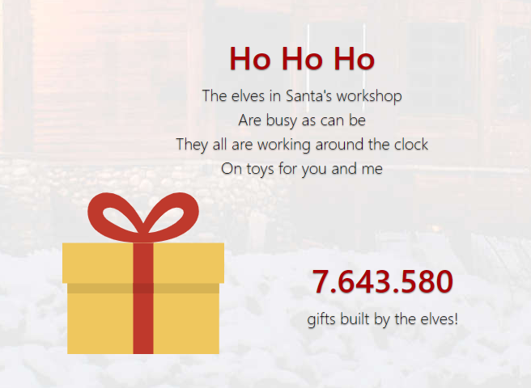
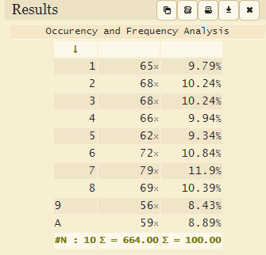

# HV19.15 Santa's Workshop

_The Elves are working very hard._

_Look at http://whale.hacking-lab.com:2080/ to see how busy they are._

---



This challenge was quite similar to [Day 13 - TrieMe](../day13/README.md). Either you solve it in a
couple of minutes or you will get stuck for hours.. Unfortunately, it was the second case for me.

Also, this was first challenge I wouldn't have solved without a good hint (thanks _Engy_).

## Failed attempts

### Analyze the gift number sequence
I collected a lots of numbers and made frequency analysis.

```
174a92952794487311526526478822118523392a941937794899261a72696a32a4668647a9627474a2137535a583439122988a2523595658a62a8a3758675432867638811696244473534996266133134644a65326aa853541873a572928568535756518662a41265a528257314a2962a59271212349a891472572a256a7716489442731846966725a1547a7221178765943a7137841473581227a43a337281778297761771871695718618943448344a6868a1893a131a884784663a7a4315813318869aa4a4253327411253146942477a5a984941a736243251aa36828965a517a69657311a7198712976553689233aa678563a7226963661558a171353219746495473485712636738738495877a2144a749a965a2897541366889735214883993152147197a2721673769648524613148839537988aa5a752a633918376847452526785969a878689267
```



The distributions is random. Moving on.

### Dig into MQTT messages
I also analyzed the MQTT messages on the byte level, checking against the spec 
http://docs.oasis-open.org/mqtt/mqtt/v3.1.1/os/mqtt-v3.1.1-os.pdf.
Nope, nothing here (luckily, the space was very small).

## The right solution

As one of the first things, I tried to wildcard the topic (i.e. setting the topic to `#`). It worked
but didn't help. I was still receiving the same messages.

I noticed that the client ID serves as a filter. You can't listen to messages from another client ID topic
(`HV19/gifts/SOME_OTHER_CLIENT_ID/`) does not work. I tried to push messages myself and used multiple client IDs.

I also tried to listen for [SYS-Ttopics](https://www.hivemq.com/blog/why-you-shouldnt-use-sys-topics-for-monitoring/)
but found nothing.

As it turned out, I should have been more careful here. There was a hint in _SYS-Topics_!
Change topic to `$SYS/#` to get the hint:
```
$SYS/broker/version: 'mosquitto version 1.4.11 (We elves are super-smart and know about CVE-2017-7650 and the POC. So we made a genious fix you never will be able to pass. Hohoho)'
```

The CVE is about wildcarding (`#` or `+`) the client ID. That sounds good! But the elves fixed it, somehow ..

This is where I stucked until being hinted. I knew that I need to manipulate the client ID somehow but
I couldn't figure out how.. I tried some encodings or appending null chars.

The correct bypass was to set the client ID to `YOUR_CLIENT_ID/#` and listen to topic `#`
(or `HV19/gifts/YOUR_CLIENT_ID/#`):

The flag was hidden in the name of the topic..
```
HV19/gifts/0541848161850547/HV19{N0_1nput_v4l1d4t10n_3qu4ls_d1s4st3r}: 'Congrats, you got it. The elves should not overrate their smartness!!!'
```

I don't know what was the best way how to solve this.. I definitely should have payed more attention
to the commented out line with `// var topic = 'HV19/gifts/'+clientid+'/flag-tbd';` ..

The flag is `HV19{N0_1nput_v4l1d4t10n_3qu4ls_d1s4st3r}`