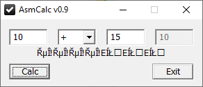
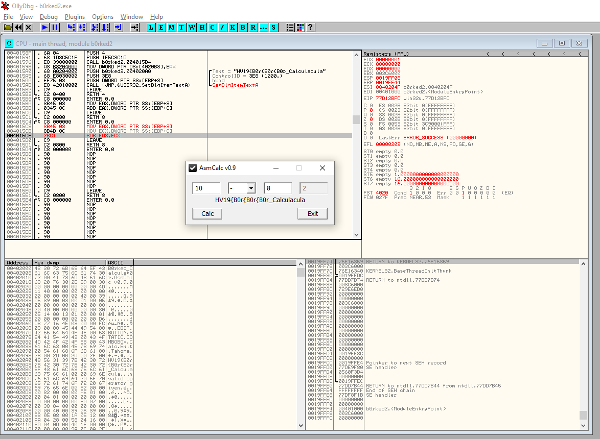
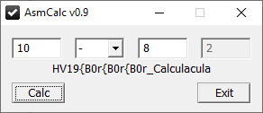
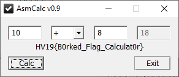

# HV19.16 B0rked Calculator

_Santa has coded a simple project for you, but sadly he removed all the operations._

_But when you restore them it will print the flag!_

[HV19.16-b0rked.zip](HV19.16-b0rked.zip)

---



The calculator is broken and we need to fix it. 

I started with _static analysis_ using [Ghidra](https://ghidra-sre.org/). There are only a few procedures. 
Some of them are about the GUI but, more interestingly, some are not implemented (just `NOP` instructions).

It's quite obvious we need to provide implementations for the basic arithmetic operations. The easiest way
is to _patch_ the binary. To my surprise, _Ghidra_ is
[not a good tool for patching binaries](https://github.com/NationalSecurityAgency/ghidra/issues/530).

I used [OllyDB](http://www.ollydbg.de/) again:



## Plus

The original:
```
004015B6  C8 000000      ENTER 0,0
004015BA  8B45 08        MOV EAX,DWORD PTR SS:[EBP+8]
004015BD  90             NOP
004015BE  90             NOP
004015BF  90             NOP
004015C0  C9             LEAVE
```

We have 3 bytes available. This is how I patched it:
```
004015B6  C8 000000      ENTER 0,0
004015BA  8B45 08        MOV EAX,DWORD PTR SS:[EBP+8]
004015BD  0345 0C        ADD EAX,DWORD PTR SS:[EBP+C]
004015C0  C9             LEAVE
004015D1  C2 0800        RETN 8
```

## Minus
```
004015C4  C8 000000      ENTER 0,0
004015C8  8B45 08        MOV EAX,DWORD PTR SS:[EBP+8]
004015CB  8B4D 0C        MOV ECX,DWORD PTR SS:[EBP+C]
004015CE  2BC1           SUB EAX,ECX
004015D0  C9             LEAVE
004015D1  C2 0800        RETN 8
```

The flag is showing up!



## Multiply
```
004015D4  C8 000000      ENTER 0,0
004015D8  8B45 08        MOV EAX,DWORD PTR SS:[EBP+8]
004015DB  8B4D 0C        MOV ECX,DWORD PTR SS:[EBP+C]
004015DE  F7E1           MUL ECX
004015E0  C9             LEAVE
004015E1  C2 0800        RETN 8
```

## Divide
I inspired here https://www.aldeid.com/wiki/X86-assembly/Instructions/div.

```
004015E4  C8 000000      ENTER 0,0
004015E8  33D2           XOR EDX,EDX
004015EA  8B45 08        MOV EAX,DWORD PTR SS:[EBP+8]
004015ED  8B4D 0C        MOV ECX,DWORD PTR SS:[EBP+C]
004015F0  F7F1           DIV ECX
004015F2  C9             LEAVE
004015F3  C2 0800        RETN 8
```

And we are done!



Nice, I really enjoyed this one and learnt something new.

The flag is `HV19{B0rked_Flag_Calculat0r}`