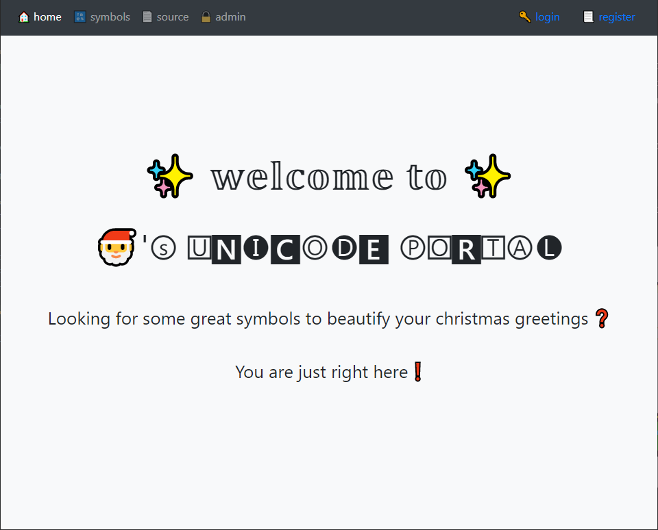
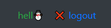
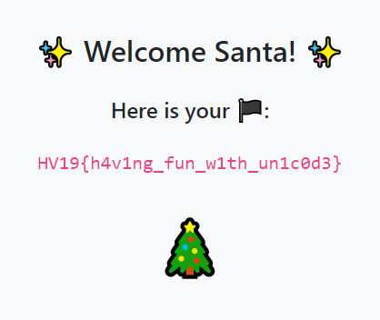

# HV19.17 Unicode Portal

_Buy your special gifts online, but for the ultimative gift you have to become admin._

http://whale.hacking-lab.com:8881/

---



The important staff is hidden under the _source_ tab:
```php
<?php

if (isset($_GET['show'])) highlight_file(__FILE__);

/**
 * Verifies user credentials.
 */
function verifyCreds($conn, $username, $password) {
  $usr = $conn->real_escape_string($username);
  $res = $conn->query("SELECT password FROM users WHERE username='".$usr."'");
  $row = $res->fetch_assoc();
  if ($row) {
    if (password_verify($password, $row['password'])) return true;
    else addFailedLoginAttempt($conn, $_SERVER['REMOTE_ADDR']);
  }
  return false;
}

/**
 * Determines if the given user is admin.
 */
function isAdmin($username) {
  return ($username === 'santa');
}

/**
 * Determines if the given username is already taken.
 */
function isUsernameAvailable($conn, $username) {
  $usr = $conn->real_escape_string($username);
  $res = $conn->query("SELECT COUNT(*) AS cnt FROM users WHERE LOWER(username) = BINARY LOWER('".$usr."')");
  $row = $res->fetch_assoc();
  return (int)$row['cnt'] === 0;
}

/**
 * Registers a new user.
 */
function registerUser($conn, $username, $password) {
  $usr = $conn->real_escape_string($username);
  $pwd = password_hash($password, PASSWORD_DEFAULT);
  $conn->query("INSERT INTO users (username, password) VALUES (UPPER('".$usr."'),'".$pwd."') ON DUPLICATE KEY UPDATE password='".$pwd."'");
}

/**
 * Adds a failed login attempt for the given ip address. An ip address gets blacklisted for 15 minutes if there are more than 3 failed login attempts.
 */
function addFailedLoginAttempt($conn, $ip) {
  $ip = $conn->real_escape_string($ip);
  $conn->query("INSERT INTO fails (ip) VALUES ('".$ip."')");
}

?>
```

Obviously, the use of `UPPER` and `LOWER` case conversions make no real sense here. Also, the whole
site is about Unicode so I focused on that. I registered a new user named `hell☃`.  It worked.



But how come that the name I see on the screen is not UPPER cased?

The next thing I tried is how the site handles [diacritics](https://en.wikipedia.org/wiki/Diacritic).
Being a Czech was kinda an advantage here, we use diacritics in half of the words :-) So I tried
to register one more user named `Včela`. It worked again. The name was, however, still displayed
in the original case..

So I tried to login as `VČELA` and `včela` and all worked. Then I tried `vcela`. Worked. Ok, now I
get it. All usernames are stored in UPPER case and stripped from diacritics (the side
effect of UPPER conversion with an inappropriate collation) but being displayed as typed into the login
form.

I registered the user named `sanťa` with password `qqq`. According to the source code, this should
override the password for real `santa`. I logged in as `santa` with password `qqq` and grabbed
the flag.



The flag is `HV19{h4v1ng_fun_w1th_un1c0d3}`