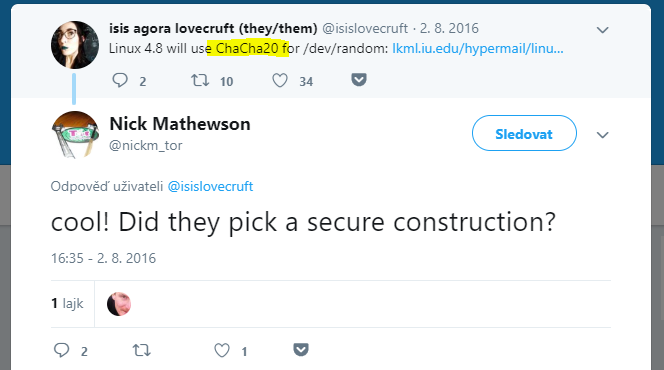
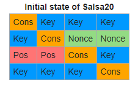

# HV19.18 Dance with me

_Santa had some fun and created todays present with a special dance. this is what he made up for you:_

```
096CD446EBC8E04D2FDE299BE44F322863F7A37C18763554EEE4C99C3FAD15
```

_Dance with him to recover the flag._

[HV19-dance.zip](HV19-dance.zip)

---

Let's start from the beginning.
```
$ file dance 
dance: Debian binary package (format 2.0)
```

Ok, it's a _deb_ package. I read some basic info on [wiki](https://en.wikipedia.org/wiki/Deb_%28file_format%29)
and then extracted the package contents.
```
$ ar t dance 
debian-binary
control.tar.gz
data.tar.lzma

$ tar xzfv control.tar.gz
.
./control

$ cat control
Package: com.hacking-lab.dance
Name: dance
Architecture: iphoneos-arm
Description: An awesome tool of some sort!!
Maintainer: hardlock
Author: hardlock
Section: System
Tag: role::hacker
Version: 0.0.1
Installed-Size: 196

$ tar --lzma -xvf data.tar.lzma 
.
./usr
usr/bin
usr/bin/dance

$ file usr/bin/dance 
usr/bin/dance: Mach-O universal binary with 3 architectures: [armv7:Mach-O armv7 executable, flags:<NOUNDEFS|DYLDLINK|TWOLEVEL|PIE>] [arm64:Mach-O 64-bit arm64 executable, flags:<NOUNDEFS|DYLDLINK|TWOLEVEL|PIE>]
```

Now we're finally getting to the binary. It's an interesting format.
See [Universal binary](https://en.wikipedia.org/wiki/Universal_binary) for details.
Unfortunately, it's for iOS so I can't run it (at least not without some emulators which I don't have experience with).

```
$ strings dance
...
Input your flag:
```

Looks like a classic crypto reverse challenge. You have a binary which can do only encryption,
you need to analyze it and find a way how to decrypt the flag.

Loading the binary into _Ghidra_ and selecting the binary for `aarch64` architecture.

The interesting procedures:

## entry
```
_printf(local_c0,"Input your flag: "); // read user input
_fgets(acStack224,0x20,*(FILE **)___stdinp);
sVar1 = _strlen(acStack224);
if (sVar1 != 0) { // if input is not empty, copy it into acStack224
_memcpy(&local_c0,acStack224,sVar1);
}
_dance(&local_c0,(ulonglong)sVar1,&local_80,0xb132d0a8e78f4511); // encrypt(plaintext, ptLength, key, nonce)
sVar1 = _strlen(acStack224);
if (sVar1 != 0) {
uVar3 = 0;
do {
  _printf("%02X"); // print in hex
  uVar3 = uVar3 + 1;
  sVar1 = _strlen(acStack224);
} while (uVar3 < sVar1);
}
```

In a nutshell, read the input plaintext into memory. If it's not empty then encrypt it using the procedure `_dance`
and then print the result to STD out in hex.

## _dance
```
byte local_64 [64]; // 64 byte (512 bit) key derived from the provided key and nonce
if (param_2 != 0) { // plaintext length
uVar1 = 0; // counter
do {
  if ((int)(uVar1 & 0x3f) == 0) { // if counter is 0
    _dance_block(local_98,param_3,param_4,uVar1 >> 6 & 0x3ffffff); // create an encryption key
  }
  *(byte *)(param_1 + uVar1) = *(byte *)(param_1 + uVar1) ^ local_98[uVar1 & 0x3f]; // xor plaintext with the encryption key
  uVar1 = uVar1 + 1;
} while (param_2 != uVar1);
}
```

Now it's getting to be interesting. We can see that there is some kind of _key generator_
(procedure `_dance_block`) which generates a 512 bit key derived from the secret key and nonce.
Then the derived key is simply xored with the plain text one byte at a time.

Let's find out how the key is generated!

## _dance_block
```
  local_68 = 0x61707865; // WHAT IS THIS? Magic constant #1
  local_64 = *param_2;
  local_60 = param_2[1];
  local_5c = param_2[2];
  local_58 = param_2[3];
  local_54 = 0x3320646e; // Magic constant #2
  uStack64 = 0x79622d32; // Magic constant #3
  local_3c = param_2[4];
  local_38 = param_2[5];
  local_34 = param_2[6];
  local_30 = param_2[7];
  uStack44 = 0x6b206574; // Magic constant #4
  uStack80 = magicConst;
  uStack72 = param_4;
  _dance_words(local_a8,&local_68);
  uVar1 = 0;
  uVar2 = 0;
  do {
    *(undefined *)(key + uVar2) =
         (char)(local_a8[uVar2 >> 2 & 0x3fffffff] >> (ulonglong)(uVar1 & 0x18));
    uVar2 = uVar2 + 1;
    uVar1 = uVar1 + 8;
  } while (uVar2 != 0x40);
```

I noticed that there are some _magic constants_ in the key generating function and that their bytes
are within a printable ASCII range. Let's decode:

```
0x61707865 0x3320646e 0x79622d32 0x6b206574 ==> apxe3 dnyb-2k et
```

Let's google that.. And I found this [tweet](https://twitter.com/nickm_tor/status/760620023614504960).



It mentions the cipher `ChaCha20`. _Cha cha_ is a dance which fits perfectly with the challenge description!
Looks like we might be dealing with this well-known streaming cipher. Actually, we're dealing with a similar one -
[Salsa20](https://en.wikipedia.org/wiki/Salsa20). 

I was able to identify the exact cipher type by comparing the disassembled code with _Salsa20_
[initial state](https://en.wikipedia.org/wiki/Salsa20#Structure):


(_ChaCha20_ is using a different initial state).

Perfect, now we know how the flag was encrypted! I got super excited and was going to score 3rd place (in my mind)
on this challenge. Then I failed to decrypt it for many hours ..
 
I did a stupid mistake in the _nonce_. I got the _endianness_ wrong. I lost most of the sleep that night because of that.
Lesson learned, I hope.

The correct key is: `0320634661b63cafaa76c27eea00b59bfb2f7097214fd04cb257ac2904efee46` (simply read it
from the binary data starting at `DAT_100007f50`) and the correct nonce is `11458fe7a8d032b1`. Both those
values are constructed in the `entry` procedure.

Just be careful that Ghidra shows it as `_dance(&local_c0,(ulonglong)sVar1,&local_80,0xb132d0a8e78f4511);`.
You must revert the bytes order (endianness)!

I used a Python implementation of [Salsa20](https://pycryptodome.readthedocs.io/en/latest/src/cipher/salsa20.html)
for decryption:
```python
from Crypto.Cipher import Salsa20

key = bytes.fromhex("0320634661B63CAFAA76C27EEA00B59BFB2F7097214FD04CB257AC2904EFEE46")
nonce = bytes.fromhex("11458FE7A8D032B1")
ciphertext = bytes.fromhex("096CD446EBC8E04D2FDE299BE44F322863F7A37C18763554EEE4C99C3FAD15")
cipher = Salsa20.new(key, nonce)
flag = cipher.decrypt(ciphertext)
print(flag) # prints b'HV19{Danc1ng_Salsa_in_ass3mbly}'
```

The flag is `HV19{Danc1ng_Salsa_in_ass3mbly}`