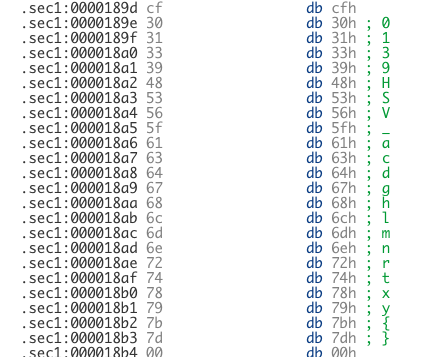

# HV19.22 The command ... is lost

_Santa bought this gadget when it was released in 2010. He did his own DYI project to control his
sledge by serial communication over IR. Unfortunately Santa lost the source code for it and doesn't
remember the command needed to send to the sledge. The only thing left is this file:
[thecommand7.data](thecommand7.data)_

_Santa likes to start a new DYI project with more commands in January, but first he needs
to know the old command. So, now it's on you to help out Santa._

---

The first leet challenge, let's see!

Googling for `100000000C9435000C945D000C945D000C945D0024` points us to [Arduino](https://www.arduino.cc/).
We know from the challenge description that Santa _bought this gadget when it was released in 2010_ which
points us specifically to [Arduino Uno](https://en.wikipedia.org/wiki/Arduino_Uno) and 
[Microchip ATmega328P](https://en.wikipedia.org/wiki/ATmega328). The important thing is that we should focus on `avr5`
architecture.

The next I was googling for some info on how to reverse it. Turns out that the support is not so good but there
is a couple of tools. Namely, I used:
- [disassembler.io](https://onlinedisassembler.com/static/home/index.html)
- [avr-objdump](http://ccrma.stanford.edu/planetccrma/man/man1/avr-objdump.1.html)
- [AVRDisassembler](https://github.com/twinearthsoftware/AVRDisassembler)

## disassembler.io
Not so great for actual reversing (or maybe I had use it improperly) but helped me a lot by showing me the alphabet
for the flag:



This data is surely used for constructing the flag!

I got a similar output using `avr-objdump`: 
```
$ avr-objdump -s -m avr5 thecommand7.data
...
0870 661f771f 881f991f 1a9469f7 60957095  f.w.......i.`.p.
0880 80959095 9b01ac01 bd01cf01 0895ee0f  ................
0890 ff1f0590 f491e02d 0994f894 ffcf3031  .......-......01
08a0 33394853 565f6163 6467686c 6d6e7274  39HSV_acdghlmnrt
08b0 78797b7d 00202020 20202020 20202020  xy{}.           
08c0 20202020 20202020 20202020 20202020                  
08d0 20202020 20202020 20202020 20202020                  
08e0 00000000 001d017d 00aa006a 01db00b9  .......}...j....
08f0 00cd000d 0a00                        ......   
```
See [thecommand7.dump](thecommand7.dump)

## AVRDisassembler
For the actual disassembling I used [AVRDisassembler](https://github.com/twinearthsoftware/AVRDisassembler) and
`avr-objdump -d -j .sec1 -m avr5 thecommand7.data`. The output is quite similar but I liked AVRDisassembler a bit 
better. See [AVRDisassembler.txt](AVRDisassembler.txt). I don't why but none of the tools was able to identify
the DATA section correctly. Luckily, I already knew it's there from the previous step.

Now, the idea was to simply look for the parts which are assembling the flag. And indeed there is something very
suspicious:
```
0584:	80-91-02-01 	lds r24, 0x0102       ; Load Direct from Data Space (32-bit)
0588:	80-93-34-01 	sts 0x0134, r24       ; Store Direct to Data Space
058C:	80-91-14-01 	lds r24, 0x0114       ; Load Direct from Data Space (32-bit)
0590:	80-93-1B-01 	sts 0x011b, r24       ; Store Direct to Data Space
0594:	80-91-11-01 	lds r24, 0x0111       ; Load Direct from Data Space (32-bit)
0598:	80-93-2A-01 	sts 0x012a, r24       ; Store Direct to Data Space
059C:	80-91-02-01 	lds r24, 0x0102       ; Load Direct from Data Space (32-bit)
05A0:	80-93-25-01 	sts 0x0125, r24       ; Store Direct to Data Space
05A4:	80-91-00-01 	lds r24, 0x0100       ; Load Direct from Data Space (32-bit)
05A8:	80-93-3C-01 	sts 0x013c, r24       ; Store Direct to Data Space
05AC:	80-91-02-01 	lds r24, 0x0102       ; Load Direct from Data Space (32-bit)
05B0:	80-93-22-01 	sts 0x0122, r24       ; Store Direct to Data Space
05B4:	80-91-13-01 	lds r24, 0x0113       ; Load Direct from Data Space (32-bit)
05B8:	80-93-1E-01 	sts 0x011e, r24       ; Store Direct to Data Space
05BC:	80-91-12-01 	lds r24, 0x0112       ; Load Direct from Data Space (32-bit)
05C0:	80-93-38-01 	sts 0x0138, r24       ; Store Direct to Data Space
05C4:	80-91-10-01 	lds r24, 0x0110       ; Load Direct from Data Space (32-bit)
...
```

The code is loading data (bytes) from similar addresses (`0x0102`, `0x0114`, `0x0111` ..) and storing it again into
a close range of addresses (`0x0134`, `0x011b`, `0x012a`, ..). The "DATA" addresses are reused (which is expected - some
letters will surely repeat) but the _storage_ addresses are unique. That looks good!

I recovered it by hand and ordered by the _storage_ address:
```
0x0117  0x0104  H
0x0118  0x0106  V
0x0119  0x0101  1
0x011a  0x0103  9
0x011b  0x0114  {
0x011c  0x0104  H
0x011d  0x0102  3
0x011e  0x0113  y
0x011f  0x0107  _
0x0120  0x0105  S
0x0121  0x010d  l
0x0122  0x0102  3
0x0123  0x010a  d
0x0124  0x010b  g
0x0125  0x0102  3
0x0126  0x0107  _
0x0127  0x010e  m 
0x0128  0x0102  3
0x0129  0x0102  3
0x012a  0x0111  t
0x012b  0x0107  _
0x012c  0x010e  m
0x012d  0x0102  3
0x012e  0x0107  _
0x012f  0x0108  a
0x0130  0x0111  t
0x0131  0x0107  _
0x0132  0x0111  t
0x0133  0x010c  h
0x0134  0x0102  3
0x0135  0x0107  _
0x0136  0x010f  n
0x0137  0x0102  3
0x0138  0x0112  x
0x0139  0x0111  t
0x013a  0x0107  _
0x013b  0x0109  c
0x013c  0x0100  0
0x013d  0x0110  r
0x013e  0x010f  n
0x013f  0x0102  3
0x0140  0x0110  r
0x0141  0x0115  }
```  
 
The flag is `HV19{H3y_Sl3dg3_m33t_m3_at_th3_n3xt_c0rn3r}`