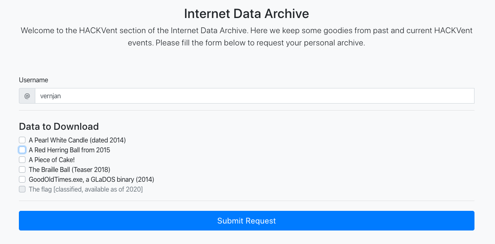
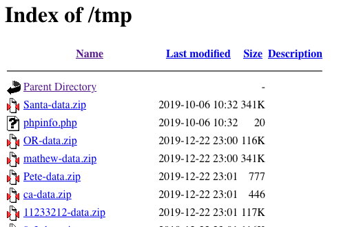

#

_Today's flag is available in the Internet Data Archive (IDA)._

http://whale.hacking-lab.com:23023/

---



The page offers download of older challenges. I tried to download ` The Braille Ball (Teaser 2018)`:


We got an OTP and a download link (`http://whale.hacking-lab.com:23023/tmp/vernjan-data.zip`).
I downloaded the archive, extract it (using the OTP) and compared the image with the one from the last year.
Images are identical (did `md5sum`). Nothing here most likely.

The next thing I tried was to download `The flag [classified, available as of 2020]`. The checkbox is disabled but
hey .. Using [Burp Suite](https://portswigger.net/burp) I captured the original request and changed its body to:
`username=vernjan&req%5B%5D=flag`. Didn't work. Server responded with: `Illegal Request`.


The next thing I focused on was the download link: `http://whale.hacking-lab.com:23023/tmp/vernjan-data.zip`.
I simply deleted the file name `vernjan-data.zip` with hope for directory traversal. Yeah! The `tmp` folder really
is traversable:



There already were lots of files so I sorted them by `Last modified`. There is `Santa-data.zip` and `phpinfo.php`.
Others were upload after the challenge had started (I'm in GMT +1 zone).
- `Santa-data.zip` is password protected. If it uses the same protection as other downloadable challenges then it's
12 random `[a-zA-Z0-9]` characters. Way too much to brute-force.
- `phpinfo.php` - See [phpinfo.html](phpinfo-day23.html). I compared it with my own version
[phpinfo-localhost.html](phpinfo-localhost.html) but found nothing useful.
 
## OTP analysis

I collected [300 OTPs](OTPs.txt):
```bash
for i in {1..300}; do
    curl -s -X POST http://whale.hacking-lab.com:23023/archive.php -d "username=xxx&req%5B%5D=candle" | grep "Your one-time Password" | grep -o "<strong>.*</strong>" | cut -c9-20 >> passwords.txt
done
```

I analyzed the OTPs using https://www.dcode.fr/frequency-analysis. 
Character distribution looks pretty random but 8 characters are not used at all: `0, 1, I, N, O, i, n o`.
This reduces the space from `62^12` to `54^12`. Still, not so great ..


santa returns http://whale.hacking-lab.com:23023/archive.php