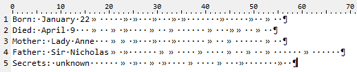

# HV19.H1 Hidden One
_Sometimes, there are hidden flags. Got your first?_

---

_Note: The challenge was released on [Day 6](../day06/README.md)._
 
At first, I was not sure where should I look for the flag. I crawled a bit the website
itself, did some port scans but without any luck. Then I decided to try to find one
more flag in [Day 6](../day06/README.md).

Looking at [Day 6](../day06/README.md) description, I felt like this information is superfluous:
```
Born: January 22	     	 	   	   	 	       	     	  	  
Died: April 9   	  	 	    	  	      	   		  	  
Mother: Lady Anne   		 	   	   	      	  	      	  
Father: Sir Nicholas	 	      		    	    	  	  	      	      
Secrets: unknown      	 	  	 	    	    	   	       	  
```

If you take a closer look (I inspected the raw [HTTP response](http-response.json)
containing the challenge description), you find out that there are extra tabs and spaces..



Ok, that's definitely something interesting .. I tried to convert to ones and zero and apply
_Bacon's cipher_ again. No luck. Then I tried binary to ASCII conversion. No luck.

The next idea was to google for `cipher tabs and spaces`. Bingo! I found this site
http://www.darkside.com.au/snow/description.html and then this
[stegsnow](http://manpages.ubuntu.com/manpages/bionic/man1/stegsnow.1.html) program.

I installed it using `apt` and executed on [hidden1.txt](hidden1.txt) file:
```
$ stegsnow -C hidden1.txt 
HV19{1stHiddenFound}
```

The flag is `HV19{1stHiddenFound}`