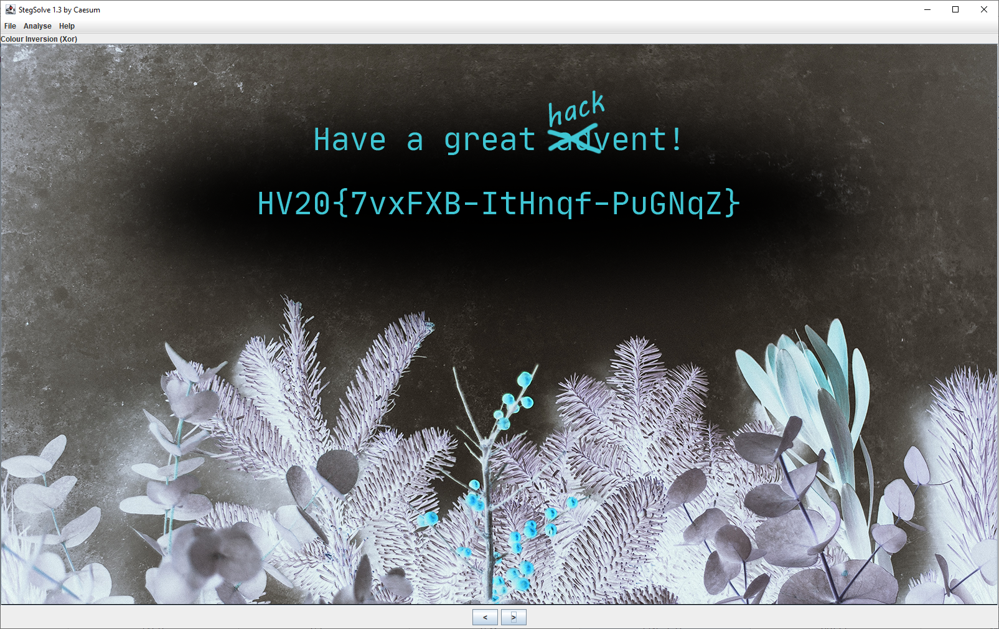

# HV20.01 Happy HACKvent 2020

_Welcome to this year's HACKvent._
 
_Attached you can find the "Official" invitation to the HackVent._

_One of my very young Cyber Elves cut some parts of the card with his alpha scissors._

_Have a great HACKvent,_

_– Santa_

---

Easy start. Let's see what's in the _alpha_ channel. I used [Stegsolve](http://www.caesum.com/handbook/stego.htm).

The flag is: `HV20{7vxFXB-ItHnqf-PuGNqZ}` 
