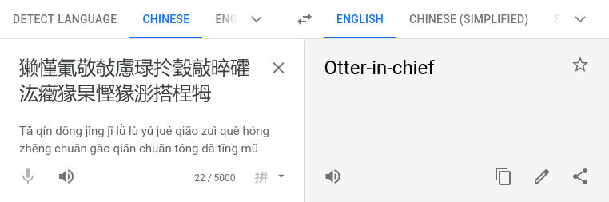

# HV20.02 Chinese Animals

_I've received this note from a friend, who is a Chinese CTF player_

恭喜！收旗爲：ＨＶ２０｛獭慬氭敬敧慮琭扵瑴敲晬礭汯癥猭杲慳猭浵搭桯牳ｅ｝

_Unfortunately, Google Translate wasn't of much help:_ 



_I suspect the data has somehow been messed up while transmitting it._

_Sadly, I can't ask my friend about more details. The Great Chinese Firewall is thwarting our attempts to reach each other, and there's no way I'm going to install WeChat on my phone._

---

Given the last `e` in the flag, I suspect this is some kind of encoding mess up.
I copied the flag (without the last `e`) and pasted it into https://r12a.github.io/app-conversion/ and I noticed
how it is encoded in `UTF-16`:


```
736D 616C 6C2D 656C 6567 616E 742D 6275 7474 6572 666C 792D 6C6F 7665 732D 6772 6173 732D 6D75 642D 686F 7273
```

Obviously, those are all ASCII characters glued together:
```
73 6D 61 6C 6C 2D 65 6C 65 67 61 6E 74 2D 62 75 74 74 65 72 66 6C 79 2D 6C 6F 76 65 73 2D 67 72 61 73 73 2D 6D 75 64 2D 68 6F 72 73
```

This decodes to:
```
small-elegant-butterfly-loves-grass-mud-hors
```

The flag is `HV20{small-elegant-butterfly-loves-grass-mud-horse}`

💡 Fun fact, `恭喜！收旗爲：` is a real Chinese and translates to:


