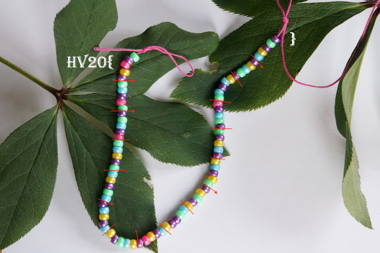
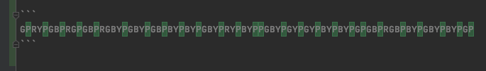

# HV20.04 Br❤️celet

_Santa was given a nice bracelet by one of his elves. Little does he know that the secret admirer has hidden a message in the pattern of the bracelet..._



---

Another _easy_ challenge 😂

I started with rewriting the bead colors into a machine-readable representation:
```
GPRYPGBPRGPGBPRGBYPGBYPGBPBYPBYPGBYPRYPBYPPGBYPGYPGYPBYPBYPGPGBPRGBPBYPGBYPBYPGP
G - Green, P - Purple, R - Red, Y - Yellow, B - Blue
```

Then doing my favorite [frequency analysis](https://www.dcode.fr/frequency-analysis):
```
P	26×	32.5%	
B	17×	21.25%	
G	16×	20%	
Y	16×	20%	
R	5×	6.25%	
TOTAL=80
```

Purple is by far the most common.
 
I got the idea when I highlighted purple bead positions:



- Purple beads are rather evenly distributed. 
- Colors NEVER repeat between purple beads.
- Once, two purple beads are neighbors. No other color can do that.

The logical conclusion is that **purple beads are dividers**!
 
Next, I replaced `P` with space for better visualisation:

```
G RY GB RG GB RGBY GBY GB BY BY GBY RY BY  GBY GY GY BY BY G GB RGB BY GBY BY G 
```

Looking good, another pattern has just emerged. The **order of colors is strictly given**!
The pattern is `RGBY`. Now we have a defined transformation to `1` and `0`:
```
G   -> 0100
RY  -> 1001
GB  -> 0110
...
```

To avoid stupid mistakes, I wrote a small decoder:
```kotlin
fun cz.vernjan.ctf.hv20.cz.vernjan.ctf.hv20.cz.vernjan.ctf.hv20.main() {
    val beads = "GPRYPGBPRGPGBPRGBYPGBYPGBPBYPBYPGBYPRYPBYPPGBYPGYPGYPBYPBYPGPGBPRGBPBYPGBYPBYPGP"

    val flag = beads.split('P').dropLast(1)
        .map { group ->
            "RGBY".map { color -> if (group.contains(color)) "1" else "0" }.joinToString("")
        }
        .map { Integer.parseInt(it, 2) }
        .map { it.toHex() }
        .chunked(2)
        .map { it.joinToString("") }
        .joinToString("") { it.hexToAscii() }

    println(flag)
}
```

The output is:
```
GPRYPGBPRGPGBPRGBYPGBYPGBPBYPBYPGBYPRYPBYPPGBYPGYPGYPBYPBYPGPGBPRGBPBYPGBYPBYPGP
[G, RY, GB, RG, GB, RGBY, GBY, GB, BY, BY, GBY, RY, BY, , GBY, GY, GY, BY, BY, G, GB, RGB, BY, GBY, BY, G]
[0100, 1001, 0110, 1100, 0110, 1111, 0111, 0110, 0011, 0011, 0111, 1001, 0011, 0000, 0111, 0101, 0101, 0011, 0011, 0100, 0110, 1110, 0011, 0111, 0011, 0100]
[4, 9, 6, c, 6, f, 7, 6, 3, 3, 7, 9, 3, 0, 7, 5, 5, 3, 3, 4, 6, e, 3, 7, 3, 4]
[49, 6c, 6f, 76, 33, 79, 30, 75, 53, 34, 6e, 37, 34]
Ilov3y0uS4n74
```

The flag is `HV20{Ilov3y0uS4n74}`
