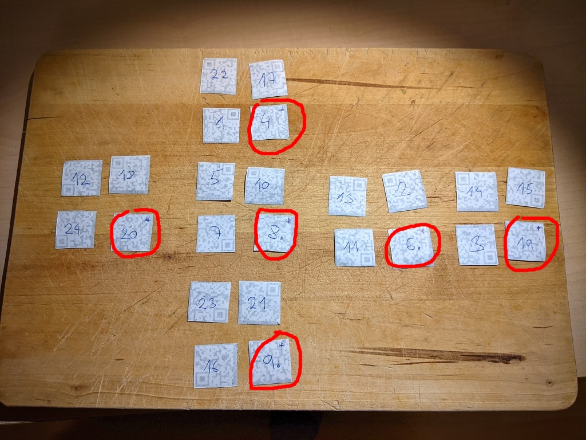

# HV20.06 Twelve steps of christmas

_On the sixth day of Christmas my true love sent to me..._
 
_six valid QRs,_  
_five potential scrambles,_  
_four orientation bottom and right,_  
_and the rest has been said previously._


[PDF version](qr-cube.pdf)

## Requirements
- a printer

## Hints
- selbmarcs
- The black lines are important - do not remove them

---

Oh boy, this one took me a long time...

Brute-forcing was most likely the easiest way in this case, but I decided to **do it manually**.

Not having a Rubik's cube at home, my first attempt was to create one. It was real fun, back to kids age.


The inner cube was made out of solid paper, and the corners were attached with small pins. 
However, the manipulation proved to be very cumbersome.

Next, I decided to do it with a pen and paper in 2D. In the beginning, it looked kind of complicated but after a couple
of rounds, it was very mechanical.


 
I used a few improvements:
- Numbering system on the back of QR code pieces
- Taking photos after each round for easy reverting in case of mistake
- I didn't bother with rotation. It will be obvious how to fit the QR code once I have the correct parts.
- Asterisks to mark the "bottom right" QR code pieces. I knew if I do well, there will be just one in each group.
- And finally, this awesome sight to help me visualize it in the beginning https://ruwix.com/online-rubiks-cube-solver-program/

After a few hours...



Of course, before getting here, I hit a few traps:
- Not doing the steps in backwards. This is the correct undo procedure:
  ```
  1) L2 B  R2 B2 L2 - R' B2 F' R2 D
  2) R  F' D' U2 B  - D' B2 F2 D U 
  3) L  F' D  R' B2 - L U2 D R2 F2    
  4) B  R  F2 D  U' - R2 B' U L' B2 !!! THIS IS THE ONE !!!
  5) R' D' L2 D  R' - L2 D U F2 U' 
  ```
- Making silly mistakes in the moves
- Pondering what the hell this `-` in the middle means

The last step was to _read_ those QR codes. I had to do this on PC. Cutting the pieces and joining them back together.
QR codes are [here](QRs).

QR codes messages:
```
HV20{Erno_
Rubik_would
_be_proud.
Petrus_is
_Valid.
#HV20QRubicsChal}
```

The flag is `HV20{Erno_Rubik_would_be_proud.Petrus_is_Valid.#HV20QRubicsChal}`
