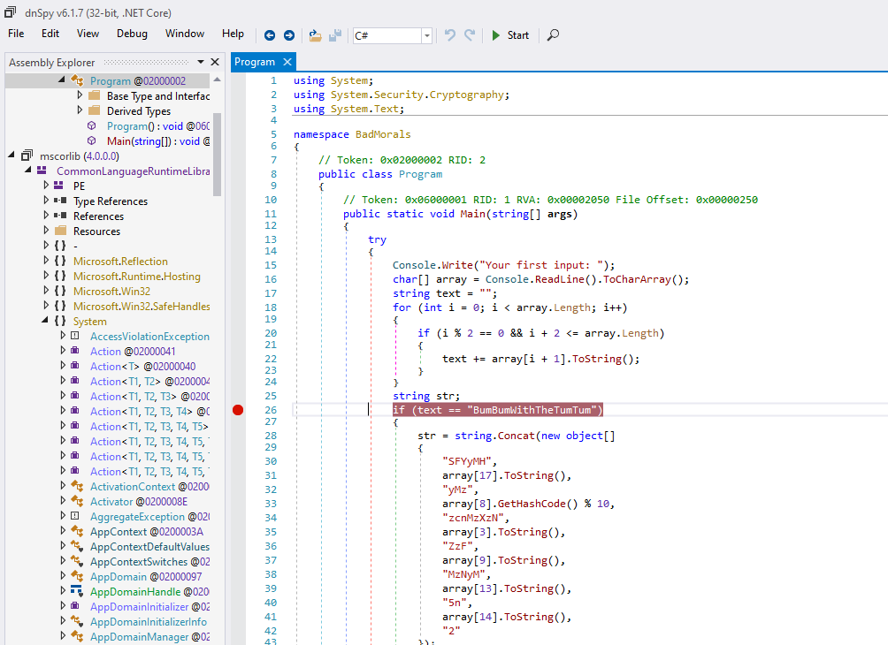

# HV20.07 Bad morals

_One of the elves recently took a programming 101 course. Trying to be helpful, he implemented a program for Santa to generate all the flags for him for this year's HACKvent 2020. The problem is, he can't remember how to use the program any more and the link to the documentation just says `404 Not found`. I bet he learned that in the Programming 101 class as well._

_Can you help him get the flag back?_

[BadMorals.exe](BadMorals.exe)

---

As usual, let's see what's the file is about:
```
$ file BadMorals.exe 
santa.exe: PE32 executable (console) Intel 80386 Mono/.Net assembly, for MS Windows 
```

I tried [Ghidra](https://ghidra-sre.org/) and [Hopper](https://www.hopperapp.com/) for reversing,
but they were not useful at all.

Then I discovered this awesome tool [dnSpy](https://github.com/dnSpy/dnSpy/releases) which made the challenge
rather easy. This tool can (at least on Windows):
- reverse to source code
- run the program with debugger



Here is the source code [BadMorals.cs](BadMorals.cs).

We need to get 3 inputs:
- Input 1 is tricky as it's not fully deterministic at first: `XBXuXmXB?uXmXW?iXtXhXTXhXeXTXuXmXTXuXm`. There are 2 `?`
  we will need to brute-force.
- Input 2 is easy, just reverse `BackAndForth` to `htroFdnAkcaB`
- Input 3 is about reverting a simple algorithm:
  ```kotlin
  val s = "DinosAreLit"
  var b = 42
  for (i in s.indices) {
      print(s[i].toInt().xor(b).toChar())
      b += i - 4
  }
  // Prints nOMNSaSFjC[
  ```
  
Finally, all the inputs are combined into one, and the SHA-1 digest is verified. We need to do a very small brute-force
to get the input 1 correctly:
```kotlin
val sha1Expected = listOf(107, 64, 119, 202, 154, 218, 200, 113, 63, 1, 66, 148, 207, 23, 254, 198, 197, 79, 21, 10)

fun main() {

    for (unknown1 in 0..9) {
        for (unknown2 in ('A'..'Z')) { // Try all Base64 valid chars

            val s1 = "SFYyMHtyMz%dzcnMzXzNuZzFuMzNyMW5n%s200ZDNfMzRzeX0=".format(unknown1, unknown2.toString())
            val a1 = Base64.getDecoder().decode(s1)
            val s2 = "Q1RGX3hsNHoxbmnf"
            val a2 = Base64.getDecoder().decode(s2)

            val a3 = a1.mapIndexed { index, b -> b.xor(a2[index % a2.size]) }.toByteArray()

            val sha1 = MessageDigest.getInstance("SHA-1")
                    .digest(a3).toList().map { it.toUByte().toInt() }

            if (sha1 == sha1Expected) {
                println("YES!!")
                println(s1.decodeBase64()) // The flag
                exitProcess(0)
            }
        }
    }
}
```

The flag is `HV20{r3?3rs3_3ng1n33r1ng_m4d3_34sy}`
