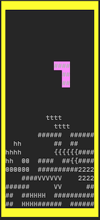

# HV20.08 The game

_Let's play another little game this year. Once again, as every year, I promise it is hardly obfuscated._

[Download](tetris.pl)

## Requirements
Perl

---

Let's start with running the game:



Tetris! Even the source code looks like Tetris - nice!

Tetris blocks seems to compose the flag. No way I'm gonna play it though.
Let's find some nice hack!

We will need to de-obfuscate. First step is easy, replace the first `eval` with `print`:
```perl
use
Term::ReadKey;
ReadMode 5;
$ |= 1;
print "\ec\e[2J\e[?25l\e[?7l\e[1;1H\e[0;0r";
@FF = split			//,'####H#V#2#0#{#h#t#t#p#s#:#/#/#w#w#w#.#y#o#u#t#u#b#e#.#c#o#m#/#w#a#t#c#h#?#v#=#d#Q#w#4#w#9#W#g#X#c#Q#}####';@BB=(89,51,30,27,75,294);$w=11;$h=23;print("\e[1;1H\e[103m".(' 'x(2*$w+2))."\e[0m\r\n".(("\e[103m \e[0m".(' 'x(2*$w))."\e[103m \e[0m\r\n")x$h)."\e[103m".(' 'x(2*$w+2))."\e[2;1H\e[0m");sub bl{($b,$bc,$bcc,$x,$y)=@_;for$yy(0..2){for$xx(0..5){print("\e[${bcc}m\e[".($yy+$y+2).";".($xx+$x*2+2)."H${bc}")if((($b&(0b111<<($yy*3)))>>($yy*3))&(4>>($xx>>1)));}}}sub r{$_=shift;($_&4)<<6|($_&32)<<2|($_&256)>>2|($_&2)<<4|($_&16)|($_&128)>>4|($_&1)<<2|($_&8)>>2|($_&64)>>6;}sub _s{($b,$bc,$x,$y)=@_;for$yy(0..2){for$xx(0..5){substr($f[$yy+$y],($xx+$x),1)=$bc if(((($b & (0b111<<($yy*3)))>>($yy*3))&(4>>$xx)));}}$Q='QcXgWw9d4';@f=grep{/ /}@f;unshift @f,(" "x$w)while(@f<$h);p();}sub cb{$_Q='ljhc0hsA5';($b,$x,$y)=@_;for$yy(0..2){for$xx(0..2){return 1 if(((($b&(0b111<<($yy*3)))>>($yy*3))&(4>>$xx))&&(($yy+$y>=$h)||($xx+$x<0)||($xx+$x>=$w)||(substr($f[$yy+$y],($xx+$x),1) ne ' ')));}}}sub p{for$yy(0..$#f){print("\e[".($yy+2).";2H\e[0m");$_=$f[$yy];s/./$&$&/gg;print;}};sub k{$k='';$k.=$c while($c=ReadKey(-1));$k;};sub n{$bx=5;$by=0;$bi=int(rand(scalar @BB));$__=$BB[$bi];$_b=$FF[$sc];$sc>77&&$sc<98&&$sc!=82&&eval('$_b'."=~y#$Q#$_Q#")||$sc==98&&$_b=~s/./0/;$sc++;}@f=(" "x$w)x$h;p();n();while(1){$k=k();last if($k=~/q/);$k=substr($k,2,1);$dx=($k eq 'C')-($k eq 'D');$bx+=$dx unless(cb($__,$bx+$dx,$by));if($k eq 'A'){unless(cb(r($__),$bx,$by)){$__=r($__)}elsif(!cb(r($__),$bx+1,$by)){$__=r($__);$bx++}elsif(!cb(r($__),$bx-1,$by)){$__=r($__);$bx--};}bl($__,$_b,101+$bi,$bx,$by);select(undef,undef,undef,0.1);if(cb($__,$bx,++$by)){last if($by<2);_s($__,$_b,$bx,$by-1);n();}else{bl($__," ",0,$bx,$by-1);}}sleep(1);ReadMode 0;print"\ec";
```

I went through the code and reformat it a bit.

Here is the partially [de-obfuscated code](tetris-deobfuscated.pl) with some notes.

I was intrigued, mainly, by this sub:
```perl
@FF = split	//,'####H#V#2#0#{#h#t#t#p#s#:#/#/#w#w#w#.#y#o#u#t#u#b#e#.#c#o#m#/#w#a#t#c#h#?#v#=#d#Q#w#4#w#9#W#g#X#c#Q#}####';

# New block
sub n {
  $bx=5; # Start X position
  $by=0;
  $bi=int(rand(scalar @BB)); # Random block type
  $__=$BB[$bi];
  $_b=$FF[$sc]; # Block letter
  # What is this !!!
  $sc > 77 && $sc <98 && $sc != 82 && eval('$_b'."=~y#$Q#$_Q#") || $sc==98 && $_b=~s/./0/;
  $sc++; # Step counter
}
```

I tried to submit the original flag `HV20{https://www.youtube.com/watch?v=dQw4w9WgXcQ}` and,
of course, it was not accepted. Then I noticed that this **subroutine is replacing some letters**:
```perl
eval('$_b'."=~y#$Q#$_Q#")
```
- See docs for [y](https://www.geeksforgeeks.org/perl-y-operator/) operator
- `$Q` is a search list (`QcXgWw9d4`)
- `$_Q` is a replacement list (`ljhc0hsA5`)

I rewrote this code in Kotlin:
```kotlin
fun main() {
    val searchList = "QcXgWw9d4"
    val replacementList = "ljhc0hsA5"

    "####H#V#2#0#{#h#t#t#p#s#:#/#/#w#w#w#.#y#o#u#t#u#b#e#.#c#o#m#/#w#a#t#c#h#?#v#=#d#Q#w#4#w#9#W#g#X#c#Q#}####"
        .forEachIndexed { i, c ->
            if (c != '#') {
                if (i > 77 && i < 98 && i != 82) {
                    val index = searchList.indexOf(c)
                    print(replacementList[index])
                } else if (i == 98) {
                    print("0")
                } else {
                    print(c)
                }
            }
        }
}
```

It prints out the flag `HV20{https://www.youtube.com/watch?v=Alw5hs0chj0}`

---

💡 Fun fact, pressing `q` quits the game!

#
