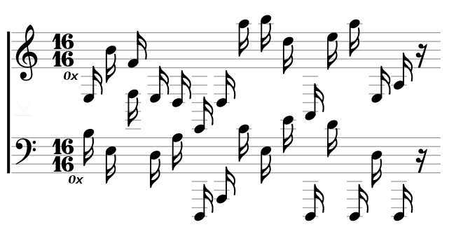
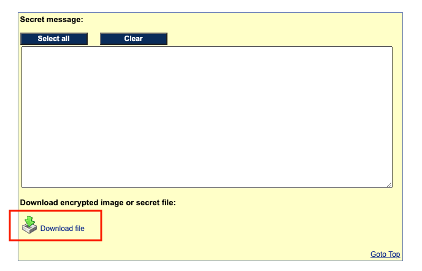
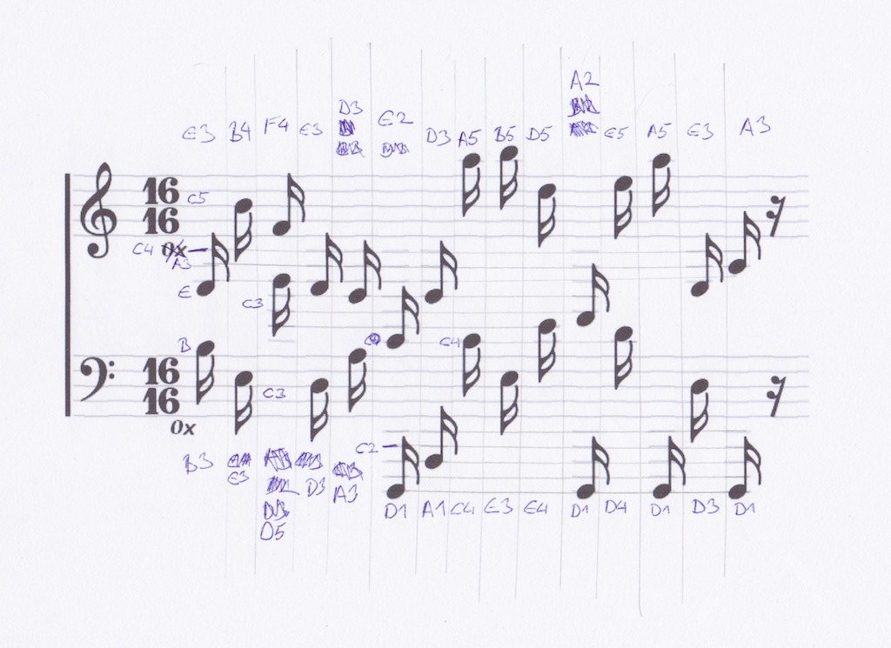
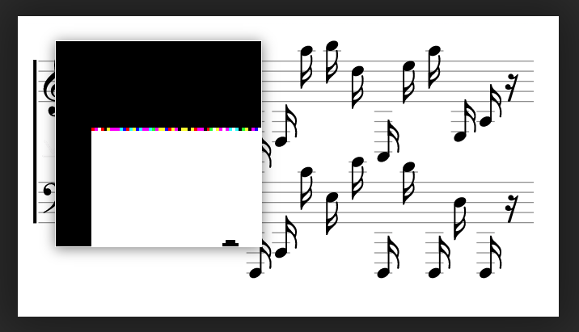

# HV20.11 Chris'mas carol

_Since yesterday's challenge seems to have been a bit on the hard side, we're adding a small musical innuendo to relax._

_My friend Chris from Florida sent me this score. Enjoy! Is this what you call postmodern?_



_He also sent [this image](miami.png), but that doesn't look like Miami's skyline to me._

---

Staring at the musical sheet sparked no idea, and so I moved to the _image_:


One of the usual things I do when doing steganalysis is an image reverse search. This time it was a good call.
I used https://tineye.com/ and it pointed me to https://www.mobilefish.com/services/steganography/steganography.php.
On this page, there is **exactly the same image** (md5s matches). So, we can rule out any deep analysis of this image
and save some time. Apparently, the only purpose of this image was to bring us to this site. 

This site offers a steganography tool. I tried to use it on the musical sheet. The UI is rather bad, and so
I totally missed for the first time, that a file [flag.zip](flag.zip) was extracted!



The file is, of course, protected by a password. Back to the musical sheet!

I had a really hard time cracking it. After some hints, here is how you do it:
Each note has a name (a, b, c, d, e, f, g) based on its vertical position (I knew that) but also a number
depending on the [octave](https://en.wikipedia.org/wiki/Octave)! See the wiki for more details.



Here is the rewrite:
```
e3 b4 f4 e3 d3 e2 d3 a5 b5 d5 a2 e5 a5 e3 a3
b3 e3 d5 d3 a3 d1 a1 c4 e3 e4 d1 d4 d1 d3 d1
```

XOR the lines and get the password: `PW!0p3raV1s1t0r`

Finally, unzip the archive and get the flag:
```
$ 7z x flag.zip -p'PW!0p3raV1s1t0r'
$ cat flag.txt 
HV20{r3ad-th3-mus1c!}
```

The flag is `HV20{r3ad-th3-mus1c!}`

---

💡 Fun fact, you can see the embedded archive file in `carol.png`.
It's on the very first line in LSBs
(using https://29a.ch/photo-forensics/#forensic-magnifier):



You can even read it (but it's encrypted):
```kotlin
fun main() {
    val image = Resources.asImage("hv20/notes.png")
    val message = (0 until image.width).map { x ->
        Color(image.getRGB(x, 0), true)
    }.map {
        decodeColor(it.red) + decodeColor(it.green) + decodeColor(it.blue)
    }.joinToString("")
        .chunked(8).map { Integer.parseInt(it, 2).toChar() }.joinToString("")

    println(message)
}

fun decodeColor(value: Int) = if (value == 254) "1" else "0"

// h>RS8tJTNeryiwAAA==`8MC/BmZjFmYGRIZlDq7ApkAAJDI ...
```
