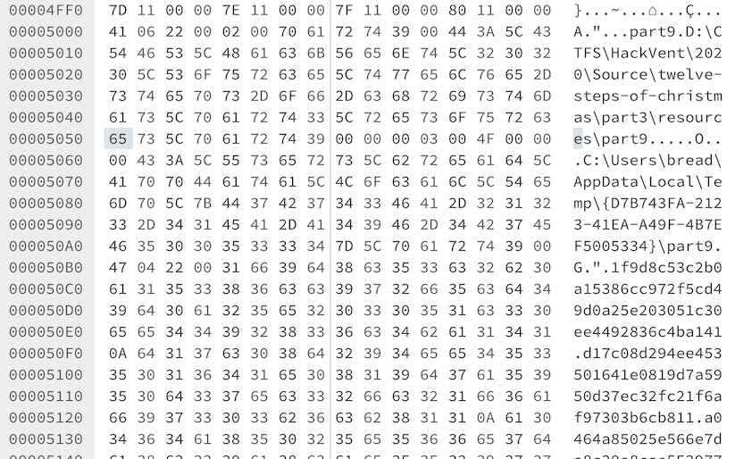
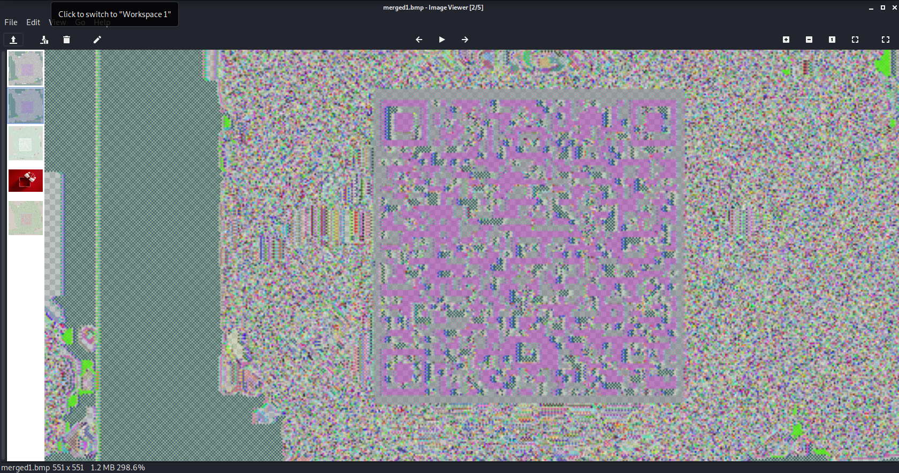
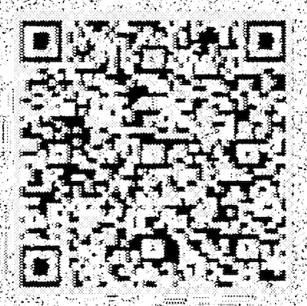

# HV20.13 Twelve steps of christmas

_On the ninth day of Christmas my true love sent to me..._

_nineties style xls,  
eighties style compression,  
seventies style crypto,  
and the rest has been said previously._

[Download](list.xls)

## Hints

- _Wait, Bread is on the Nice list? Better check that comment again..._

---

I started with the comment (as the hint suggests). It says:
```
Not a loaf of bread which is mildly disappointing 1f 9d 8c 42 9a 38 41 24 01 80 41 83 8a 0e f2 39 78 42 80 c1 86 06 03 00 00 01 60 c0 41 62 87 0a 1e dc c8 71 23 Why was the loaf of bread upset? His plan were always going a rye. How does bread win over friends? “You can crust me.” Why does bread hate hot weather? It just feels too toasty.
```

Okay, I think I will get back to this one later...

Next, I was browsing through the XLS file in a hex editor. There is
a big chunk of hex encoded data:



I dumped the data into [data.txt](data.txt) and decoded it:
```
$ cat data.txt | xxd -r -p > something
$ file something
something: compress'd data 12 bits
```

The file starts with `1F 9D` which points to `tar zip`.
See [List of file signatures](https://en.wikipedia.org/wiki/List_of_file_signatures).

Let's unpack it:
```
$ mv something data.z
$ gunzip data.z
$ file data
data: openssl enc'd data with salted password
```

It's encrypted. Based on the challenge description, my guess is
[DES](https://en.wikipedia.org/wiki/Data_Encryption_Standard) in
[ECB](https://en.wikipedia.org/wiki/Block_cipher_mode_of_operation#Electronic_codebook_(ECB))
(there are obvious patterns in the encrypted data which is typical for ECB).

Back to the "Bread's comment". It also starts with `1F 9D`! Let's do the same here:
```
$ echo 1f9d8c429a384124018041838a0ef239784280c186060300000160c04162870a1edcc87123 | xxd -r -p | gunzip > comment
$ file comment
comment: PC bitmap, Windows 98/2000 and newer format, 551 x 551 x 32
```

It's an image! Actually, it's just an image header. See https://en.wikipedia.org/wiki/BMP_file_format.

I got an idea to merge those two files together...
```
$ cat comment data > merged.bmp
```

The image can't be opened :-(

After this moment, I tried tons of other things with no result.

Many hours later, after a hint, I learned that my first idea was correct... It's a bit of luck here.
On macOS, I was unable to open the image and there was no image preview. On the other hand, in Kali, the
BMP image was rendered (of course not perfect, data is encrypted):



After some Gimp-foo. I turned it into this:



Not perfect, but cell-phone QR code reader was able to read it.

The flag is `HV20{U>watchout,U>!X,U>!ECB,Im_telln_U_Y.HV2020_is_comin_2_town}`
