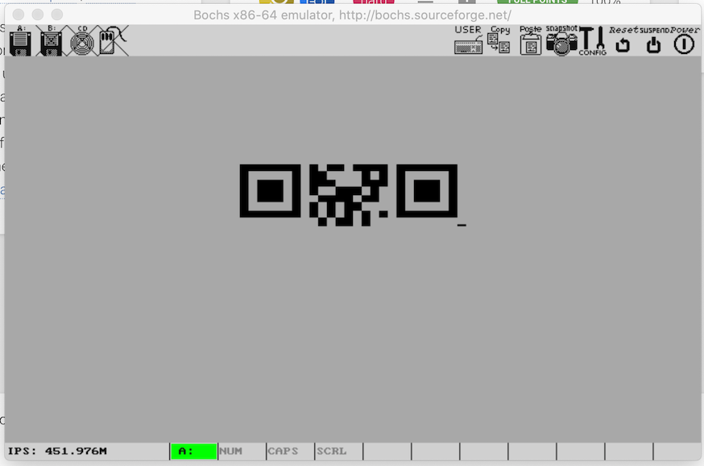
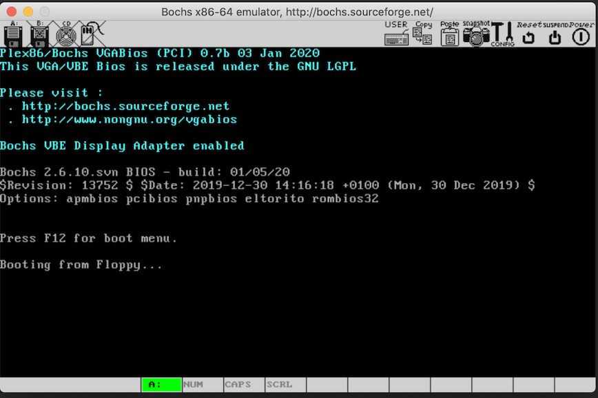
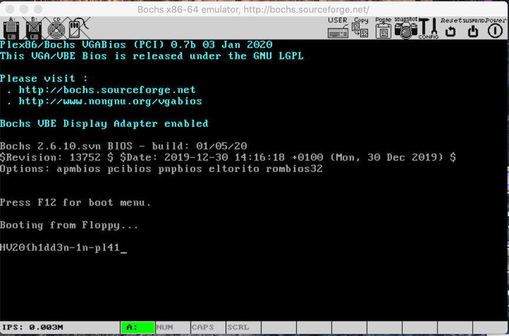
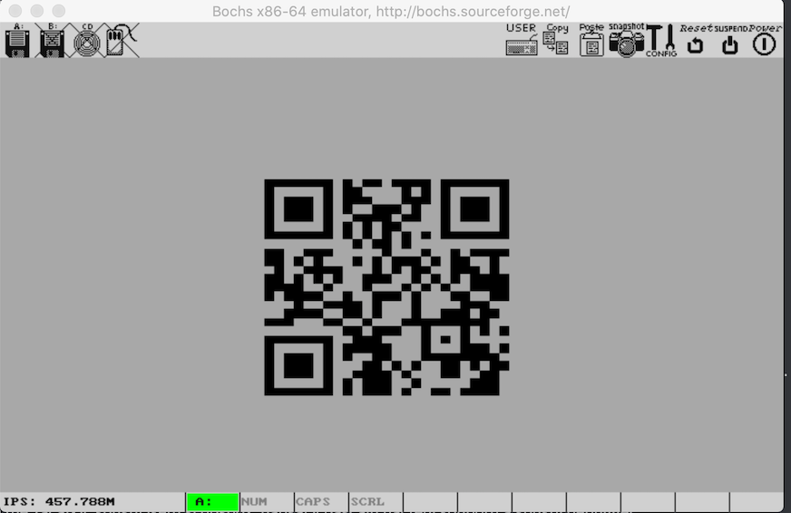

# HV20.14 Santa's Special GIFt

_Today, you got a strange GIFt from Santa:_


_You are unsure what it is for. You do happen to have some wood lying around, but the tool seems to be made for metal. You notice how it has a rather strange size. You could use it for your fingernails, perhaps? If you keep looking, you might see some other uses..._

---

Fire up the hex editor and let's see what's inside. The first thing which
caught my attention was this string: `uvag:--xrrc-tbvat`. Googling for it
quickly revealed it's rot13 encrypted: `hint:--keep-going`.

This string is followed by `00 3B 00 00 55 AA`. `00 3B` marks the end of
a GIF file. So this `00 00 55 AA` should not be there...

Let's google for it. All results point to [Master Boot Record](https://en.wikipedia.org/wiki/Master_boot_record).
The file size fits for MBR (512 bits) and the offset of `55 AA` is also correct (at `0x01FE`).

Next, I googled for _reversing MBR_. Lots of good staff available online.
I found this article https://countuponsecurity.com/2017/07/02/analysis-of-a-master-boot-record-eternalpetya/
to be the most helpful.

I installed [Bochs](https://en.wikipedia.org/wiki/Bochs) and started to play around.
It's a very nice tool. After some time, I was able to put it to use.

Here is a simple config file `bochsrc.txt`:
```
megs: 32
floppya: 1_44=tool.gif, status=inserted
boot: a
log: bochsout.txt
```

Make sure `tool.gif` is in the same folder and start the emulator:
```
$ bochs
========================================================================
                       Bochs x86 Emulator 2.6.11
              Built from SVN snapshot on January 5, 2020
                Timestamp: Sun Jan  5 08:36:00 CET 2020
========================================================================
...
You can also start bochs with the -q option to skip these menus.

1. Restore factory default configuration
2. Read options from...
3. Edit options
4. Save options to...
5. Restore the Bochs state from...
6. Begin simulation
7. Quit now

Please choose one: [6]
```

I began the simulation [6]:
```
00000000000i[      ] lt_dlhandle is 0x7fd83f60af70
00000000000i[PLUGIN] loaded plugin libbx_sdl2.so
00000000000i[      ] installing sdl2 module as the Bochs GUI
00000000000i[SDL2  ] maximum host resolution: x=3360 y=2100
00000000000i[      ] using log file bochsout.txt
Next at t=0
(0) [0x0000fffffff0] f000:fff0 (unk. ctxt): jmpf 0xf000:e05b          ; ea5be000f0
<bochs:1>
```

Enter `c` (continue). The emulator will show this:



Looking good but yet somehow broken...

The next step is to use the [built-in debugger](http://bochs.sourceforge.net/doc/docbook/user/internal-debugger.html) and fix it.
If you are familiar with [GDB](https://www.gnu.org/software/gdb/), this is kinda similar.

One more important thing to know is **where to place your breakpoint**. It's  at `0x7c00`.
Read [How to DEBUG System Code using The Bochs Emulator on a Windows™ PC](https://thestarman.pcministry.com/asm/bochs/bochsdbg.html).

Begin a new simulation and before pressing `c`, set the breakpoint:
```
<bochs:2> lb 0x7c00
```

Then press `c`:



At this point, MBR is getting loaded. 
I started stepping through the code. Enter `n` (next) and repeat many times.
The (hidden) flag starts to appear!



The hidden flag is `HV20{h1dd3n-1n-pl41n-516h7}`

Back to the QR code. We need to fix the instructions to display the whole damn thing.

After some fiddling with debugger, printing registry values and disassembling
instructions I was able to figure out what to do:
- Set breakpoint at `0x7c7b` (beginning of the loop printing the QR code)
- Disassemble instructions: `u 0x7c7b 0x7d00`:
  ```
  0000000000007c5b: (                    ): cmp si, 0x00e0            ; 81fee000
  0000000000007c5f: (                    ): jnz .+2 (0x00007c63)      ; 7502
  ```
  This is the issue. `si` holds the number of QR blocks to print, and it is decrementing. It should be compared to `0x0000`,
  not with `0x00e0`. This causes the premature termination of the printing loop. I fixed the instruction right in the GIF file.
  It's easy to find it, there are not many `e0` bytes. It's located at `0x005d`. Change it to `00`.
  
Run [tool-patched.gif](tool-patched.gif) and scan the full QR.



The flag is `HV20{54n74'5-m461c-b00t-l04d3r}`
