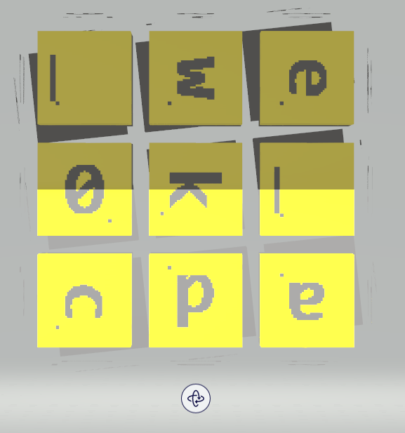

# HV20.16 Naughty Rudolph

_Santa loves to keep his personal secrets on a little toy cube he got from a kid called Bread. Turns out that was not a very good idea. Last night Rudolph got hold of it and frubl'd it about five times before spitting it out. Look at it! All the colors have come off! Naughty Rudolph!_

[Download](cube.stl)

---

[STL](https://en.wikipedia.org/wiki/STL_(file_format)) is a format for 3D models. I opened the file with Windows native
[Paint 3D](https://en.wikipedia.org/wiki/Paint_3D). There is, again, a Rubik's cube:


I added colors to make the characters readable:

 

At this point, I thought it's gonna be easy... According the description, Rudolph "frubl'd it about five times".
I took that literally, and started reversing it as `d'lb'u'r'f'`. I did it in Excel:


No flag appeared. Then I thought I should do 5x `d'lb'u'r'f'`. So I recorded Excel marcos to make it fast.
Even though it worked quite nice, it was not the right solution.

The goal of this challenge was, indeed, to **brute-force all the possible moves**.

Shame I wasted 2 hours doing ^^ but it came handy when I started programming the challenge.
The full source code is a bit long so you can read it [here](../../../src/main/kotlin/cz/vernjan/ctf/hv20/Day16.kt).
 
This is just a snippet:
```kotlin
fun main() {
    for (move1 in Move.values()) {
        println("Move: $move1")
        for (move2 in Move.values()) {
            for (move3 in Move.values()) {
                for (move4 in Move.values()) {
                    for (move5 in Move.values()) {
                        cube = cloneCube(cubeOrig)
                        move1.doIt()
                        move2.doIt()
                        move3.doIt()
                        move4.doIt()
                        move5.doIt()
                        val result = readCube()
                        if (result.matches("^HV20\\{.*}$".toRegex())) {
                            println(result)
                            println("$move1 -> $move2 -> $move3 -> $move4 -> $move5")
                            printCubeIn2D()
                        }
                    }
                }
            }
        }
    }
}
```

It prints:
```
First move: LEFT
First move: LEFT2
First move: LEFT_R
HV20{no_sle3p_sihce_4wks_lea_5_tr_n_hi6tscoae_a7olds@}
LEFT_R -> FRONT_R -> RIGHT -> BACK_R -> RIGHT2
[#, #, #] [H, V, 2] [#, #, #] [#, #, #]
[#, #, #] [0, {, n] [#, #, #] [#, #, #]
[#, #, #] [o, _, s] [#, #, #] [#, #, #]
[l, e, 3] [e, _, 4] [a, _, 5] [h, i, 6]
[p, _, s] [w, k, s] [_, t, r] [t, s, c]
[i, h, c] [_, l, e] [_, n, _] [o, a, e]
[#, #, #] [_, a, 7] [#, #, #] [#, #, #]
[#, #, #] [o, l, d] [#, #, #] [#, #, #]
[#, #, #] [s, @, }] [#, #, #] [#, #, #]

HV20{no_sle3p_since_4wks_lead5_to_@_hi6hscore_a7_last}
LEFT_R -> BACK_R -> DOWN -> FRONT_R -> RIGHT2
[#, #, #] [H, V, 2] [#, #, #] [#, #, #]
[#, #, #] [0, {, n] [#, #, #] [#, #, #]
[#, #, #] [o, _, s] [#, #, #] [#, #, #]
[l, e, 3] [e, _, 4] [a, d, 5] [h, i, 6]
[p, _, s] [w, k, s] [_, t, o] [h, s, c]
[i, n, c] [_, l, e] [_, @, _] [o, r, e]
[#, #, #] [_, a, 7] [#, #, #] [#, #, #]
[#, #, #] [_, l, a] [#, #, #] [#, #, #]
[#, #, #] [s, t, }] [#, #, #] [#, #, #]

First move: RIGHT
First move: RIGHT2
First move: RIGHT_R
First move: UP
First move: UP2
First move: UP_R
First move: DOWN
First move: DOWN2
First move: DOWN_R
First move: FRONT
First move: FRONT2
First move: FRONT_R
First move: BACK
HV20{ncsele_s_aida_w7lka4r3__5@too__hi6hs_ocestenl_sp}
BACK -> LEFT_R -> DOWN_R -> BACK_R -> RIGHT_R
[#, #, #] [H, V, 2] [#, #, #] [#, #, #]
[#, #, #] [0, {, n] [#, #, #] [#, #, #]
[#, #, #] [c, s, e] [#, #, #] [#, #, #]
[l, e, _] [_, w, 7] [_, _, 5] [h, i, 6]
[s, _, a] [l, k, a] [@, t, o] [h, s, _]
[i, d, a] [4, r, 3] [o, _, _] [o, c, e]
[#, #, #] [s, t, e] [#, #, #] [#, #, #]
[#, #, #] [n, l, _] [#, #, #] [#, #, #]
[#, #, #] [s, p, }] [#, #, #] [#, #, #]

First move: BACK2
First move: BACK_R
```

There are 3 possible flags (I neglected character rotations in my solution) but obviously,
this one correct: `HV20{no_sle3p_since_4wks_lead5_to_@_hi6hscore_a7_last}`

---

I might be a bit lucky with choosing the default cube orientation. I took the one I saw in Paint 3D before doing
any manipulations:


