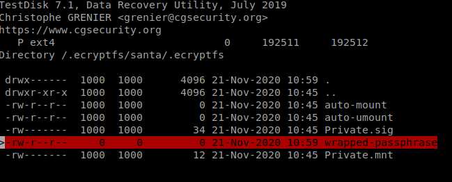
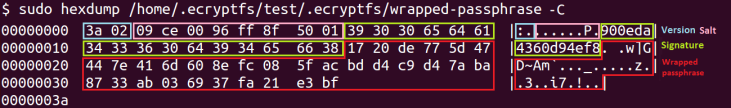

# HV20.18 Santa's lost home

_Santa has forgotten his password and can no longer access his data. While trying to read the hard disk from another computer he also destroyed an important file. To avoid further damage he made a backup of his home partition. Can you help him recover the data._

_When asked he said the only thing he remembers is that he used his name in the password... I thought this was something only a `real human` would do..._

[Backup](backup.bz2)

## Hints

- _It's not rock-science, it's station-science!_
- _Use default options_

---

Unzip the backup and do some basics:
```
$ bzip2 -d backup.bz2
$ file backup
backup: Linux rev 1.0 ext2 filesystem data, UUID=5a9bec26-3f99-4101-bc44-153139202629 (extents) (64bit) (large files) (huge files)
$ fdisk -l backup
Disk backup: 94 MiB, 98566144 bytes, 192512 sectors
Units: sectors of 1 * 512 = 512 bytes
Sector size (logical/physical): 512 bytes / 512 bytes
I/O size (minimum/optimal): 512 bytes / 512 bytes
```

Alright, let's mount it:
```
$ cd /mnt/hv18 && mount -o loop backup /mnt/hv18
$ ls -la /mnt/hv18
total 32
drwxr-xr-x 3 root   root    4096 Nov 21 10:45 .ecryptfs
drwx------ 2 root   root   16384 Nov 21 10:40 lost+found
dr-x------ 2 hacker hacker  4096 Nov 21 10:45 santa
```

Folder `.ecryptfs` points to [ECryptfs](https://en.wikipedia.org/wiki/ECryptfs).
Otherwise, there is a bunch of encrypted files. I read some basics about
[How to use eCryptfs on Linux](https://linuxhint.com/ecryptfs_linux/) and then about
[How to crack Ubuntu encryption and passwords](https://research.kudelskisecurity.com/2015/08/25/how-to-crack-ubuntu-disk-encryption-and-passwords/).

According to this article (and based on the challenge description) there is an important file missing.
The file is `/home/.ecrpytfs/$USER/.ecrpytfs/wrapped-passphrase`.

Once we have this file, we can start cracking the password. So let's try to recover it.

The first tool I tried was [TestDisk](https://en.wikipedia.org/wiki/TestDisk). It was able to show
the deleted file but not to recover it:



The file is there, but it has 0 size.

I was unable to find any tool to recover the file. At last, I was able to dig it out using `debugfs`:
```
$ debugfs backup
debugfs 1.45.5 (07-Jan-2020)
debugfs: dump_unused
Unused block 19 contains non-zero data:

�;9��Z��&?�A�D19 &)w$g
Unused block 20 contains non-zero data:

�;9��U���n�U
Unused block 21 contains non-zero data:

��_��_��_@��A`�_��_��_

...

Unused block 1815 contains non-zero data:

# ~/.bash_logout: executed by bash(1) when login shell exits.

# when leaving the console clear the screen to increase privacy

if [ "$SHLVL" = 1 ]; then
    [ -x /usr/bin/clear_console ] && /usr/bin/clear_console -q
fi

Unused block 23552 contains non-zero data:

:�#�/f���051119b0bace0ab6۸�G�������"����W�-xegta20o�
```

It's a bit of mess, but I knew I was looking for this pattern `[0-9a-f]{16}`:



There is one match! The very last block:
```
Unused block 23552 contains non-zero data:

:�#�/f���051119b0bace0ab6۸�G�������"����W�-xegta20o�
```

I could have just searched through the `backup` file... 🤦

Carve out the file:
```
$ dd if=backup of=wrapped-passphrase bs=1 skip=$((0x05C00000)) count=58
58+0 records in
58+0 records out
58 bytes copied, 0.0104722 s, 5.5 kB/s
$ xxd wrapped-passphrase 
00000000: 3a02 a723 b12f 66bc feaa 3035 3131 3139  :..#./f...051119
00000010: 6230 6261 6365 3061 6236 dbb8 dd00 478f  b0bace0ab6....G.
00000020: a189 aec3 cbe5 2294 f4ca d157 fe2d 7865  ......"....W.-xe
00000030: 6774 611f 321b 9930 6fc7                 gta.2..0o.
```

Nevermind, the main point is that we have `wrapped-passphrase` now, and we can start cracking it.

## Cracking wrapped-passphrase

The first step is preparing a file to crack for [John The Ripper](https://www.openwall.com/john/). There is a handy python script
[ecryptfs2john.py](https://github.com/openwall/john/blob/bleeding-jumbo/run/ecryptfs2john.py) just for that:
```
$ ./ecryptfs2john.py wrapped-passphrase > hashfile
$ cat hashfile
wrapped-passphrase:$ecryptfs$0$1$a723b12f66bcfeaa$051119b0bace0ab6
```

Cracking the file is not that easy. You need to apply all the hints provided in the challenge description:

- **It's not rock-science, it's station-science!** points to using a wordlist from [CrackStation](https://crackstation.net/crackstation-wordlist-password-cracking-dictionary.htm)
  (`rockyou.txt` is a very popular wordlist)
- **real human** points to a _Smaller Wordlist (Human Passwords Only)_ from CrackStation
- **thing he remembers is that he used his name in the password** - we can eliminate most of the passwords from the wordlist.
  This is very important, because cracking a single password is rather slow. It requires 5,000 SHA-512 computations.
  On my i3 8100 (4 cores), I was able to check ~500 passwords per second.
- **Use default options** for John The Ripper

Prepare the wordlist:
```
$ grep -i santa realhuman_phill.txt > santa-passwords.txt
$ wc -l santa-passwords.txt 
13852 santa-passwords.txt
```

13,852 passwords to check, that's looking good!

Now we have all we need, let's get the job done:
```
$ john --wordlist=santa-passwords.txt hashfile
Using default input encoding: UTF-8
Loaded 1 password hash (eCryptfs [SHA512 256/256 AVX2 4x])
Will run 4 OpenMP threads
Press 'q' or Ctrl-C to abort, almost any other key for status
think-santa-lives-at-north-pole (wrapped-passphrase)
1g 0:00:00:25 DONE (2020-12-18 21:01) 0.03892g/s 518.1p/s 518.1c/s 518.1C/s teensanta..tierrasanta100
Use the "--show" option to display all of the cracked passwords reliably
Session completed
```

The passphrase is `think-santa-lives-at-north-pole`.

Finally, the last step - decrypt the files:
```
$ cp wrapped-passphrase /mnt/hv18/.ecryptfs/santa/.ecryptfs/
$ cd /mnt/hv18/.ecryptfs/santa/
$ ecryptfs-recover-private .Private 
INFO: Found [.Private].
Try to recover this directory? [Y/n]: y
INFO: Found your wrapped-passphrase
Do you know your LOGIN passphrase? [Y/n] y
INFO: Enter your LOGIN passphrase...
Passphrase: 
Inserted auth tok with sig [7b4f67408a83013e] into the user session keyring
INFO: Success!  Private data mounted at [/tmp/ecryptfs.pE94fWYa].
```

Decrypted files were mounted at `/tmp/ecryptfs.pE94fWYa`:
```
$ cat /tmp/ecryptfs.pE94fWYa/flag.txt
HV20{a_b4ckup_of_1mp0rt4nt_f1l35_15_3553nt14l}
```
