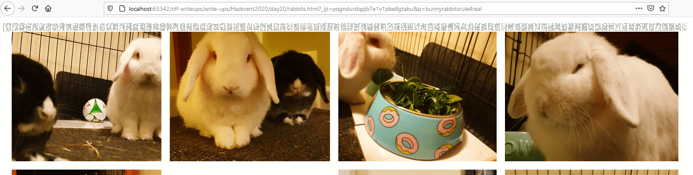
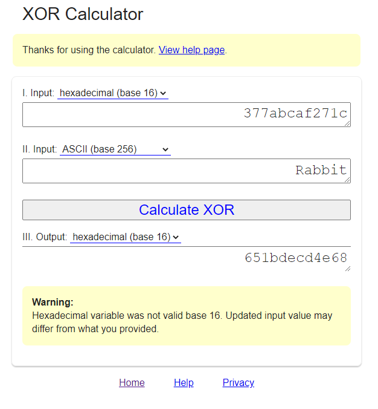
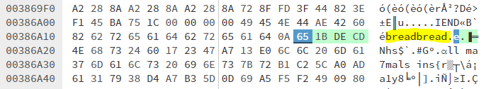
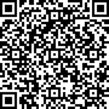

# HV20.20 Twelve steps of Christmas

_On the twelfth day of Christmas my true love sent to me..._  
_twelve rabbits a-rebeling,_  
_eleven ships a-sailing,_  
_ten (twentyfourpointone) pieces a-puzzling,_  
_and the rest is history._


---

Run `exiftool` or open the image in a hex editor and notice that there is an [embedded HTML page](rabbits.html) inside.

To make the page work, change `` to `` and either revert the SHA-1
hash `60DB15C4E452C71C5670119E7889351242A83505` (which is `bunnyrabbitsrule4real`) or comment the `passwd` check out.

Load the page in any a web server (doesn't work if you open it as a local file), append `?p=bunnyrabbitsrule4real`
and _click_ anywhere in the image. A secret file [11.py](11.py) gets decoded and downloaded.



## 11.py
```python
import sys
i = bytearray(open(sys.argv[1], 'rb').read().split(sys.argv[2].encode('utf-8') + b"\n")[-1])
j = bytearray(b"Rabbits are small mammals in the family Leporidae of the order Lagomorpha (along with the hare and the pika). Oryctolagus cuniculus includes the European rabbit species and its descendants, the world's 305 breeds[1] of domestic rabbit. Sylvilagus includes 13 wild rabbit species, among them the seven types of cottontail. The European rabbit, which has been introduced on every continent except Antarctica, is familiar throughout the world as a wild prey animal and as a domesticated form of livestock and pet. With its widespread effect on ecologies and cultures, the rabbit (or bunny) is, in many areas of the world, a part of daily life-as food, clothing, a companion, and a source of artistic inspiration.")
open('11.7z', 'wb').write(bytearray([i[_] ^ j[_ % len(j)] for _ in range(len(i))]))
```

The script requires 2 arguments (a file - `rabbits.png`), and a _split pattern_. To determine the split pattern,
I XORed the expected result (7z magic header `37 7a bc af 27 1c`) with the word `Rabbit`:



Looking for `65 1b de cd` in `rabbits.png` points to split pattern `bread`:



Run the script:
```
$ python3 11.py rabbits.png bread
```

New file `11.7z` is created.

```
$ file 11.7z     
11.7z: 7-zip archive data, version 0.4
```

Looks good!

## 11.7z

Unzip and get `11.tar`. Untar and get:
```
$ ls                    
1c63adeddbefb62258429939a0247538742b10dfd7d95cdc55c5ab76428ec974       ab2b751e14409f169383b5802e61764fb4114839874ff342586ffa4f968de0c1  manifest.json
1d66b052bd26bb9725d5c15a5915bed7300e690facb51465f2d0e62c7d644649.json  bc7f356b13fa5818f568082beeb3bfc0f0fe9f9424163a7642bfdc12ba5ba82b  repositories
7184b9ccb527dcaef747979066432e891b7487867de2bb96790a01b87a1cc50e       e0f45634ac647ef43d22d4ea46fce543fc1d56ed338c72c712a6bc4ddb96fd46
```

This is a **Docker image**!

You can import it with `docker load < 11.tar` but it's useless in this case.

## Docker image 12stepsofchristmas:11

Docker image is "reverse friendly". Let's start with `1d66b052bd26bb9725d5c15a5915bed7300e690facb51465f2d0e62c7d644649.json`:
```json
{
  "architecture": "amd64",
  "config": {
    "User": "bread",
    "Env": [
      "PATH=/usr/local/sbin:/usr/local/bin:/usr/sbin:/usr/bin:/sbin:/bin"
    ],
    "Cmd": [
      "/bin/sh",
      "-c",
      "tail -f /dev/null"
    ],
    "WorkingDir": "/home/bread/",
    "ArgsEscaped": true,
    "OnBuild": null
  },
  "created": "2020-12-08T14:41:59.119577934+11:00",
  "history": [
    {
      "created": "2020-10-22T02:19:24.33416307Z",
      "created_by": "/bin/sh -c #(nop) ADD file:f17f65714f703db9012f00e5ec98d0b2541ff6147c2633f7ab9ba659d0c507f4 in / "
    },
    {
      "created": "2020-10-22T02:19:24.499382102Z",
      "created_by": "/bin/sh -c #(nop)  CMD [\"/bin/sh\"]",
      "empty_layer": true
    },
    {
      "created": "2020-12-08T14:41:33.015297112+11:00",
      "created_by": "RUN /bin/sh -c apk update \u0026\u0026 apk add  --update-cache --repository http://dl-3.alpinelinux.org/alpine/edge/testing/ --allow-untrusted steghide xxd # buildkit",
      "comment": "buildkit.dockerfile.v0"
    },
    {
      "created": "2020-12-08T14:41:33.4777984+11:00",
      "created_by": "RUN /bin/sh -c adduser --disabled-password --gecos '' bread # buildkit",
      "comment": "buildkit.dockerfile.v0"
    },
    {
      "created": "2020-12-08T14:41:33.487504964+11:00",
      "created_by": "WORKDIR /home/bread/",
      "comment": "buildkit.dockerfile.v0"
    },
    {
      "created": "2020-12-08T14:41:59.119577934+11:00",
      "created_by": "RUN /bin/sh -c cp /tmp/t/bunnies12.jpg bunnies12.jpg \u0026\u0026 steghide embed -e loki97 ofb -z 9 -p \"bunnies12.jpg\\\\\\\" -ef /tmp/t/hidden.png -p \\\\\\\"SecretPassword\" -N -cf \"bunnies12.jpg\" -ef \"/tmp/t/hidden.png\" \u0026\u0026 mkdir /home/bread/flimflam \u0026\u0026 xxd -p bunnies12.jpg \u003e flimflam/snoot.hex \u0026\u0026 rm -rf bunnies12.jpg \u0026\u0026 split -l 400 /home/bread/flimflam/snoot.hex /home/bread/flimflam/flom \u0026\u0026 rm -rf /home/bread/flimflam/snoot.hex \u0026\u0026 chmod 0000 /home/bread/flimflam \u0026\u0026 apk del steghide xxd # buildkit",
      "comment": "buildkit.dockerfile.v0"
    },
    {
      "created": "2020-12-08T14:41:59.119577934+11:00",
      "created_by": "USER bread",
      "comment": "buildkit.dockerfile.v0",
      "empty_layer": true
    },
    {
      "created": "2020-12-08T14:41:59.119577934+11:00",
      "created_by": "CMD [\"/bin/sh\" \"-c\" \"tail -f /dev/null\"]",
      "comment": "buildkit.dockerfile.v0",
      "empty_layer": true
    }
  ],
  "os": "linux",
  "rootfs": {
    "type": "layers",
    "diff_ids": [
      "sha256:ace0eda3e3be35a979cec764a3321b4c7d0b9e4bb3094d20d3ff6782961a8d54",
      "sha256:f9a8379022de9f439ace90e2104d99b33559d08c2e21255914d27fdc0051e0af",
      "sha256:1c50319140b222d353c0d165923ddc72c017da86dc8f56fa77826c53eba9c20d",
      "sha256:5f70bf18a086007016e948b04aed3b82103a36bea41755b6cddfaf10ace3c6ef",
      "sha256:56553910173dbbe9836893f8e0a081a58208ad47385b66fbefad69caa5e687e1"
    ]
  }
}
```

We are mainly interested in this line:
```
"RUN /bin/sh -c cp /tmp/t/bunnies12.jpg bunnies12.jpg \u0026\u0026 steghide embed -e loki97 ofb -z 9 -p \"bunnies12.jpg\\\\\\\" -ef /tmp/t/hidden.png -p \\\\\\\"SecretPassword\" -N -cf \"bunnies12.jpg\" -ef \"/tmp/t/hidden.png\" \u0026\u0026 mkdir /home/bread/flimflam \u0026\u0026 xxd -p bunnies12.jpg \u003e flimflam/snoot.hex \u0026\u0026 rm -rf bunnies12.jpg \u0026\u0026 split -l 400 /home/bread/flimflam/snoot.hex /home/bread/flimflam/flom \u0026\u0026 rm -rf /home/bread/flimflam/snoot.hex \u0026\u0026 chmod 0000 /home/bread/flimflam \u0026\u0026 apk del steghide xxd # buildkit"
```

There is an evil catch. The `steghide` password is very confusing. To make sense out of it, **unescape the json first**:
```
RUN /bin/sh -c cp /tmp/t/bunnies12.jpg bunnies12.jpg &&
 steghide embed -e loki97 ofb -z 9 -p "bunnies12.jpg\" -ef /tmp/t/hidden.png -p \"SecretPassword" -N -cf "bunnies12.jpg" -ef "/tmp/t/hidden.png" &&
 mkdir /home/bread/flimflam && xxd -p bunnies12.jpg > flimflam/snoot.hex && rm -rf bunnies12.jpg && split -l 400 /home/bread/flimflam/snoot.hex /home/bread/flimflam/flom && rm -rf /home/bread/flimflam/snoot.hex && chmod 0000 /home/bread/flimflam && apk del steghide xxd # buildkit
```

We need to this backwards. Go into `flimflam` folder in layer `ab2b751e14409f169383b5802e61764fb4114839874ff342586ffa4f968de0c1`
and join the parts back together:
```
$ cd flimflam
$ for f in flom*; do cat $f >> flom; done
$ cat flom | xxd -r -p > flom.jpg
```

This is `flom.jpg`:


## steghide

Finally, extract the secret image (passphrase is `bunnies12.jpg\" -ef /tmp/t/hidden.png -p \"SecretPassword`):
```
$ steghide extract -sf flom.jpg -xf secretfile
Enter passphrase: 
wrote extracted data to "secretfile".

$ file secretfile
secretfile: PNG image data, 185 x 185, 8-bit gray+alpha, non-interlaced

$ mv secretfile secretfile.png
```



The flag is `HV20{My_pr3c10u5_my_r363x!!!,_7hr0w_17_1n70_7h3_X1._-_64l4dr13l}`
