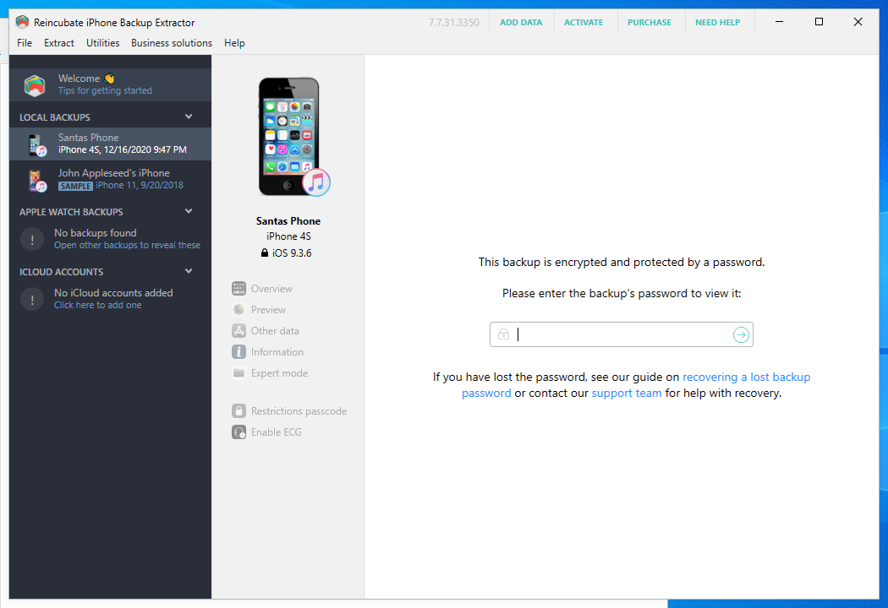
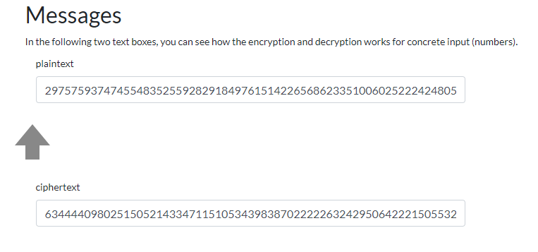

# HV20.23 Those who make backups are cowards!

_Santa tried to get an important file back from his old mobile phone backup. Thankfully he left a post-it note on his phone with the PIN. Sadly Rudolph thought the Apple was real and started eating it (there we go again...). Now only the first of eight digits, a **2**, is still visible..._

_But maybe you can do something to help him get his important stuff back?_

## Hints

- _If you get stuck, call Shamir_

[Download](backup.rar)

---

Backup contents:
```
$ file *
000cae3437db21095a85771716e6874f92ce7593: data
012707a2ae34d77a28b16a9e443b780ea4e6b0aa: data
01a14737bf725839e60201704f5e0447e23800a6: data
...
DDNABackup.plist:                         XML 1.0 document, ASCII text
...
fe4618d750f01049b6b82e988f8f0227cda1ab8d: data
fe987f9baac32e5744aa4e8238bdd5f21f283653: data
ff72d8290d991b3aa58cc2bc6e306434fd47d566: data
Info.plist:                               XML 1.0 document, ASCII text
Manifest.mbdb:                            data
Manifest.plist:                           Apple binary property list
Status.plist:                             Apple binary property list
```

From `Info.plist`:
```
<key>Last Backup Date</key>
<date>2020-12-16T20:47:32Z</date>
<key>Product Name</key>
<string>iPhone 4S</string>
<key>Product Type</key>
<string>iPhone4,1</string>
<key>Product Version</key>
<string>9.3.6</string>
```

This is an encrypted backup created with iTunes `12.11.0.26`.

The first step is getting the PIN. We know it's 8 digits and starts with `2`.

[hashcat](https://hashcat.net/hashcat/) can crack _iTunes backups_.

1) https://github.com/philsmd/itunes_backup2hashcat
  ```
  $ ./itunes_backup2hashcat.pl backup/Manifest.plist > hashfile
  $ cat hashfile
  itunes_backup$*9*892dba473d7ad9486741346d009b0deeccd32eea6937ce67070a0500b723c871a454a81e569f95d9*10000*0834c7493b056222d7a7e382a69c0c6a06649d9a**
  ```  

2) Run hashcat
  ```
  $ hashcat -m 14700 -a 3 hashfile '2?d?d?d?d?d?d?d'
  ```
  The pin is `20201225`

Once we have the pin, we can view the backup. I used [IPhone Backup Extractor](https://www.iphonebackupextractor.com/):



Enter the pin `20201225`.

The hint tells us: "If you get stuck, call Shamir".

Browse into contacts. There are 2 contacts:
```
M 6344440980251505214334711510534398387022222632429506422215055328147354699502
N 77534090655128210476812812639070684519317429042401383232913500313570136429769
```

_Shamir_ points to [Adi Shamir](https://en.wikipedia.org/wiki/Adi_Shamir), 
one of the [RSA](https://en.wikipedia.org/wiki/RSA_(cryptosystem)) inventors.

What can we do with `M` (message) and `N` (modulus)?
Modulus is very short (256 bits), and it can be [easily factorized](http://factordb.com/index.php?query=77534090655128210476812812639070684519317429042401383232913500313570136429769):

```
77534090655128210476812812639070684519317429042401383232913500313570136429769 = 250036537280588548265467573745565999443 * 310091043086715822123974886007224132083
```

We don't have a public exponent, but I guessed it's the most common one `65537`.

Now we can get the private key and decrypt `M`.
I used this handy online tool at https://www.cryptool.org/en/cto/highlights/:



It decrypts into `29757593747455483525592829184976151422656862335100602522242480509` --> `0x485632307B73307272795F6E305F67616D335F746F5F706C61797D`
--> `HV20{s0rry_n0_gam3_to_play}`

---

## pip for Python 2.7

- Install `pip` for Python 2.7 `python2.7 -m pip install pip` or https://stackoverflow.com/a/25474222/3019563
- Now you should have binary `pip2.7`
- `pip2.7 install ...`


You can decrypt the keychain using the following command :
python keychain_tool.py -d "_extract/KeychainDomain/keychain-backup.plist" "_extract/Manifest.plist"
https://github.com/dinosec/iphone-dataprotection/tree/master/python_scripts