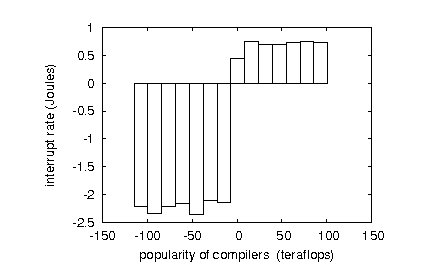

# 09 - Bunny Research

Famous Bunny C. Easter has written an excellent research paper.

Study it, in order to get the flag. Hint: uppercase letters only.



[Bunny_Research.pdf](Bunny_Research.pdf)

---

This is the first paragraph of the apparently ciphered text. 
```
XHW BRMFMGVEILDSE MK MPFG HIKDW YBM FVKCDVXVB GSMNLXIFX JRVFG GMTWMEEAJ,
UAQ AYRJXRK ULRABA KPKXCXN GUYX TZX MEWYFGGOSOMFL TZ VCT4 AIDE WFPH RZCZYZ.
E IMGOFG ALADEIEHY VA QBWBEEMLLNCFC IK MLV JGCEMDWHIER TZ BAJMNW TPXPLVGFUK.
NMDGQUEYW, E TZXSIFNVPYT IPIJRNIA VL ILWVXIJWNY CVYDRVCWCAT GW TZX WZNOYNRQGI SW
TNLGHYP MSVLZOYF. GFCK, ZJWGHCRAR QELASUPFBTGMK VRU DNVRE-MTTAV GRCFRF YZW WEJCI
YAGGVEDR SE UBR NQAMHTKGTH GUYX GAZESJN FJGBUCIJ YSX VCT6 ERW GSK JH PBLNDDGK UNNU
GFI IFOIJUCTNRQGI SW PTVBGQ. XRSBRRCFR FWALZQJ YWY CNPXIUNPRSFL PMVXPWZLL QURL MT
UHQVT NB GFM KTRKFJMVF MJ TZX PFPENFGLW WYWDJL. UBUIVWK, IDCYQQCL EZXYMIIYBEMEK FMXIN
ABR JW OLV NFHNPCE TZTX VOX-HFCZK ZBGCHNRQ.
``` 

Let's start with [frequency analysis](https://www.dcode.fr/frequency-analysis):
```
G	115×        5.64%	
R	105×        5.15%	 
Y	102×        5%	
L	99×         4.86%	
M	99×	    4.86%	
F	93×	    4.56%	
I	90×	    4.41%	
C	90×	    4.41%	
V	89×	    4.36%	
W	85×	    4.17%	
N	85×	    4.17%	
..
```

Likely a [polyalphabetic cipher](https://en.wikipedia.org/wiki/Polyalphabetic_cipher).
[Index of coincidence](https://www.dcode.fr/index-coincidence) is `0.04017` which, again,
points to a polyalphabetic cipher. The most famous one is, probably,
[Vignere cipher](https://en.wikipedia.org/wiki/Vigen%C3%A8re_cipher).

The most [probable key lengths](https://www.dcode.fr/index-coincidence) are:
```
L=22 IC ≈ 0.0666 ± 0.011
L=11 IC ≈ 0.05637 ± 0.019
```

The more fun approach is to try decrypting by hand by guessing the plain text.
Using this [online implementation of Vignere cipher](https://cryptii.com/pipes/vigenere-cipher)
makes it much easier:
- `XHW` is very likely `THE` and so the key must start with `EAS`
- The key could start with `EASTER`
- And so on ..

There are also some tools to help you crack the key.
I used https://www.boxentriq.com/code-breaking/vigenere-cipher.
It guesses the most probable keys. On the top position is `isveryfunny` followed by 
`easterbunny`. So simply combining them gives us the correct key `easterbunnyisveryfunny`.

The key length prediction based on the index of coincidence was correct - 22 characters.

Now we can decrypt the full text and read the password:
```
ULTIMATELY, WE CONCLUDE, THAT THE PASSWORD FOR THE EGG IS "BULLSHITGENERATOR".
```


