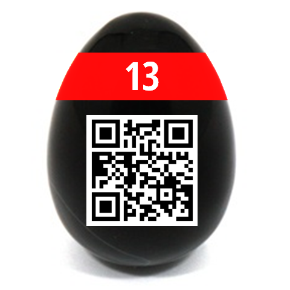

# 14 - Tap the Xap

A prototype of an application has been leaked from the famous EasterApps studio.

**Peek** into the file, in order to find an Easter egg!


[TapTheXap.xap](TapTheXap.xap)

---

[XAP](https://en.wikipedia.org/wiki/XAP_(file_format)) is file format for Windows Phone apps.
It's just a Zip archive. Unzip it and find `TapTheXap.dll` inside.

```
$ file TapTheXap.dll 
TapTheXap.dll: PE32 executable (DLL) (console) Intel 80386 Mono/.Net assembly, for MS Windows
```

Let's start simple:
```
$ strings -n 10 TapTheXap.dll
..
part 1: Dpbwob2HGo
```

Cool, looks like we found _part 1_ of something, maybe the flag?

Next, let's try Binwalk:
```
$ binwalk TapTheXap.dll 

DECIMAL       HEXADECIMAL     DESCRIPTION
--------------------------------------------------------------------------------
0             0x0             Microsoft executable, portable (PE)
6612          0x19D4          Zip archive data, encrypted at least v2.0 to extract, compressed size: 60719, uncompressed size: 60707, name: egg13.png
67461         0x10785         End of Zip archive, footer length: 22
71115         0x115CB         Copyright string: "CopyrightAttribute"
```

There's an encrypted Zip archive with `egg13.png` (extract it with `-e` flag).
Ok, so the part 1 (`Dpbwob2HGo`) is most likely for a password. 

We need to get the _part 2_ now ..

_Ghidra_ nor _Hopper_ doesn't work well with this format. Google for the rescue!

See https://reverseengineering.stackexchange.com/questions/274/reverse-engineering-apps-for-windows-phone-7-and-8

Install _dotPeek_ by [JetBrains](https://www.jetbrains.com/) and use it to
decompile `TapTheXap.dll`:
```
public App()
    {
      base.\u002Ector();
      App.Part2 = "u752reVoT1";
      this.add_UnhandledException(new EventHandler<ApplicationUnhandledExceptionEventArgs>(this.Application_UnhandledException));
      this.InitializeComponent();
      this.InitializePhoneApplication();
      this.InitializeLanguage();
    }
```

Now you have the password: `Dpbwob2HGou752reVoT1`

Unzip and grab the egg!

