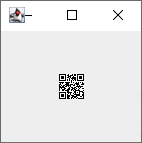

# 15 - Boolean 101

In this challenge, you'll need to juggle with zeroes and ones.


[boolean_101.zip](boolean_101.zip)

---

Archive contains 4 text files in the following format:
```
0111011001000100111111111
0100011101001101101110100
0001100000000111100110001
0110101111110010001101011
1110011011100110001100011
0001100101001000100100110
0101111010101100010000110
0011000101110100100101110
1110000001010010100010010
0110001010001110111101110
0000010111010000001100001
0010110111100001100101110
1011110100111010011110101
1111011101000001111001001
0101010001110001101011101
0100100001110010011101110
1001101110110001010110111
0100111011010011111111010
0001111101101011101010110
1111011100001111000011101
0000111000101110001000000
0001110101101000101110000
0011100010011001101100011
0100010100000111001101110
0110011001101010110110100
```

We have 25x25 matrix. Most likely a QR code!

The goal is clear, combine those 4 matrices into one using the given formula:
```
((not(a) and b) or c) xor d
```

See [my solution in Kotlin](../../../src/main/kotlin/cz/vernjan/ctf/he14/ch15/Boolean101.kt).

Here is the QR code:


