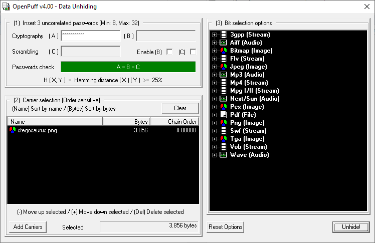

# 16 - Jurassic Hack

Did you know that dinosaurs did lay eggs? One of the beasts below even hides an easter egg. Go get it!

**Important**

- you'll need the 2015 version of the stego tool
- the **flag** is the file name of the URL: `egg15kd.........7B.png`


---

The new hints make this challenge quite easy. I downloaded all pictures and
checked for interesting strings:
```
$ strins -n 10 *.png
tCheck Stego                  G
_qjDKiZxKyzD{ef$
j>maRh{aR0e
>V7:x(@WS"
jT%`;1!q]IJ8m
tCheck Stego                  G
>n55!q3rAV]
iKWoXjkVW&
sAt=TUvxn]
tPuff stegosaurus no B no C   G
FT!~4-/n^r~V?5
#f0$l7hwn0
k&1D!91 '"
]H X (npo`
uL_z~L_zql_z
3=s]Wz~@7ze
$5Q@    M~STR
L{IHHc`(B9.
C&[%O2~h'N
z7T?qpK w$
)Ej`]]7kP]
tCheck Stego                  G
I#Eq_J5r?@
D:8?1*#)d       d
```

We have 3 times `Check Stego` and also, in `stegosaurus.png`, `Puff stegosaurus no B no C`.

Of course, it's hidden in _stego_-saurus :-)

The next clue is the word `Puff`. Googling for `puff stegano` reveals
[OpenPuff](https://en.wikipedia.org/wiki/OpenPuff).

The hardest part is to get the right version, because there is no official changelog
available. I was able to find it [viewing history on Wikipedia](https://en.wikipedia.org/w/index.php?title=OpenPuff&action=history).

The correct version is OpenPuff `4.00` (does not work with `4.01`!)

Download the tool and use it to extract the secret from `stegosaurus.png`:



- The password (A) is `stegosaurus` and we have no (B) or (C) passwords
- The carrier is `stegosaurus.png`

Once you click `Unhide!`, a new file [url.txt](url.txt) is extracted.

The flag is `egg15kdm7deolxiYKJuR93O7B.png`