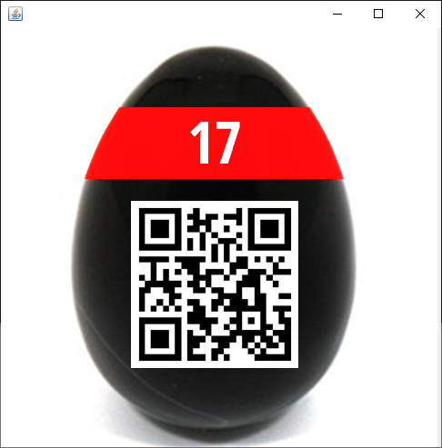

# 17 - Egg Safe

The safe below holds a red egg.
You'll need to crack it's code - a string of format `9999-9999-9999-9999` - in order to get it.

[egg_safe.zip](egg_safe.zip)

---

Start with extracting the archive.
```
$ ls
1.png  2.png  commons-codec-1.9.jar  egg_safe.jar run.bat
``` 
We have 2 images (unfortunately encrypted), Java lib `commons-codec-1.9.jar`, Java
app `egg_safe.jar` and a run script.

The most interesting is the Java app. Let's unpack it (_jar_ is a just a zip archive) and
peek into `ps/hacking/hackyeaster/eggsafe/EggSafe.class`. To make more sense of it,
we need to decompile it (lots of tools available, I used [IntelliJ IDEA](https://www.jetbrains.com/idea/)).

See [EggSafe.java](EggSafe.java)

We need to crack the code in the given format `9999-9999-9999-9999`. To make it feasible,
the code parts (separated with `-`) are checked individually.

## Part 1 and 2
```
byte[] b0 = parts[0].getBytes();
MessageDigest digest = MessageDigest.getInstance("MD5");
byte[] b1 = parts[0].getBytes();

for(int i = 0; i <= Integer.parseInt(parts[1]); ++i) {
    digest.update(b1);
    b1 = digest.digest(b1);
}

String t1 = Base64.encodeBase64String(b1); // must equal to Q4jgwADL0QO0H7CNPMhxJw==
```

Let's not start here, it requires to brute force 10,000*10,000 options with increasing
rounds of hashing.

## Part 1 and 3
```
digest = MessageDigest.getInstance("SHA1");
byte[] b2 = parts[0].getBytes();

for(int i = 0; i < Integer.parseInt(parts[2]); ++i) {
    digest.update(b2);
    b2 = digest.digest(b2);
    b2[0] = 99;
    b2 = digest.digest(b2);
}

String t2 = Base64.encodeBase64String(b2); // must equal to KMZ9wInjZg0C4R0EkZSjKYsonN8=
```

Pretty much the same as before.

## Part 1 and 4
```
Cipher c = Cipher.getInstance("AES/CBC/PKCS5Padding");
SecretKeySpec k = new SecretKeySpec((parts[3] + parts[3] + parts[3] + parts[3]).getBytes(), "AES");
c.init(1, k, ips);
byte[] b3 = c.doFinal(b0);

String t3 = Base64.encodeBase64String(b3); // must equal to hH0zVgJvd0aaUsoUXlg==
```

This looks most promising. Again 10,000*10,000 options, but the complexity of each round
is the same.

Once we crack this part, it will be much easier to crack _part 2_ and _part 3_.

Here is my [EggSafeCracker](../../../src/main/kotlin/cz/vernjan/ctf/he14/ch17/EggSafeCracker.java).

The secret code is: `8122-4901-6001-2311` (just pass it to the run script).

And finally, the egg:


