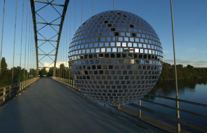
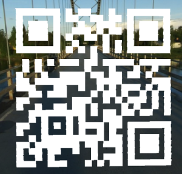

# 04 - Disco 2

*This year, we dance outside, yeaahh! See [here](https://hackyeaster.hacking-lab.com/hackyeaster/challenges/disco2/disco2.html).*

---

This is how the scene rendered in 3D looked like



At first, I was digging in [theRealBeat.mp3](theRealBeat.mp3) which was playing in the background but it was
a dead end.

Then I downloaded the sources to my local machine and start modifying it:

- I felt I should somehow take a look inside of the ball.
```
controls.minDistance = 50; // Was 500
```


Bingo, now it's time to make a nice readable QR code of out it ..


- Filter out the mirrors on the surface of the ball to get clean background.
  The trick is that the mirrors forming QR code are *Integers*.
```
for (var i = 0; i < mirrors.length; i++) {
  var m = mirrors[i];
  // ..
  if (Number.isInteger(m[0]) && Number.isInteger(m[1]) && Number.isInteger(m[2])) {   
    scene.add(mirrorTile);
  }
}
```


- Comment out the line where mirrors are rotated to look at the center.
```
//mirrorTile.lookAt(center);
```


-  Make the ball bigger.
```
var geometry = new THREE.SphereBufferGeometry(800.0, 48, 24); // Was 400.0
```


- Remove texture from the mirrors.
```
sphereMaterial = new THREE.MeshLambertMaterial({
  //envMap : textureCube
});
```



- Invert colors, crop and here is the final result:

