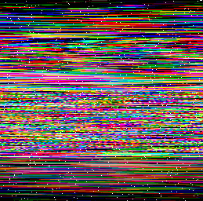
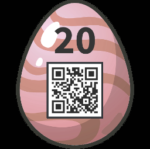

# 20 - Scrambled Egg
*This Easter egg image is a little distorted...*

*Can you restore it?*


---

I enjoyed this one! The goal is clear, restore the original egg image.

I started with small analysis. The interesting stuff is hidden in the alpha channel. Here is the list
of transparent pixels (i.e. the small white dots in the image) from the first 5 rows:
```
(13, Color[r=0,g=23,b=0]), (23, Color[r=23,g=0,b=0]), (133, Color[r=0,g=0,b=23])
(87, Color[r=0,g=214,b=0]), (182, Color[r=214,g=0,b=0]), (225, Color[r=0,g=0,b=214])
(32, Color[r=0,g=0,b=175]), (206, Color[r=0,g=175,b=0]), (221, Color[r=175,g=0,b=0])
(18, Color[r=223,g=0,b=0]), (129, Color[r=0,g=223,b=0]), (217, Color[r=0,g=0,b=223])
(27, Color[r=0,g=53,b=0]), (47, Color[r=53,g=0,b=0]), (242, Color[r=0,g=0,b=53])
...
```
**Couple of observations:**
1) There is 256 rows.
2) There are 3 transparent pixels in each row. So each row has 256 opaque + 3 transparent pixels.
3) Transparent pixels in the same row always have the same value in one of the RGB channels and 
this value is unique. For those first 5 rows we have `23, 214, 175, 223 and 53`. 
4) Positions of the transparent pixels in each row are random. We can associate each position with
exactly one of the RGB channels. For the first row we have `G 13, R 23, B 133`.

## Step 1: Sort rows
Observation **3)** encourages to sort the rows by the RGB values in the alpha channel.

 

This is the result. Actually, it looks good, there is a nice pattern forming up.

## Step 2: Shift color channels
The second step is based on the observation **4)**. I was lazy at first and only shifted the red channel.


Wow, the egg is showing up! And after shifting green and blue channel:



See [ScrambledEgg.kt](../../../src/main/kotlin/cz/vernjan/ctf/he19/ch20/ScrambledEgg.kt) for implementation details.