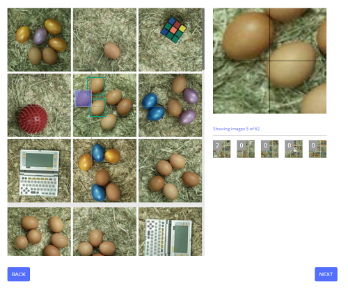

#24 - CAPTEG

*CAPTEG - Completely Automated Turing test to know how many Eggs are in the Grid*

*CAPTEG is almost like a CAPTCHA. But here, you have to proof you are a bot that can count the eggs in the grid quickly.
Bumper also wanna train his AI for finding eggs faster and faster ;)*

[CAPTEG page](http://whale.hacking-lab.com:3555/)

*No Easter egg here. Enter the flag directly on the flag page.*

---

This is the challenge:


The goal is to count the correct number of eggs in the picture. The trick is not to make any
mistake (42 consecutive rounds) and to solve each round in less than 8 seconds.

We will need some counting robot for this!

After searching for a while for *object detection* services, I have stumbled upon
[Nanosets](https://nanonets.com/) and decided to give a try.

I must say this service is very cool! After quick registration, I uploaded 50 sample
images and annotated a few of them manually.



Then I had to wait for a few hours until the model is trained.
 
The first results were quite good:


Once I was convinced this could work, I wrote a [client](../../../src/main/kotlin/cz/vernjan/ctf/he19/ch24/CAPTEG.kt)
for CAPTEG and Nanosets API to do
the job for me. The object detecting model was not perfect and made a mistake time to time.
It took a few tries and strong nerves to watch the progress but in the end the CAPTEG was beated.  

This is output from the last round:

```
Round 42:
Downloading /picture: 200 OK
Counting eggs for picture C:\Users\Jan\AppData\Local\Temp\capteg9506685112546872500\picture42.jpg
Nanosets 200 OK: Counted 12 eggs (done in 4880 ms)
Verify guess 12: 200 he19-s7Jj-mO4C-rP13-ySsJ
```
