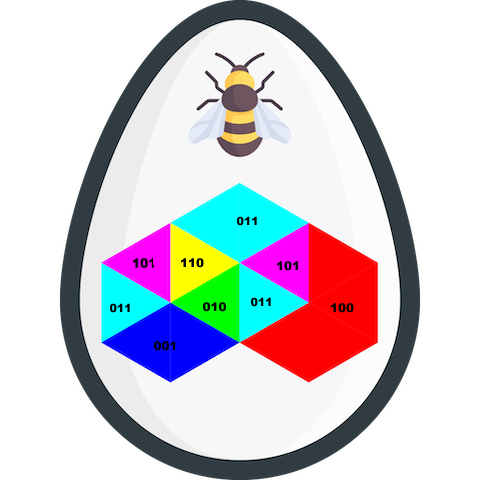

# Beehive
There's a secret code in the beehive.

⚑ format: `he2021{flaglower}`.

**Lowercase** only, and no spaces!

[beehive.png](beehive.png)

---

Not taking the available hint was a **big mistake**. I wasted time on this one.

## Rabbit hole

I strongly believed the solution lies in RGB somehow:

I tried to read the message in many ways but, of course, I failed.

Then, I finally took the hint: `Kim Godgul`

Quick google serch took me to https://omniglot.com/conscripts/colorhoney.php.
> The ColorHoney and ColorTokki alphabets were invented by Kim Godgul in 2009
> as alternative ways of writing English. They use six colours (Red, Green, Blue,
> Cyan, Magenta, Yellow) and different shapes to represent different letters, with
> each letter being represented by two colours. The scripts are similar, but use
> different shapes and are structured slightly differently. Tokki means rabbit in
> Korean.

Now it's easy peasy, the message is `busybee`.

The flag is `he2021{busybee}`