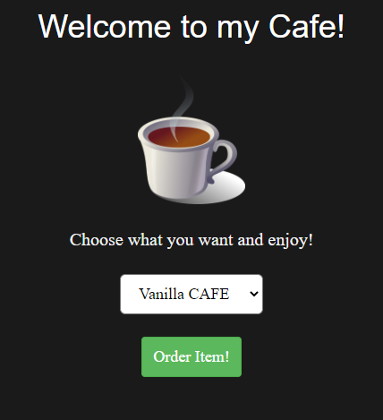

# Cafe Shop
They have good things at the cafe shop, but I want a COLA - DECAF it must be!

Visit the shop here:
http://46.101.107.117:2104

---

Cafe shop page:



There are 3 products available:
```
<option value="11865457 Vanilla Cafe">Vanilla CAFE</option>
<option value="42640575 Cherry Cola">Cherry COLA</option>
<option value="80427209 Beef Jerky">BEEF Jerky</option>
```

HTTP request is a simple POST:
```
POST http://46.101.107.117:2104/order
Content-Type: application/x-www-form-urlencoded

id=11865457+Vanilla+Cafe
```

Apparently, the goal here is to determine the correct id for COLA - DECAF.

I was able to determine the acceptable range for ids is `00000000-99999999`. 
Otherwise `Invalid item id!` is returned.

The hint is:
> They also serve hash browns, for $256.

