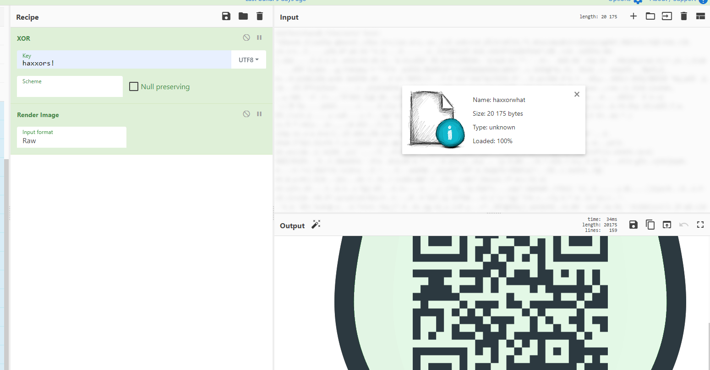

# Haxxor what?
I got this image of an Easter egg.

But what kind of encryption is this?!

[haxxorwhat](haxxorwhat)

---

According to the challenge description, the encrypted file is an image. 
The most likely format is [PNG](https://en.wikipedia.org/wiki/Portable_Network_Graphics).
All PNG images start with a magic header `89 50 4e 47 0d 0a 1a 0a`. We can use this fact to
revert the XOR key:
```
89 50 4e 47 0d 0a 1a 0a     # PNG magic header
  XOR
e1 31 36 3f 62 78 69 2b     # First 8 bytes from the encrypted file
---
haxxors!
```

Bingo, we have the XOR key. The next step is to revert the encryption.
I used [CyberChef](https://gchq.github.io/CyberChef/):



The flag is `he2021{r34l_x0r_h4xx0r}`