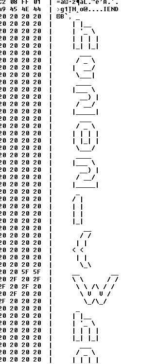

# Hidden
I swear I had the flag a minute ago, but now it seems to be hidden somewhere...

Go back to level 3 and analyze the files of the challenges again. If you look hard enough, you can find an additional flag.

---

Luckily, there are only 4 files. I started viewing the files in hex editor and discovered the flag almost
immediately. It's hidden in challenge [Sunshine](../../level3/sunshine/README.md).

Open the file in hex editor or run `xxd`:

The flag is `he2021{Wh0_is_scared_0f_h3xdump5?}`