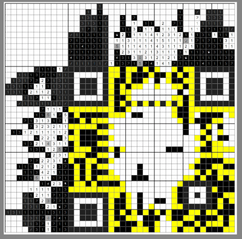
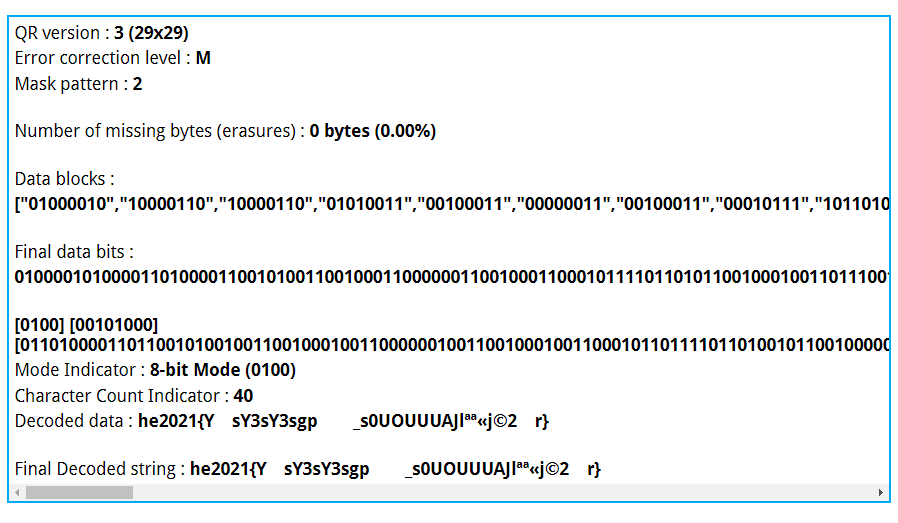
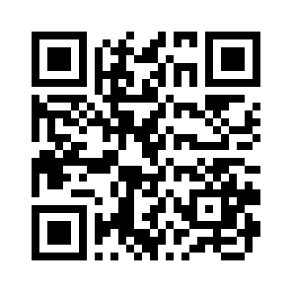
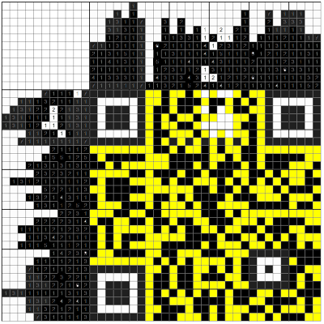
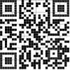

# No No No
No! No... nono ..

Where's the egg???

[nonobunnygram.png](nonobunnygram.png)

---

I took the hard way here, but I had a lot of fun :-)

I know there are many tools to solve [nonograms](https://en.wikipedia.org/wiki/Nonogram) but I wanted to
do it by hand. Once I started, I just couldn't stop.

I started with the well-known QR code structure (position, alignment and timing), and then started
to fill the data:

Yellow color marks fields which must be blank.

After a few hours, I got stuck. There were no obvious steps, and I'd have to start guessing.

Luckily, I already had a partial QR code, and I was able to read it using this awesome tool
https://merricx.github.io/qrazybox/:

(This screenshot is from a later stage, at first I got something as `he2ry1{Y3sY3....`)

I was able to guess the flag is going to be `he2021{Y3sY3sY3s...}`. Next, I generated QR code for
`he2021{Y3sY3sY3aaaaaaaaaaaaaaaaaaaaaaaa}`. I used https://monika-heusinger.net/qr/ which gives
full control over the version, error correction level and mask pattern:

(Reads `he2021{Y3sY3sY3aaaaaaaaaaaaaaaaaaaaaaaa}`)

I copied the missing pieces into my partial QR code. Especially the last `}` was a game changer 
and gave me enough information to fill the rest by hand:

Cut, re-colored and resized into the final working QR code:

The flag is `he2021{Y3sY3sY3sgram_s0unds_a_l0t_nic3r}`