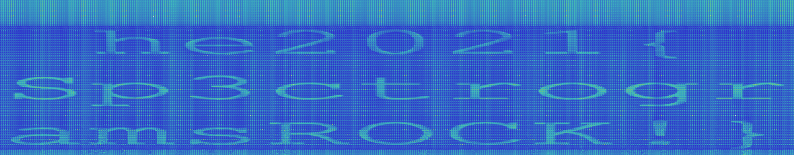

# Bunny Beat
The bunnies have discovered minimal beats!

But where is the flag?

[bunnybeat.wav](bunnybeat.wav)

---

There is a very unpleasant noise in the audio. Let's try to identify what that is.

I analyzed the file using [Audacity](https://www.audacityteam.org/).

At first, I couldn't find anything, but after reading 
https://www.clear.rice.edu/elec301/Projects01/smokey_steg/freq.html I got the idea to look into
higher frequencies.

Here is my spectrogram configuration:

The important option is _Max Frequency (Hz)_.

Once the config is applied, the flag becomes readable:

The flag is `he2021{Sp3ctrogramsROCK!}`