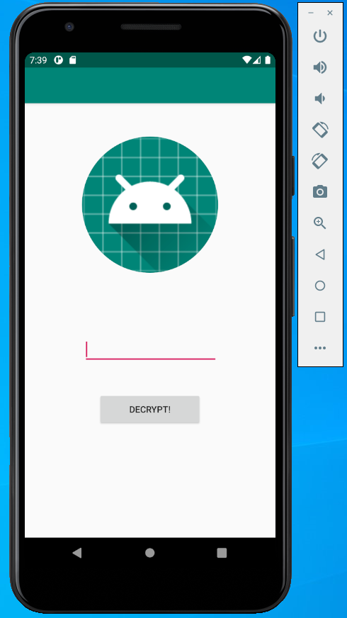

# Eggcryptor
Eggcryptor is hiding something from you.

Crack it and get the Easter Egg!

[eggcryptor.apk](eggcryptor.apk)

---

APK stands for [Android application package](https://en.wikipedia.org/wiki/Android_application_package).

There are some good advices on [how to reverse APK](https://stackoverflow.com/questions/1249973/decompiling-dex-into-java-sourcecode/8016997).

## Apktool

I used [Apktool](https://ibotpeaches.github.io/Apktool/) to disassemble APK:
```
$ ./apktool.sh d eggcryptor.apk
I: Using Apktool 2.5.0 on eggcryptor.apk
I: Loading resource table...
I: Decoding AndroidManifest.xml with resources...
I: Loading resource table from file: /home/vernjan/.local/share/apktool/framework/1.apk
I: Regular manifest package...
I: Decoding file-resources...
I: Decoding values */* XMLs...
I: Baksmaling classes.dex...
I: Baksmaling classes2.dex...
I: Copying assets and libs...
I: Copying unknown files...
I: Copying original files...
$ ls eggcryptor
AndroidManifest.xml  apktool.yml  original  res  smali  smali_classes2
```

This does not decompile the source code but recovers all the resources,
such as [res/values/strings.xml](strings.xml) and [res/raw/raw.raw](raw.raw).

## dex2jar

Next, I used [dex2jar](https://github.com/pxb1988/dex2jar) to decompile the source code
(`dex` → `jar` → import into [IntelliJ IDEA](https://www.jetbrains.com/idea/)).
However, decompiling throws:
```
$ ./d2j-dex2jar.sh -f -o output_jar.jar eggcryptor.apk
dex2jar eggcryptor.apk -> output_jar.jar
com.googlecode.d2j.DexException: not support version.
        at com.googlecode.d2j.reader.DexFileReader.<init>(DexFileReader.java:151)
        at com.googlecode.d2j.reader.DexFileReader.<init>(DexFileReader.java:211)
        at com.googlecode.dex2jar.tools.Dex2jarCmd.doCommandLine(Dex2jarCmd.java:104)
        at com.googlecode.dex2jar.tools.BaseCmd.doMain(BaseCmd.java:288)
        at com.googlecode.dex2jar.tools.Dex2jarCmd.main(Dex2jarCmd.java:32)
```

No surprise, the release is from 2015.

Luckily, I found a more recent version at https://github.com/DexPatcher/dex2jar.

```
$ ./d2j-dex2jar.sh -f -o output_jar.jar eggcryptor.apk
dex2jar eggcryptor.apk -> output_jar.jar
```

## Android Studio
I used [Android Studio](https://developer.android.com/studio) for running the app.



## Solution

I imported all the staff into a new IntelliJ IDEA project and browsed the decompiled source code.

[MainActivity.java](MainActivity.java):
```
 public void onClick(View var1) {
    if (pattern.matcher(pin.getText()).matches()) {
        try {
            byte[] var3x = Crypto.decrypt(pin.getText().toString(), data);
            Bitmap var4x = BitmapFactory.decodeByteArray(var3x, 0, var3x.length);
            var3.setImageBitmap(var4x);
        } catch (Exception var2) {
            var3.setImageBitmap((Bitmap)null);
        }
    } else {
        Toast.makeText(MainActivity.this.getApplicationContext(), MainActivity.this.getResources().getString(2131689523), 1).show();
    }

}
```

- `pattern` is regex pattern `[a-z][0-9]{4}` (see [res/values/strings.xml](strings.xml)).
  This is only 26*10^4 = 260,000 options to brute-force.
- `data` is the encrypted image (see [res/raw/raw.raw](raw.raw))

[Crypto.java](Crypto.java):
```
public static byte[] decrypt(String pin, String data) throws Exception {
    byte[] iv = new byte[8];

    for(int i = 0; i < 8; ++i) {
        iv[i] = (byte)i;
    }

    SecretKeySpec key = new SecretKeySpec(
        SecretKeyFactory.getInstance("PBKDF2WithHmacSHA256")
            .generateSecret(new PBEKeySpec(pin.toCharArray(), iv, 10000, 128)).getEncoded(), "AES");
   
    Cipher aes = Cipher.getInstance("AES");
    aes.init(2, key);
    return aes.doFinal(Base64.decode(data, 0));
}
```

Based on this, I create the decryptor:
```java
public class Eggcryptor {

    private static final byte[] PNG_MAGIC_HEADER = {(byte) 0x89, 0x50, 0x4E, 0x47};
    private static final byte[] IV = new byte[8];

    static {
        for (int i = 0; i < 8; ++i) {
            IV[i] = (byte) i;
        }
    }

    public static void main(String[] args) {
        byte[] data = Base64.getDecoder().decode(
                Resources.INSTANCE.asString("he21/eggcryptor.raw"));

        for (char ch : "abcdefghijklmnopqrstuvwxyz".toCharArray()) {
            System.out.println("Ch: " + ch);
            for (int i = 0; i < 10_000; i++) {
                String pin = ch + String.format("%04d", i);
                try {
                    byte[] header = Arrays.copyOf(decrypt(pin, data), 4);
                    if (Arrays.equals(PNG_MAGIC_HEADER, header)) {
                        System.out.println("Bingo! Pin is " + pin);
                        System.exit(0);
                    }
                } catch (Exception e) {
                    // ignore
                }
            }
        }
    }

    public static byte[] decrypt(String pin, byte[] data) throws Exception {
        SecretKeySpec key = new SecretKeySpec(
                SecretKeyFactory.getInstance("PBKDF2WithHmacSHA256")
                        .generateSecret(new PBEKeySpec(pin.toCharArray(), IV, 10000, 128))
                        .getEncoded(), "AES");

        Cipher aes = Cipher.getInstance("AES");
        aes.init(Cipher.DECRYPT_MODE, key);
        return aes.doFinal(data);
    }
}
```

It outputs: `Bingo! Pin is g0717`


The flag is `he2021{th3r3s_4_h4ck_4_th4t}`