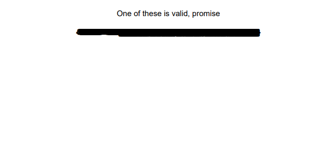

# Lost
One of the flags accidentally fell into the pot with the rejected ones!

Can you recover the lost flag?

[lost.pdf](lost.pdf)

---

The document seems to be rather empty:


If you mark all the text and copy, you will get [500 flags](flags.txt).

Which one is the correct one?

I took a simple path and tried them all:
```shell
while read flag; do
    echo "Testing flag: $flag"
    curl -X POST -d "{\"flag\":\"$flag\"}" -H 'Content-Type: application/json' -H 'Cookie: JSESSIONID=4B39AD2DD1CF27DDAA3DD4EF46EFC832'  https://21.hackyeaster.com/rest/user/challenge/26/checkflag
    echo
done < flags
```

After a short while, I had the correct flag:
```
Testing flag: he2021{XnZrb-aclTs-AZYCP-xj2Y6-z3nza}
{"solveStatus":"WRONG","challengeLevel":null,"challengeDifficulty":null,"challengePoints":null,"levelUp":null}
Testing flag: he2021{3t5Kc-PiP6Z-9xa2f-RNJrY-auDng}
{"solveStatus":"CORRECT","challengeLevel":6,"challengeDifficulty":3,"challengePoints":200,"levelUp":true}
Testing flag: he2021{9qCUV-wy15z-iX8kw-lYosl-O90te}
{"solveStatus":"WRONG","challengeLevel":null,"challengeDifficulty":null,"challengePoints":null,"levelUp":null}
Testing flag: he2021{qi3Xg-vzJkf-XR3Zw-Cmyf2-jp8Np}
```

The flag is `he2021{3t5Kc-PiP6Z-9xa2f-RNJrY-auDng}`